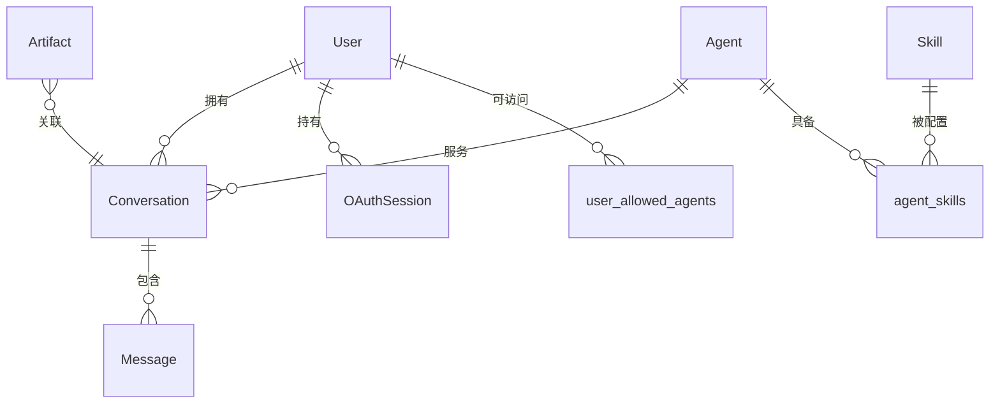
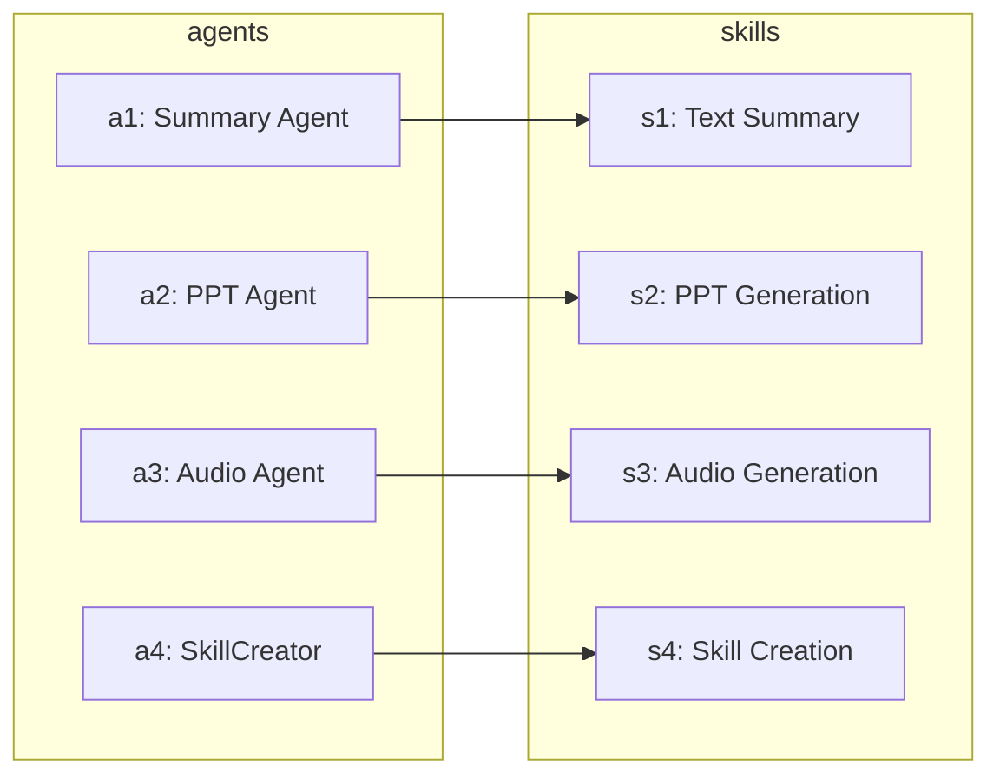

本文档详细阐述 BobCFC AI Agent 平台后端数据库的模型设计，包括实体关系、字段定义、数据约束以及异步操作模式。该平台采用 **PostgreSQL** 作为主数据库，通过 **SQLAlchemy 2.0** 的异步驱动实现高效的数据访问层。

## 核心架构概览



BobCFC 平台的数据模型围绕 **用户-会话-消息** 核心链路展开，辅以 **Agent-Skill** 能力系统和 **OAuth** 认证支持。所有实体均继承统一的 `TimestampMixin`，确保审计追踪能力。

Sources: [backend/app/models/base.py](backend/app/models/base.py#L1-L21), [backend/alembic/versions/001_initial.py](backend/alembic/versions/001_initial.py#L1-L133)

## 数据表详解

### 用户表 (users)

`User` 模型是平台的核心实体之一，承载用户身份认证与权限管理职能。

```python
class User(Base, TimestampMixin):
    __tablename__ = "users"
    
    username = Column(String(100), unique=True, nullable=False, index=True)
    email = Column(String(255), unique=True, nullable=False, index=True)
    password_hash = Column(String(255), nullable=True)
    role = Column(String(20), nullable=False, default="REGULAR_USER")
    provider = Column(String(50), nullable=True)
    provider_user_id = Column(String(255), nullable=True)
    claims_data = Column(JSON, nullable=True)
```

| 字段 | 类型 | 约束 | 说明 |
|------|------|------|------|
| `id` | UUID String | 主键 | 自动生成的唯一标识符 |
| `username` | VARCHAR(100) | UNIQUE, NOT NULL, INDEX | 用户名，用于登录 |
| `email` | VARCHAR(255) | UNIQUE, NOT NULL, INDEX | 邮箱地址 |
| `password_hash` | VARCHAR(255) | NULLABLE | 密码哈希值，支持本地认证 |
| `role` | VARCHAR(20) | NOT NULL, DEFAULT | 角色：`SUPER_ADMIN` 或 `REGULAR_USER` |
| `provider` | VARCHAR(50) | NULLABLE | OIDC 提供商标识（如 `entra`） |
| `provider_user_id` | VARCHAR(255) | NULLABLE | 第三方平台用户 ID |
| `claims_data` | JSONB | NULLABLE | 存储 OIDC 声明的原始数据 |
| `created_at` | TIMESTAMP | NOT NULL | 创建时间，自动填充 UTC 时间 |
| `updated_at` | TIMESTAMP | NOT NULL | 更新时间，修改时自动更新 |

平台支持**混合认证模式**：本地密码认证和 OIDC (Microsoft Entra ID / ADFS)。当使用 OIDC 时，`password_hash` 为空，认证信息存储在 `provider_user_id` 和 `claims_data` 中。

Sources: [backend/app/models/user.py](backend/app/models/user.py#L1-L21), [backend/app/schemas/user.py](backend/app/schemas/user.py#L1-L33)

### 会话表 (conversations)

`Conversation` 模型关联用户与 AI Agent 之间的对话上下文，是聊天功能的核心数据载体。

```python
class Conversation(Base, TimestampMixin):
    __tablename__ = "conversations"
    
    user_id = Column(String(36), ForeignKey("users.id", ondelete="CASCADE"), nullable=False, index=True)
    agent_id = Column(String(50), ForeignKey("agents.id"), nullable=True)
    title = Column(String(500), nullable=False, default="New Conversation")
    model_id = Column(String(100), nullable=True)
    
    messages = relationship("Message", back_populates="conversation", 
                           cascade="all, delete-orphan", lazy="selectin")
```

关键设计特点：
- **级联删除**：删除会话时自动删除所有关联消息，确保数据一致性
- **延迟加载优化**：使用 `selectin` 策略批量加载消息，减少 N+1 查询
- **可选 Agent 绑定**：允许创建不指定 Agent 的通用会话

Sources: [backend/app/models/conversation.py](backend/app/models/conversation.py#L1-L15)

### 消息表 (messages)

`Message` 模型存储对话中的每条消息内容。

```python
class Message(Base):
    __tablename__ = "messages"
    
    id = Column(String(36), primary_key=True, default=lambda: str(uuid.uuid4()))
    conversation_id = Column(String(36), ForeignKey("conversations.id", ondelete="CASCADE"), 
                            nullable=False, index=True)
    role = Column(String(20), nullable=False)
    content = Column(Text, nullable=False)
    timestamp = Column(DateTime(timezone=True), nullable=False, 
                       default=lambda: datetime.now(timezone.utc))
```

| 字段 | 说明 |
|------|------|
| `role` | 消息角色：`user` 或 `assistant` |
| `content` | 消息内容，使用 TEXT 类型支持长文本 |
| `timestamp` | 消息发送时间，精确到微秒 |

**注意**：`Message` 继承自 `Base` 而非 `TimestampMixin`，因为其使用独立的 `timestamp` 字段而非通用的 `created_at`。

Sources: [backend/app/models/message.py](backend/app/models/message.py#L1-L21)

### Agent 表 (agents)

`Agent` 模型定义 AI 代理的能力配置，是平台智能服务的核心抽象。

```python
class Agent(Base, TimestampMixin):
    __tablename__ = "agents"
    
    id = Column(String(50), primary_key=True)
    name = Column(String(200), nullable=False)
    description = Column(Text, nullable=False)
    status = Column(String(20), nullable=False, default="ACTIVE")
    recommended_model = Column(String(100), nullable=True)
```

Agent 与 Skill 之间通过关联表建立多对多关系。

Sources: [backend/app/models/agent.py](backend/app/models/agent.py#L1-L33)

### 技能表 (skills)

`Skill` 模型定义 AI Agent 可调用的具体技能。

```python
class Skill(Base, TimestampMixin):
    __tablename__ = "skills"
    
    id = Column(String(50), primary_key=True)
    name = Column(String(200), nullable=False)
    description = Column(Text, nullable=False)
    type = Column(String(100), nullable=False)
    status = Column(String(20), nullable=False, default="ACTIVE")
```

平台预置技能类型包括：

| 技能 ID | 名称 | 类型 | 功能描述 |
|---------|------|------|----------|
| `s1` | Text Summary | `TEXT_SUMMARY` | 长文本摘要提取关键点 |
| `s2` | PPT Generation | `PPT_GENERATION` | 从内容生成 PowerPoint 幻灯片 |
| `s3` | Audio Generation | `AUDIO_GENERATION` | 将文本转换为语音 |
| `s4` | Skill Creation | `SKILL_CREATION` | 创建新的 AI 能力 |

Sources: [backend/app/models/skill.py](backend/app/models/skill.py#L1-L17), [backend/app/db/seed.py](backend/app/db/seed.py#L1-L87)

### 制品表 (artifacts)

`Artifact` 模型追踪 AI 生成的文件制品状态。

```python
class Artifact(Base, TimestampMixin):
    __tablename__ = "artifacts"
    
    session_id = Column(String(36), nullable=False, index=True)
    name = Column(String(500), nullable=False)
    type = Column(String(100), nullable=False)
    status = Column(String(20), nullable=False, default="PENDING")
    storage_path = Column(String(1000), nullable=True)
```

制品状态流转：`PENDING` → `COMPLETED` / `FAILED`

Sources: [backend/app/models/artifact.py](backend/app/models/artifact.py#L1-L17)

### OAuth 会话表 (oauth_sessions)

`OAuthSession` 模型存储 OIDC 认证的令牌信息。

```python
class OAuthSession(Base):
    __tablename__ = "oauth_sessions"
    
    id = Column(String(36), primary_key=True)
    user_id = Column(String(36), ForeignKey("users.id"), nullable=False, index=True)
    provider = Column(String(50), nullable=False)
    access_token = Column(String(4000), nullable=True)
    refresh_token = Column(String(4000), nullable=True)
    id_token = Column(String(8000), nullable=True)
    expires_at = Column(BigInteger, nullable=True)
```

**安全注意**：令牌字段使用较长的 VARCHAR 长度以容纳 JWT 令牌和 ID Token。

Sources: [backend/app/models/oauth_session.py](backend/app/models/oauth_session.py#L1-L19)

## 关联表设计

### Agent-Skill 关联 (agent_skills)

```python
agent_skills = Table(
    "agent_skills",
    Base.metadata,
    Column("agent_id", String(50), ForeignKey("agents.id", ondelete="CASCADE"), primary_key=True),
    Column("skill_id", String(50), ForeignKey("skills.id", ondelete="CASCADE"), primary_key=True),
)
```

### 用户-Agent 权限 (user_allowed_agents)

```python
user_allowed_agents = Table(
    "user_allowed_agents",
    Base.metadata,
    Column("user_id", String(36), ForeignKey("users.id", ondelete="CASCADE"), primary_key=True),
    Column("agent_id", String(50), nullable=False, primary_key=True),
)
```



Sources: [backend/app/models/agent.py](backend/app/models/agent.py#L1-L33)

## 异步数据库操作

平台采用 **asyncpg** 驱动实现完全异步的数据库访问。

```python
# 数据库引擎配置
engine = create_async_engine(
    settings.database_url,
    echo=False,
    pool_size=20,
    max_overflow=10,
    pool_pre_ping=True,
)

async_session = async_sessionmaker(engine, class_=AsyncSession, expire_on_commit=False)
```

连接池参数说明：

| 参数 | 值 | 说明 |
|------|-----|------|
| `pool_size` | 20 | 最小连接数 |
| `max_overflow` | 10 | 允许超出的最大连接数 |
| `pool_pre_ping` | True | 每次使用前验证连接有效性 |

依赖注入获取数据库会话：

```python
async def get_db() -> AsyncSession:
    async with async_session() as session:
        try:
            yield session
            await session.commit()
        except Exception:
            await session.rollback()
            raise
```

Sources: [backend/app/db/session.py](backend/app/db/session.py#L1-L36)

## 数据完整性约束

平台通过 Check 约束确保数据有效性：

```sql
-- 用户角色约束
CHECK (role IN ('SUPER_ADMIN', 'REGULAR_USER'))

-- 技能状态约束
CHECK (status IN ('ACTIVE', 'INACTIVE'))

-- Agent 状态约束
CHECK (status IN ('ACTIVE', 'INACTIVE'))

-- 消息角色约束
CHECK (role IN ('user', 'assistant'))

-- 制品状态约束
CHECK (status IN ('PENDING', 'COMPLETED', 'FAILED'))
```

Sources: [backend/alembic/versions/001_initial.py](backend/alembic/versions/001_initial.py#L1-L133)

## 索引策略

| 表名 | 索引字段 | 类型 | 用途 |
|------|----------|------|------|
| `users` | `username` | UNIQUE | 快速用户查询 |
| `users` | `email` | UNIQUE | 邮箱查找 |
| `conversations` | `user_id` | 普通 | 用户会话列表查询 |
| `messages` | `conversation_id` | 普通 | 会话消息检索 |
| `artifacts` | `session_id` | 普通 | 制品关联查询 |
| `oauth_sessions` | `user_id` | 普通 | 用户 OAuth 状态查询 |

Sources: [backend/alembic/versions/001_initial.py](backend/alembic/versions/001_initial.py#L1-L133)

## 后续阅读

- [数据迁移与初始化](11-shu-ju-qian-yi-yu-chu-shi-hua) — 了解 Alembic 迁移工具和种子数据初始化流程
- [API 端点参考](17-api-duan-dian-can-kao) — 探索通过 API 操作数据的接口设计
- [OIDC 认证流程](18-oidc-ren-zheng-liu-cheng) — 深入了解 OAuthSession 与 OIDC 集成