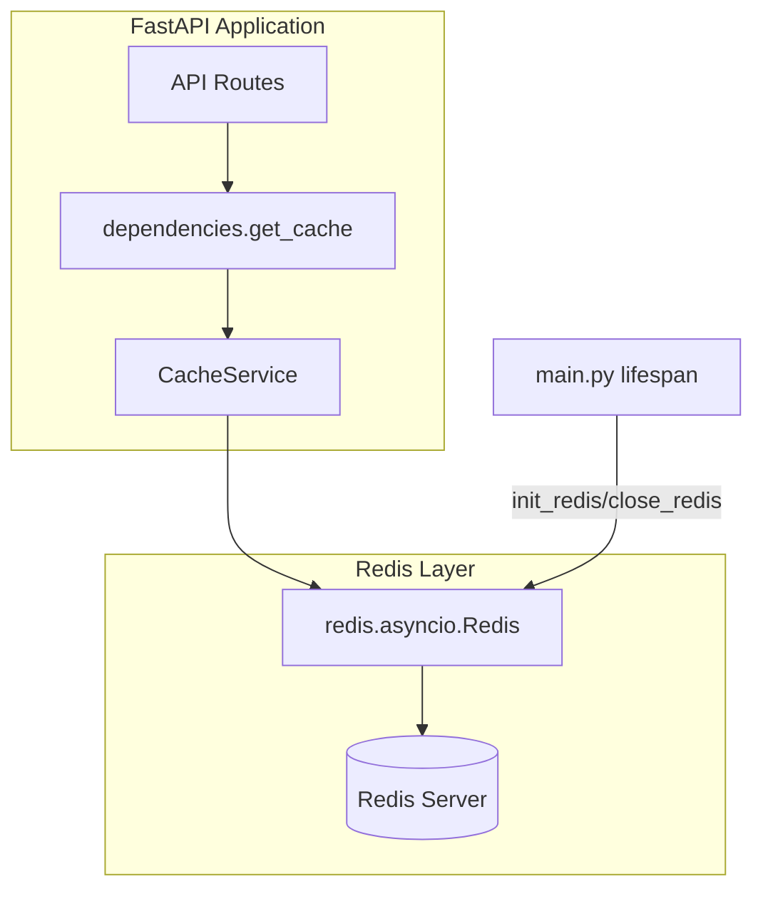
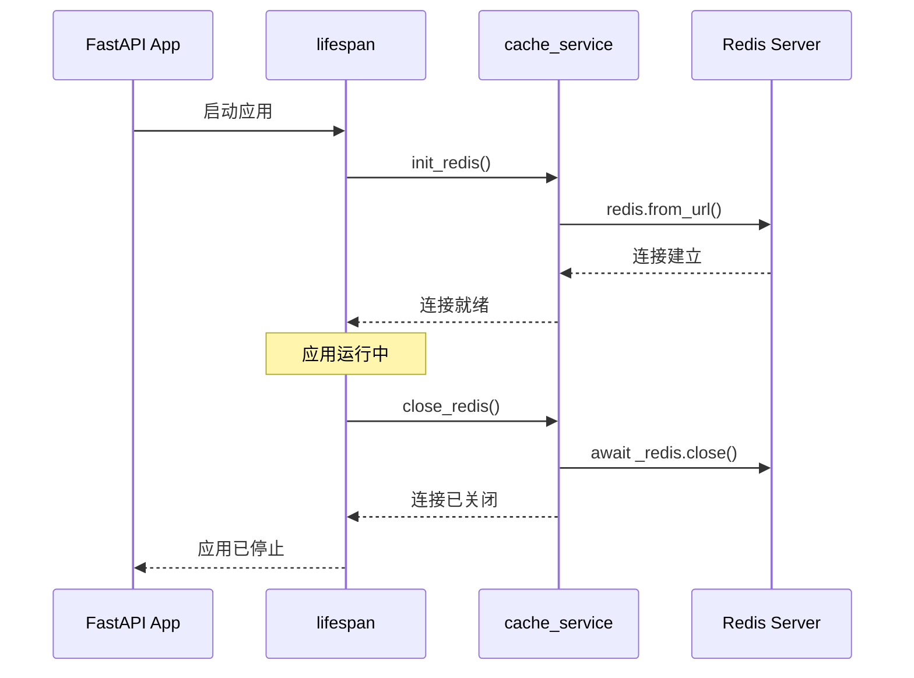

本文档详细阐述 BobCFC 平台后端缓存服务的技术架构与实现细节。该服务基于 Redis 构建，为系统提供高性能的键值存储能力，支持 JSON 序列化数据的缓存读写与模式匹配批量失效。

## 架构概览

BobCFC 平台的缓存层采用异步 Redis 客户端架构，与 FastAPI 应用的生命周期紧密集成。整体架构遵循依赖注入模式，通过 FastAPI 的 `Depends` 机制向路由处理器提供缓存服务实例。



Sources: [backend/app/main.py](backend/app/main.py#L1-L29), [backend/app/dependencies.py](backend/app/dependencies.py#L50-L54), [backend/app/services/cache_service.py](backend/app/services/cache_service.py#L1-L57)

## 核心组件

### Redis 连接管理

缓存服务的 Redis 连接采用单例模式管理，通过全局变量 `_redis` 维护唯一的连接实例。在 FastAPI 应用启动时（`lifespan` 上下文管理器），调用 `init_redis()` 初始化连接；应用关闭时调用 `close_redis()` 优雅关闭连接并重置全局变量。



Sources: [backend/app/services/cache_service.py](backend/app/services/cache_service.py#L10-L24), [backend/app/main.py](backend/app/main.py#L8-L26)

### CacheService 类设计

`CacheService` 类封装了所有缓存操作，提供四个核心方法：

| 方法 | 功能 | 参数 | 返回值 |
|------|------|------|--------|
| `get(key)` | 读取缓存值 | `key: str` | 解析后的 Python 对象或 `None` |
| `set(key, value, ttl)` | 写入缓存 | `key: str`, `value: Any`, `ttl: int = 300` | `None` |
| `delete(key)` | 删除单个键 | `key: str` | `None` |
| `invalidate_pattern(pattern)` | 批量删除匹配键 | `pattern: str` (glob 模式) | `None` |

**关键实现细节**：当缓存值为字典或列表类型时，`set` 方法自动将其序列化为 JSON 字符串存储；`get` 方法则自动尝试将存储值反序列化为 Python 对象。这种设计确保了复杂数据结构的透明序列化/反序列化。

```python
# 内部实现逻辑
async def get(self, key: str) -> Any:
    raw = await self._redis.get(key)
    if raw is None:
        return None
    try:
        return json.loads(raw)  # 自动反序列化
    except json.JSONDecodeError:
        return raw

async def set(self, key: str, value: Any, ttl: int = 300):
    if isinstance(value, (dict, list)):
        value = json.dumps(value)  # 自动序列化
    await self._redis.set(key, value, ex=ttl)
```

Sources: [backend/app/services/cache_service.py](backend/app/services/cache_service.py#L32-L57)

## 依赖注入集成

`get_cache` 函数定义在 `dependencies.py` 中，作为 FastAPI 依赖项供路由处理器使用。通过该机制，开发者可以在任何需要缓存的路由中注入 `CacheService` 实例：

```python
async def get_cache():
    """Dependency for CacheService."""
    r = await get_redis()
    from app.services.cache_service import CacheService
    return CacheService(r)
```

在路由中使用示例：

```python
@router.get("/example")
async def example_endpoint(cache: CacheService = Depends(get_cache)):
    # 读取缓存
    cached_data = await cache.get("example_key")
    
    if cached_data is None:
        # 缓存未命中，执行实际逻辑
        cached_data = {"message": "Hello"}
        # 写入缓存，5分钟过期
        await cache.set("example_key", cached_data)
    
    return cached_data
```

Sources: [backend/app/dependencies.py](backend/app/dependencies.py#L50-L54)

## 配置管理

Redis 连接配置通过环境变量 `REDIS_URL` 集中管理，默认值为 `redis://localhost:6379/0`。配置在 `Settings` 类中定义，支持通过 `.env` 文件或环境变量覆盖：

```python
# Redis
redis_url: str = "redis://localhost:6379/0"
```

Sources: [backend/app/config.py](backend/app/config.py#L12), [backend/.env.example](backend/.env.example#L4)

## Docker Compose 部署

平台通过 Docker Compose 统一管理 Redis 容器，提供开箱即用的缓存服务：

```yaml
redis:
  image: redis:7-alpine
  ports:
    - "6379:6379"
  volumes:
    - redisdata:/data
  healthcheck:
    test: ["CMD", "redis-cli", "ping"]
    interval: 5s
    retries: 5
```

后端服务通过 `depends_on` 条件确保 Redis 健康检查通过后才启动：

```yaml
backend:
  depends_on:
    redis:
      condition: service_healthy
```

Sources: [backend/docker-compose.yml](backend/docker-compose.yml#L18-L24), [backend/docker-compose.yml](backend/docker-compose.yml#L82-L85)

## 与其他服务的协作

### OIDC 服务中的 JWKS 缓存

值得注意的是，OIDC 服务中的 JWKS（JSON Web Key Set）缓存并未使用 Redis，而是采用进程内内存字典 `_jwks_cache`。这是因为 JWKS 密钥变更频率极低，且在同一进程生命周期内保持一致即可，无需跨进程共享：

```python
# JWKS cache
_jwks_cache: dict[str, dict[str, Any]] = {}

async def _fetch_jwks(tenant: str) -> dict:
    if tenant in _jwks_cache:
        return _jwks_cache[tenant]
    # ... fetch from Microsoft
    _jwks_cache[tenant] = jwks
    return jwks
```

这种设计体现了缓存策略的差异化选择：**高频变更、需要跨实例共享的数据使用 Redis**；**低频变更、进程内即可的数据使用内存缓存**。

Sources: [backend/app/services/oidc_service.py](backend/app/services/oidc_service.py#L26-L27), [backend/app/services/oidc_service.py](backend/app/services/oidc_service.py#L158-L169)

## 使用场景建议

基于当前实现，以下是推荐与不推荐的缓存使用场景：

| 场景 | 推荐程度 | 说明 |
|------|----------|------|
| 会话数据缓存 | ✅ 推荐 | 用户会话信息可利用 Redis 分布式存储 |
| API 响应缓存 | ✅ 推荐 | 频繁访问的只读数据可缓存减少数据库压力 |
| 实时状态存储 | ⚠️ 需评估 | WebSocket 连接状态管理需考虑一致性 |
| 分布式锁 | ⚠️ 需扩展 | 当前未实现锁机制，需引入额外库支持 |
| 长时间大对象存储 | ❌ 不推荐 | Redis 内存限制，不适合存储大型数据 |

## 扩展方向

当前缓存服务已具备基础能力，后续可考虑以下扩展：

1. **模式匹配缓存失效**：利用已有的 `invalidate_pattern` 方法，可实现命名空间隔离，如 `user:{user_id}:*` 模式可清除某用户的所有缓存

2. **缓存监控**：集成 Redis `INFO` 命令，定期采集命中率、内存使用等指标

3. **分布式锁**：基于 Redis 的 `SET NX EX` 指令实现分布式锁，支持跨服务实例的并发控制

---

## 相关文档

- [后端技术架构](8-hou-duan-ji-zhu-jia-gou) — 了解 Redis 在整体架构中的定位
- [数据库模型设计](10-shu-ju-ku-mo-xing-she-ji) — 缓存层与持久化层的关系
- [OIDC 认证流程](18-oidc-ren-zheng-liu-cheng) — JWKS 缓存机制详解