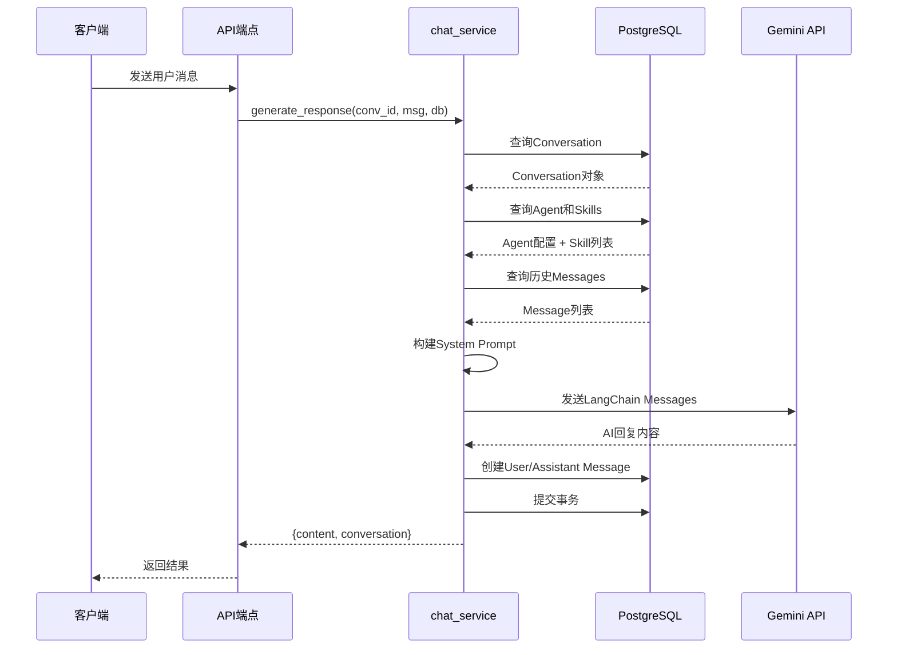
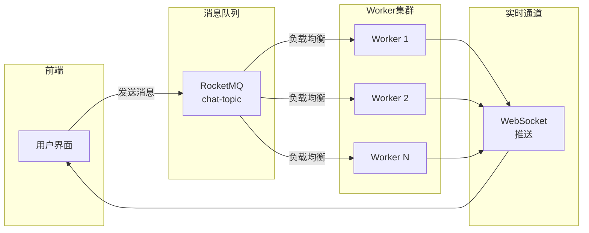

本文档详细阐述 BobCFC 平台聊天服务的完整实现架构，涵盖数据模型、核心服务逻辑、通信接口及消息处理流程。该服务采用双通道架构，同时支持 REST API 同步调用和 WebSocket 实时通信，并通过 LangChain 框架与 Gemini 大语言模型集成实现智能对话。

## 系统架构概览

聊天服务采用分层架构设计，核心组件包括数据持久层、业务逻辑层和通信接口层。数据持久层基于 PostgreSQL 数据库，通过 SQLAlchemy ORM 管理 Conversation 和 Message 数据模型；业务逻辑层封装于 `chat_service.py` 的 `generate_response` 函数中，负责对话上下文管理、Prompt 构建和大模型调用；通信接口层提供 RESTful API 和 WebSocket 两种接入方式。

```mermaid
graph TB
    subgraph Client["客户端层"]
        FE[前端应用]
    end
    
    subgraph API["通信接口层"]
        REST_API[/api/chat<br/>REST端点]
        WS_API[/api/ws/chat<br/>WebSocket端点]
    end
    
    subgraph Service["业务逻辑层"]
        CS[chat_service<br/>generate_response]
        LC[LangChain<br/>ChatGoogleGenerativeAI]
        SP[System Prompt<br/>构建器]
    end
    
    subgraph Data["数据持久层"]
        PG[(PostgreSQL<br/>conversations表)]
        MSG[(PostgreSQL<br/>messages表)]
        RD[(Redis<br/>缓存)]
    end
    
    subgraph MQ["消息队列层"]
        RMQ[RocketMQ<br/>chat-topic]
        CC[chat_consumer<br/>Worker]
    end
    
    FE --> REST_API
    FE --> WS_API
    REST_API --> CS
    WS_API --> CS
    CS --> SP
    SP --> LC
    LC --> Gemini[(Gemini API)]
    CS --> PG
    CS --> MSG
    CC --> RMQ
    CC --> WS_API
    
    style RMQ fill:#f9f,stroke:#333
    style Gemini fill:#ff9,stroke:#333
```

Sources: [chat_service.py](backend/app/services/chat_service.py#L1-L138), [chat.py](backend/app/api/chat.py#L1-L34), [chat_ws.py](backend/app/api/chat_ws.py#L1-L49)

## 数据模型设计

聊天服务涉及两个核心数据模型：**Conversation** 表示用户会话上下文，**Message** 存储对话中的每条消息。两个模型通过 `conversation_id` 外键建立一对多关联，并配置了级联删除策略。

### Conversation 模型

Conversation 模型继承 `TimestampMixin` 混入类，自动管理 `id`、`created_at` 和 `updated_at` 字段。关键字段包括：`user_id` 关联用户身份、`agent_id` 指定对话代理（可选）、`title` 存储会话标题、`model_id` 配置使用的 LLM 模型标识。

```python
class Conversation(Base, TimestampMixin):
    __tablename__ = "conversations"

    user_id = Column(String(36), ForeignKey("users.id", ondelete="CASCADE"), nullable=False, index=True)
    agent_id = Column(String(50), ForeignKey("agents.id"), nullable=True)
    title = Column(String(500), nullable=False, default="New Conversation")
    model_id = Column(String(100), nullable=True)

    messages = relationship("Message", back_populates="conversation", cascade="all, delete-orphan", lazy="selectin")
```

Sources: [conversation.py](backend/app/models/conversation.py#L1-L15)

### Message 模型

Message 模型定义消息的持久化结构，`role` 字段通过 CheckConstraint 约束限制为 `user` 或 `assistant` 两个枚举值。`timestamp` 字段默认使用 UTC 时区的当前时间，`id` 字段采用 UUID v4 算法生成。

```python
class Message(Base):
    __tablename__ = "messages"

    id = Column(String(36), primary_key=True, default=lambda: str(__import__("uuid").uuid4()))
    conversation_id = Column(String(36), ForeignKey("conversations.id", ondelete="CASCADE"), nullable=False, index=True)
    role = Column(String(20), nullable=False)
    content = Column(Text, nullable=False)
    timestamp = Column(DateTime(timezone=True), nullable=False, default=lambda: datetime.now(timezone.utc))

    __table_args__ = (
        CheckConstraint("role IN ('user', 'assistant')", name="ck_message_role"),
    )
```

Sources: [message.py](backend/app/models/message.py#L1-L21)

### 数据关联关系

Conversation 与 Message 之间的一对多关系采用 `selectin` 懒加载策略，在查询 Conversation 时自动预加载关联的 Message 列表。这种设计避免了 N+1 查询问题，同时在列表场景下（如侧边栏会话列表）可以通过设置 `messages=[]` 返回轻量级数据。

Sources: [conversations.py](backend/app/api/conversations.py#L51-L62)

## 核心服务逻辑

`generate_response` 函数是聊天服务的业务逻辑核心，实现了完整的对话处理流程。该函数接收 `conversation_id`、`user_message` 和数据库会话三个参数，返回包含模型回复内容和更新后会话对象的字典结构。

### 处理流程详解



Sources: [chat_service.py](backend/app/services/chat_service.py#L23-L137)

### Prompt 构建机制

`_build_system_prompt` 函数负责构建系统级提示词，组合 Agent 的身份描述和可用技能清单。构建逻辑按顺序添加三部分内容：Agent 名称与描述、可用技能列表（格式为 `技能名 (描述)` 的逗号分隔字符串）、通用回复指导语。

```python
def _build_system_prompt(agent: Agent | None, skills: list[Skill]) -> str:
    parts = []
    if agent:
        parts.append(f"You are {agent.name}: {agent.description}.")
        if skills:
            skill_descs = ", ".join(f"{s.name} ({s.description})" for s in skills)
            parts.append(f"Available skills: {skill_descs}.")
        parts.append("Respond helpfully and concisely.")
    return "\n".join(parts)
```

Sources: [chat_service.py](backend/app/services/chat_service.py#L12-L20)

### LangChain 集成

服务使用 `langchain_google_genai` 包提供的 `ChatGoogleGenerativeAI` 类与 Gemini API 交互。消息历史通过 LangChain 内置的 `SystemMessage`、`HumanMessage` 和 `AIMessage` 类型封装，支持多轮对话上下文传递。

```python
from langchain_google_genai import ChatGoogleGenerativeAI
from langchain_core.messages import SystemMessage, HumanMessage as LCHuman, AIMessage as LCAI

llm = ChatGoogleGenerativeAI(model=model_id, google_api_key=settings.gemini_api_key, temperature=0.7)

messages = []
system_text = _build_system_prompt(agent, skills)
if system_text:
    messages.append(SystemMessage(content=system_text))
for m in history_msgs:
    if m.role == "user":
        messages.append(LCHuman(content=m.content))
    else:
        messages.append(LCAI(content=m.content))
messages.append(LCHuman(content=user_message))

response = await llm.ainvoke(messages)
assistant_content = response.content
```

Sources: [chat_service.py](backend/app/services/chat_service.py#L66-L86)

### 自动标题生成

当检测到 `history_msgs` 长度为 0（即首轮对话）时，系统自动使用用户消息的前 30 个字符作为会话标题，实现零配置的用户体验。

```python
is_first = len(history_msgs) == 0
if is_first:
    conv.title = user_message[:30]
```

Sources: [chat_service.py](backend/app/services/chat_service.py#L108-L111)

## 通信接口设计

聊天服务提供两种通信接口，分别适用于不同场景：**REST API** 适用于简单的同步请求响应模式，**WebSocket** 适用于需要实时反馈的长对话场景。

### REST API 端点

`/api/chat` 端点接收 JSON 格式的请求体，包含 `conversationId` 和 `message` 两个必填字段。请求需要携带有效的用户认证信息，响应返回包含 `content`（AI 回复）和 `conversation`（更新后的会话对象）的结构。

| 参数 | 类型 | 位置 | 说明 |
|------|------|------|------|
| conversationId | string | body | 会话唯一标识符 |
| message | string | body | 用户发送的消息内容 |

**请求示例**：
```json
{
  "conversationId": "550e8400-e29b-41d4-a716-446655440000",
  "message": "帮我解释一下什么是微服务架构"
}
```

**响应示例**：
```json
{
  "content": "微服务架构是一种软件架构风格，将应用程序拆分为多个小型、独立的服务，每个服务运行在独立进程中...",
  "conversation": {
    "id": "550e8400-e29b-41d4-a716-446655440000",
    "userId": "user-123",
    "agentId": "assistant",
    "messages": [...],
    "title": "帮我解释一下什么是微服务架构",
    "modelId": "gemini-2.0-flash"
  }
}
```

Sources: [chat.py](backend/app/api/chat.py#L1-L34)

### WebSocket 端点

`/api/ws/chat` WebSocket 端点支持持久化连接，适合需要流式反馈或频繁交互的应用场景。客户端发送 JSON 消息指定 `conversationId` 和 `message`，服务端返回与 REST API 相同格式的响应。

**客户端发送格式**：
```json
{
  "conversationId": "550e8400-e29b-41d4-a716-446655440000",
  "message": "继续上面的话题"
}
```

**服务端响应格式**：
```json
{
  "content": "继续讨论微服务架构的优势...",
  "conversation": {...}
}
```

**错误响应格式**：
```json
{
  "error": "conversationId and message required"
}
```

Sources: [chat_ws.py](backend/app/api/chat_ws.py#L9-L48)

## WebSocket 连接管理

`WebSocketManager` 类实现了基于 `conversation_id` 分组的 WebSocket 连接池管理机制，支持多客户端同时连接同一会话场景。

### 核心功能

| 方法 | 功能描述 |
|------|----------|
| `connect(websocket, conversation_id)` | 接受 WebSocket 连接并将其加入对应会话的连接集合 |
| `disconnect(websocket, conversation_id)` | 移除连接并在连接集合为空时清理会话记录 |
| `send_to_conversation(conversation_id, data)` | 向指定会话的所有连接广播 JSON 消息 |

Sources: [manager.py](backend/app/websocket/manager.py#L1-L44)

### 连接管理策略

连接集合采用 `set` 数据结构存储，天然支持去重和高效删除操作。在 `send_to_conversation` 方法中实现了死连接自动检测和清理机制，遍历发送过程中发生异常的 WebSocket 对象会被标记并在完成后从集合中移除。

```python
async def send_to_conversation(self, conversation_id: str, data: dict):
    if conversation_id in self._connections:
        payload = json.dumps(data)
        dead = set()
        for ws in self._connections[conversation_id]:
            try:
                await ws.send_text(payload)
            except Exception:
                dead.add(ws)
        for ws in dead:
            self._connections[conversation_id].discard(ws)
```

Sources: [manager.py](backend/app/websocket/manager.py#L26-L40)

## 会话管理 API

会话管理端点提供完整的 CRUD 操作，支持会话的创建、查询、列表和配置更新功能。

| 端点 | 方法 | 功能 |
|------|------|------|
| `/api/conversations` | GET | 获取当前用户的会话列表（轻量模式，不含消息） |
| `/api/conversations` | POST | 创建新会话，支持指定 agentId 和 modelId |
| `/api/conversations/{conv_id}` | GET | 获取会话详情，包含完整消息历史 |
| `/api/conversations/{conv_id}` | PATCH | 更新会话配置，如切换模型 |

Sources: [conversations.py](backend/app/api/conversations.py#L1-L139)

### 创建会话逻辑

创建会话时支持三种模型指定方式优先级：请求体中显式指定 `modelId` > 关联 Agent 的 `recommended_model` > 系统默认值 `gemini-2.0-flash`。

```python
# Default model from agent
if not model_id and agent_id:
    agent = await db.get(Agent, agent_id)
    if agent and agent.recommended_model:
        model_id = agent.recommended_model

if not model_id:
    model_id = "gemini-2.0-flash"
```

Sources: [conversations.py](backend/app/api/conversations.py#L95-L102)

## RocketMQ 集成设计

聊天服务预留了 RocketMQ 消息队列集成接口，当前 `chat_consumer.py` 为占位实现。设计目标是支持大规模分布式部署场景，将聊天请求通过消息队列分发至多个 Worker 节点处理。



Sources: [chat_consumer.py](backend/app/mq/chat_consumer.py#L1-L29)

### 集成状态

当前 RocketMQ 消费者处于占位状态，当 RocketMQ broker 不可用时会输出警告日志并优雅降级至同步处理模式。待 RocketMQ 环境就绪后，可通过 `run_workers.py` 脚本启动独立的消费者进程。

Sources: [chat_consumer.py](backend/app/mq/chat_consumer.py#L20-L25)

## 依赖配置

聊天服务运行时依赖以下关键配置项：

| 配置项 | 环境变量 | 默认值 | 说明 |
|--------|----------|--------|------|
| Gemini API Key | `GEMINI_API_KEY` | 空 | 必填，GCP Vertex AI 或 Gemini API 凭证 |
| 数据库连接 | `DATABASE_URL` | postgresql+asyncpg://... | PostgreSQL 异步连接字符串 |
| Redis 连接 | `REDIS_URL` | redis://localhost:6379/0 | 会话和缓存存储 |
| RocketMQ 地址 | `ROCKETMQ_NAMESRV` | localhost:9876 | 消息队列服务地址 |

Sources: [config.py](backend/app/config.py#L1-L74)

## 路由注册

所有聊天相关路由在应用启动时通过 `main.py` 统一注册：

```python
from app.api.conversations import router as conversations_router
from app.api.chat import router as chat_router
from app.api.chat_ws import router as chat_ws_router

app.include_router(conversations_router)
app.include_router(chat_router)
app.include_router(chat_ws_router)
```

Sources: [main.py](backend/app/main.py#L51-L68)

---

**阅读建议**：本服务的数据持久化层基于 [数据库模型设计](10-shu-ju-ku-mo-xing-she-ji) 中定义的 SQLAlchemy 模型；与身份认证的集成遵循 [OIDC 认证流程](18-oidc-ren-zheng-liu-cheng) 的会话管理机制；后续可扩展至 [消息队列集成](16-xiao-xi-dui-lie-ji-cheng) 实现分布式部署。