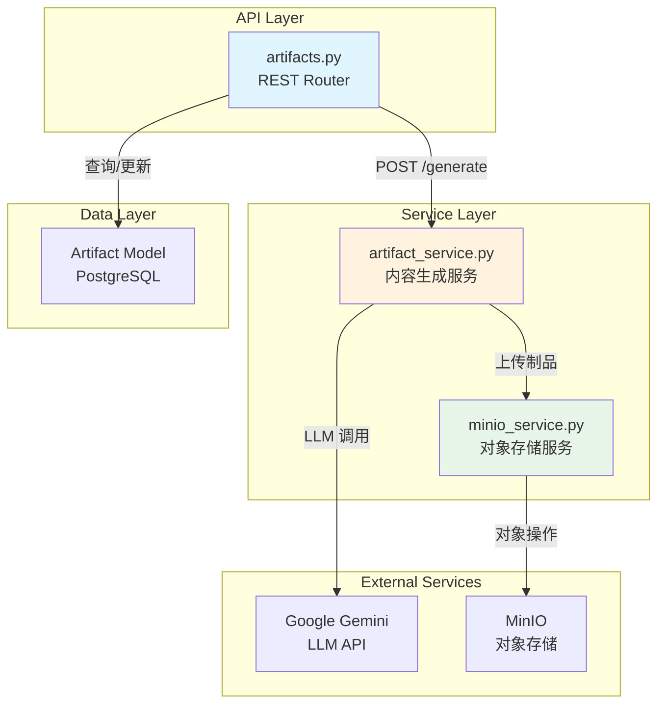
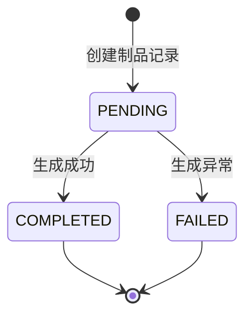
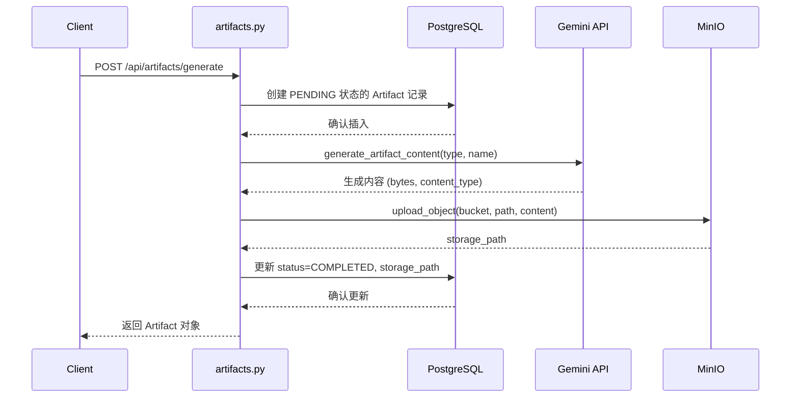
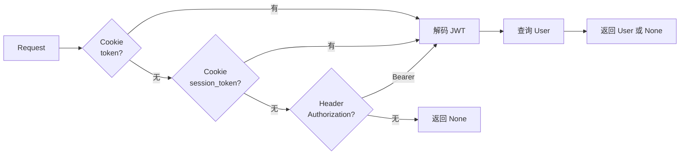

本文档详细介绍 BobCFC 平台的制品生成服务（Artifact Generation Service），涵盖服务架构、数据模型、API 接口、存储集成以及与 LLM 的协作流程。该服务通过集成 Google Gemini 模型，为用户提供智能化的多类型制品内容生成能力。

## 服务架构概述

制品生成服务采用典型的分层架构设计，将内容生成、状态管理和对象存储解耦为独立模块。



### 核心组件职责

| 组件 | 文件路径 | 职责描述 |
|------|----------|----------|
| REST 路由 | [artifacts.py](backend/app/api/artifacts.py#L1-L95) | 处理 HTTP 请求、认证、响应格式化 |
| 生成服务 | [artifact_service.py](backend/app/services/artifact_service.py#L1-L51) | 调用 LLM 生成制品内容 |
| 存储服务 | [minio_service.py](backend/app/services/minio_service.py#L1-L48) | MinIO 对象存储操作封装 |

Sources: [artifacts.py](backend/app/api/artifacts.py#L1-L95), [artifact_service.py](backend/app/services/artifact_service.py#L1-L51), [minio_service.py](backend/app/services/minio_service.py#L1-L48)

## 数据模型设计

### Artifact 实体定义

制品数据模型继承自 [Base](backend/app/models/base.py#L1-L21) 基类，并混入 TimestampMixin 实现自动时间戳管理。

```python
class Artifact(Base, TimestampMixin):
    __tablename__ = "artifacts"
    
    session_id = Column(String(36), nullable=False, index=True)
    name = Column(String(500), nullable=False)
    type = Column(String(100), nullable=False)
    status = Column(String(20), nullable=False, default="PENDING")
    storage_path = Column(String(1000), nullable=True)
```

Sources: [artifact.py](backend/app/models/artifact.py#L1-L17)

### 状态机设计

制品状态流转遵循有限状态机模式，通过 CheckConstraint 确保数据完整性：



| 状态 | 含义 | 触发时机 |
|------|------|----------|
| `PENDING` | 待处理 | 调用 `/api/artifacts/generate` 时 |
| `COMPLETED` | 已完成 | 内容生成成功并上传至 MinIO |
| `FAILED` | 失败 | 异常捕获时更新状态 |

Sources: [artifact.py](backend/app/models/artifact.py#L14-L16)

### 字段设计说明

- **id**: UUID v4 主键，由 TimestampMixin 的 id 字段提供
- **session_id**: 关联会话标识，用于按会话聚合制品
- **name**: 制品名称，最大长度 500 字符
- **type**: 制品类型（PPT、AUDIO、SUMMARY 等）
- **status**: 状态枚举，受数据库约束保护
- **storage_path**: MinIO 存储路径，格式为 `{type}/{artifact_id}/{name}.txt`

Sources: [base.py](backend/app/models/base.py#L12-L20)

## API 接口规范

### 接口概览

| 方法 | 路径 | 功能 | 认证要求 |
|------|------|------|----------|
| GET | `/api/artifacts` | 列出当前用户的所有制品 | 可选，未认证返回空数组 |
| POST | `/api/artifacts/generate` | 创建并生成新制品 | 必需，未认证返回 401 |

Sources: [artifacts.py](backend/app/api/artifacts.py#L14-L94)

### GET /api/artifacts

获取当前认证用户的所有制品列表，按创建时间倒序排列。

**请求示例**：
```http
GET /api/artifacts HTTP/1.1
Cookie: token=<jwt_token>
```

**响应格式**：
```json
[
  {
    "id": "550e8400-e29b-41d4-a716-446655440000",
    "sessionId": "user-123",
    "name": "项目汇报 PPT",
    "type": "PPT",
    "status": "COMPLETED",
    "createdAt": "2024-01-15T10:30:00+00:00",
    "storagePath": "PPT/550e8400.../项目汇报_PPT.txt"
  }
]
```

Sources: [artifacts.py](backend/app/api/artifacts.py#L19-L42)

### POST /api/artifacts/generate

创建制品生成任务，同步执行内容生成和上传。

**请求格式**：
```json
{
  "type": "PPT",
  "sessionId": "user-123",
  "name": "项目汇报 PPT"
}
```

**请求参数说明**：

| 参数 | 类型 | 必填 | 默认值 | 说明 |
|------|------|------|--------|------|
| type | string | 是 | - | 制品类型：PPT、AUDIO、SUMMARY |
| sessionId | string | 否 | 当前用户 ID | 关联会话标识 |
| name | string | 否 | `Generated {type}` | 制品名称 |

**完整处理流程**：



Sources: [artifacts.py](backend/app/api/artifacts.py#L45-L94)

## LLM 集成实现

### 生成服务核心逻辑

`generate_artifact_content` 函数是制品生成的核心，采用 LangChain 的异步调用模式：

```python
async def generate_artifact_content(artifact_type: str, name: str) -> tuple[bytes, str]:
    from langchain_google_genai import ChatGoogleGenerativeAI
    llm = ChatGoogleGenerativeAI(model="gemini-2.0-flash", google_api_key=settings.gemini_api_key)
```

Sources: [artifact_service.py](backend/app/services/artifact_service.py#L8-L18)

### 支持的制品类型

| 类型 | Prompt 策略 | 输出格式 |
|------|-------------|----------|
| PPT | 生成幻灯片大纲，包含标题和要点 | 纯文本，`---` 分隔幻灯片 |
| AUDIO | 生成语音播报脚本 | 纯文本，适合 TTS 处理 |
| SUMMARY | 生成结构化摘要文档 | 分段纯文本 |

**PPT 类型示例 Prompt**：
```
Create a PowerPoint presentation outline for '{name}'. 
Return it as a structured text outline with slide titles and bullet points. 
Format each slide with --- separator.
```

Sources: [artifact_service.py](backend/app/services/artifact_service.py#L20-L28)

### 模型配置

```python
llm = ChatGoogleGenerativeAI(
    model="gemini-2.0-flash",  # 使用 Flash 变体平衡速度与质量
    google_api_key=settings.gemini_api_key
)
```

Gemini API Key 通过环境变量 `GEMINI_API_KEY` 配置：

Sources: [config.py](backend/app/config.py#L53-L54)

## 对象存储集成

### MinIO 服务封装

MinIO 服务采用单例模式初始化，封装了桶操作和对象操作：

```python
def get_minio() -> Minio:
    global _client
    if _client is None:
        _client = Minio(
            settings.minio_endpoint,
            access_key=settings.minio_access_key,
            secret_key=settings.minio_secret_key,
            secure=settings.minio_secure,
        )
    return _client
```

Sources: [minio_service.py](backend/app/services/minio_service.py#L13-L23)

### 核心操作函数

| 函数 | 功能 | 返回值 |
|------|------|--------|
| `ensure_bucket(bucket_name)` | 确保桶存在，不存在则创建 | None |
| `upload_object(bucket, object_name, data, content_type)` | 上传对象 | `bucket/object_name` 路径 |
| `get_presigned_url(bucket, object_name, expires_seconds)` | 生成预签名 URL | 临时访问 URL |
| `download_object(bucket, object_name)` | 下载对象内容 | bytes 数据 |

Sources: [minio_service.py](backend/app/services/minio_service.py#L26-L47)

### 制品存储路径规则

制品上传时采用标准化路径格式：

```python
object_path = f"{artifact_type}/{artifact.id}/{name.replace(' ', '_')}.txt"
upload_object("artifacts", object_path, content_bytes, content_type)
```

**路径示例**：
```
artifacts/PPT/550e8400-e29b-41d4-a716-446655440000/项目汇报_PPT.txt
artifacts/AUDIO/660e8400-e29b-41d4-a716-446655440001/产品介绍音频.txt
```

Sources: [artifacts.py](backend/app/api/artifacts.py#L71-L73)

## 认证与授权

### 认证流程

服务通过 Cookie 中的 JWT Token 进行身份验证，支持多种 Token 来源：



Sources: [dependencies.py](backend/app/dependencies.py#L14-L41)

### 权限控制策略

| 接口 | 认证策略 | 说明 |
|------|----------|------|
| GET /api/artifacts | 可选认证 | 未认证返回空数组，不抛出异常 |
| POST /api/artifacts/generate | 强制认证 | 未认证抛出 401 HTTPException |

这种差异设计允许制品列表接口作为公开预览端点，同时保护生成操作。

Sources: [artifacts.py](backend/app/api/artifacts.py#L24-L25), [artifacts.py](backend/app/api/artifacts.py#L51-L52)

## 配置管理

### 相关环境变量

所有配置通过 Pydantic Settings 管理，支持 `.env` 文件：

| 变量名 | 默认值 | 说明 |
|--------|--------|------|
| `GEMINI_API_KEY` | 空 | Google Gemini API 密钥 |
| `MINIO_ENDPOINT` | localhost:9000 | MinIO 服务地址 |
| `MINIO_ACCESS_KEY` | minioadmin | MinIO 访问密钥 |
| `MINIO_SECRET_KEY` | minioadmin | MinIO 私钥 |
| `MINIO_SECURE` | false | 是否启用 HTTPS |

Sources: [config.py](backend/app/config.py#L19-L24), [config.py](backend/app/config.py#L53-L54)

## 错误处理机制

### 生成流程异常捕获

```python
try:
    content_bytes, content_type = await generate_artifact_content(artifact_type, name)
    upload_object("artifacts", object_path, content_bytes, content_type)
    artifact.status = "COMPLETED"
    artifact.storage_path = object_path
except Exception as e:
    artifact.status = "FAILED"
finally:
    await db.commit()
```

关键设计点：
- 异常被吞没后仅标记状态为 FAILED，保留制品记录供后续排查
- 使用 finally 确保数据库提交
- 返回给客户端的响应包含完整状态信息

Sources: [artifacts.py](backend/app/api/artifacts.py#L68-L81)

## 后续阅读

- [对象存储服务](15-dui-xiang-cun-chu-fu-wu)：深入了解 MinIO 集成细节
- [消息队列集成](16-xiao-xi-dui-lie-ji-cheng)：了解异步制品生成的演进方向
- [API 端点参考](17-api-duan-dian-can-kao)：完整的 REST API 文档
- [聊天服务实现](13-liao-tian-fu-wu-shi-xian)：了解与制品服务的协作模式