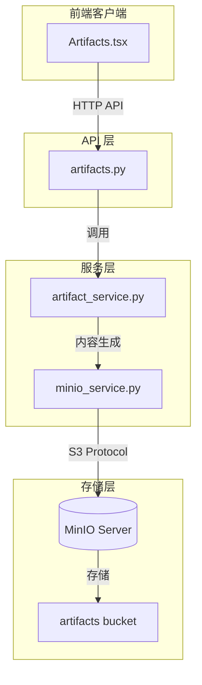

本文档介绍 BobCFC 平台中对象存储服务的架构设计与实现细节。该服务基于 MinIO 构建，为制品生成功能提供可扩展的二进制存储能力，支持文件上传、预签名 URL 生成和对象下载等核心操作。

## 技术选型：MinIO 对象存储

平台选择 MinIO 作为对象存储解决方案，原因在于其与 AWS S3 API 的高度兼容性、轻量级部署特性以及出色的性能表现。相比传统文件系统的目录结构，MinIO 的对象存储模型更适合管理制品这类无结构或半结构化的二进制数据。MinIO 作为自托管方案，可在私有环境中提供与云服务等价的功能，同时保持数据的完全控制权。

Sources: [backend/CLAUDE.md](backend/CLAUDE.md#L24-L24), [backend/docker-compose.yml](backend/docker-compose.yml#L62-L72)

## 服务架构

对象存储服务采用分层架构设计，从底层到顶层依次为：MinIO 客户端封装层、业务服务层和 API 接口层。这种分层确保了存储逻辑与业务逻辑的分离，便于测试和维护。



Sources: [backend/app/services/minio_service.py](backend/app/services/minio_service.py#L1-L48), [backend/app/api/artifacts.py](backend/app/api/artifacts.py#L1-L95)

## MinIO 服务实现

`minio_service.py` 模块提供了对 MinIO 客户端的封装，采用单例模式管理连接实例，避免重复创建开销。

### 客户端初始化

```python
def get_minio() -> Minio:
    global _client
    if _client is None:
        settings = get_settings()
        _client = Minio(
            settings.minio_endpoint,
            access_key=settings.minio_access_key,
            secret_key=settings.minio_secret_key,
            secure=settings.minio_secure,
        )
    return _client
```

单例模式确保在整个应用生命周期内只有一个活跃的 MinIO 客户端连接。当 `_client` 为 `None` 时，函数从配置中读取连接参数并初始化客户端。`get_settings()` 函数使用 `@lru_cache` 装饰器缓存配置实例，减少重复的环境变量解析开销。

Sources: [backend/app/services/minio_service.py](backend/app/services/minio_service.py#L10-L23), [backend/app/config.py](backend/app/config.py#L72-L74)

### 存储桶管理

存储桶（Bucket）是 MinIO 中的顶级命名空间，用于组织和隔离不同类型的对象。`ensure_bucket` 函数确保所需桶存在：

```python
def ensure_bucket(bucket_name: str = "artifacts"):
    client = get_minio()
    if not client.bucket_exists(bucket_name):
        client.make_bucket(bucket_name)
        logger.info(f"Created bucket: {bucket_name}")
```

该函数首先检查桶是否存在，若不存在则创建。默认值 `"artifacts"` 与配置中的 `minio_bucket` 参数保持一致。这种延迟创建策略允许应用在新环境中自动初始化存储结构。

Sources: [backend/app/services/minio_service.py](backend/app/services/minio_service.py#L26-L31)

### 对象上传

`upload_object` 函数负责将二进制数据上传至指定桶：

```python
def upload_object(bucket: str, object_name: str, data: bytes, content_type: str = "application/octet-stream") -> str:
    client = get_minio()
    client.put_object(bucket, object_name, BytesIO(data), len(data), content_type=content_type)
    return f"{bucket}/{object_name}"
```

函数接收字节数据、`BytesIO` 包装后的流对象、数据长度和 MIME 类型。返回值为对象的完整路径标识符，可直接存储在数据库中用于后续引用。`object_name` 的命名遵循 `{type}/{artifact_id}/{sanitized_name}.txt` 的层级结构，便于组织和检索。

Sources: [backend/app/services/minio_service.py](backend/app/services/minio_service.py#L33-L36), [backend/app/api/artifacts.py](backend/app/api/artifacts.py#L70-L73)

### 预签名 URL 生成

对于需要临时访问权限的场景，`get_presigned_url` 函数生成带有时效性的下载链接：

```python
def get_presigned_url(bucket: str, object_name: str, expires_seconds: int = 3600) -> str:
    client = get_minio()
    return client.presigned_get_object(bucket, object_name, expires=expires_seconds)
```

默认过期时间为 3600 秒（1 小时）。客户端可直接使用该 URL 下载，无需携带认证凭证，适用于前端直接访问存储对象的场景。

Sources: [backend/app/services/minio_service.py](backend/app/services/minio_service.py#L39-L41)

### 对象下载

`download_object` 函数从 MinIO 读取对象内容：

```python
def download_object(bucket: str, object_name: str) -> bytes:
    client = get_minio()
    response = client.get_object(bucket, object_name)
    return response.read()
```

函数返回原始字节数据，可直接用于响应体或进一步处理。底层使用流式接口，避免大文件场景下的内存溢出问题。

Sources: [backend/app/services/minio_service.py](backend/app/services/minio_service.py#L44-L47)

## 配置参数

MinIO 相关配置通过环境变量注入，采用 pydantic-settings 进行类型化管理和自动验证。

| 参数 | 环境变量 | 默认值 | 说明 |
|------|----------|--------|------|
| `minio_endpoint` | `MINIO_ENDPOINT` | `localhost:9000` | MinIO 服务器地址 |
| `minio_access_key` | `MINIO_ACCESS_KEY` | `minioadmin` | 访问密钥 |
| `minio_secret_key` | `MINIO_SECRET_KEY` | `minioadmin` | 秘密密钥 |
| `minio_bucket` | `MINIO_BUCKET` | `artifacts` | 默认存储桶名称 |
| `minio_secure` | `MINIO_SECURE` | `false` | 是否启用 HTTPS |

Sources: [backend/app/config.py](backend/app/config.py#L19-L24), [backend/.env.example](backend/.env.example#L11-L16)

## Docker 部署

平台通过 Docker Compose 管理 MinIO 实例，与 PostgreSQL、Redis 等基础设施服务协同部署：

```yaml
minio:
  image: minio/minio:latest
  command: server /data --console-address ":9001"
  ports:
    - "9000:9000"
    - "9001:9001"
  environment:
    MINIO_ROOT_USER: minioadmin
    MINIO_ROOT_PASSWORD: minioadmin
  volumes:
    - miniodata:/data
```

MinIO 同时暴露两个端口：`9000` 用于 API 通信，`9001` 用于管理控制台。数据持久化通过 Docker 卷 `miniodata` 实现。生产环境中应修改默认凭证并配置 TLS。

Sources: [backend/docker-compose.yml](backend/docker-compose.yml#L62-L72)

## 制品存储集成

制品（Artifact）是平台生成的内容产物，包括 PPT 摘要、音频解说和文档概要等类型。这些制品生成后存储于 MinIO，并通过数据库记录元数据。

### 数据模型

`Artifact` 模型定义如下：

```python
class Artifact(Base, TimestampMixin):
    __tablename__ = "artifacts"

    session_id = Column(String(36), nullable=False, index=True)
    name = Column(String(500), nullable=False)
    type = Column(String(100), nullable=False)
    status = Column(String(20), nullable=False, default="PENDING")
    storage_path = Column(String(1000), nullable=True)

    __table_args__ = (
        CheckConstraint("status IN ('PENDING', 'COMPLETED', 'FAILED')", name="ck_artifact_status"),
    )
```

关键设计说明：
- `session_id` 建立制品与用户会话的关联，便于按会话聚合
- `storage_path` 存储 MinIO 中的对象路径，上传成功后填充
- 状态机通过 CheckConstraint 确保只允许三种有效状态

Sources: [backend/app/models/artifact.py](backend/app/models/artifact.py#L1-L17), [backend/app/models/base.py](backend/app/models/base.py#L1-L21)

### 制品生成流程

制品生成 API 整合内容生成与存储上传两个阶段：

```python
@router.post("/api/artifacts/generate")
async def generate_artifact(body: dict, current_user: User, db: AsyncSession):
    # 1. 创建待处理记录
    artifact = Artifact(id=str(uuid4()), session_id=session_id, name=name, type=artifact_type, status="PENDING")
    db.add(artifact)
    await db.commit()

    # 2. 生成内容并上传
    try:
        ensure_bucket()
        content_bytes, content_type = await generate_artifact_content(artifact_type, name)
        object_path = f"{artifact_type}/{artifact.id}/{name.replace(' ', '_')}.txt"
        upload_object("artifacts", object_path, content_bytes, content_type)

        artifact.status = "COMPLETED"
        artifact.storage_path = object_path
        await db.commit()
    except Exception as e:
        artifact.status = "FAILED"
        await db.commit()
```

流程分为三个阶段：`PENDING` 表示创建记录、`COMPLETED` 表示成功上传、`FAILED` 表示处理异常。内容生成由 `artifact_service.py` 调用 Gemini API 完成，返回字节数据后上传至 MinIO。

Sources: [backend/app/api/artifacts.py](backend/app/api/artifacts.py#L45-L94), [backend/app/services/artifact_service.py](backend/app/services/artifact_service.py#L1-L51)

## 前端集成

前端通过标准 Fetch API 与制品服务交互：

```tsx
// 列表获取
const response = await fetch(`${API_BASE}/api/artifacts`, { credentials: 'include' });
const artifacts = await response.json();

// 类型过滤
const filtered = filter === 'ALL' 
    ? artifacts 
    : artifacts.filter(a => a.type === filter);
```

前端维护制品状态显示，包括类型图标映射、状态指示和下载操作入口。`credentials: 'include'` 确保 Cookie 认证信息随请求发送。

Sources: [frontend/src/components/Artifacts.tsx](frontend/src/components/Artifacts.tsx#L1-L102), [frontend/src/lib/api.ts](frontend/src/lib/api.ts#L1-L4)

## 扩展方向

当前实现已覆盖基础的对象存储能力，未来可考虑以下增强：

| 方向 | 说明 |
|------|------|
| **异步生成** | 通过 RocketMQ 将制品生成任务移至后台worker，避免 HTTP 请求超时 |
| **直接下载** | 新增 `/api/artifacts/{id}/download` 端点，生成预签名URL供前端跳转 |
| **生命周期策略** | 配置桶策略自动清理过期制品，优化存储成本 |
| **分片上传** | 支持大文件场景下的断点续传 |

Sources: [backend/CLAUDE.md](backend/CLAUDE.md#L22-L22)

## 下一步

- 了解制品生成服务的完整实现： [制品生成服务](14-zhi-pin-sheng-cheng-fu-wu)
- 查看消息队列集成设计： [消息队列集成](16-xiao-xi-dui-lie-ji-cheng)
- 参考 API 端点完整列表： [API 端点参考](17-api-duan-dian-can-kao)