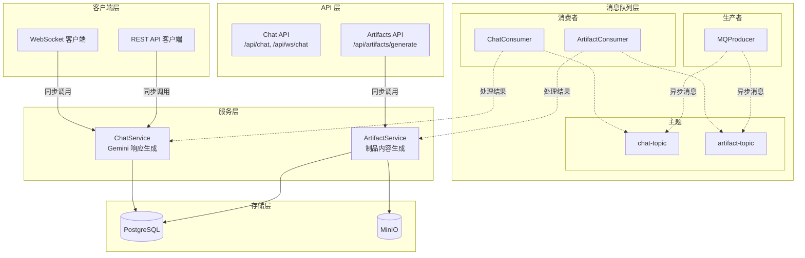
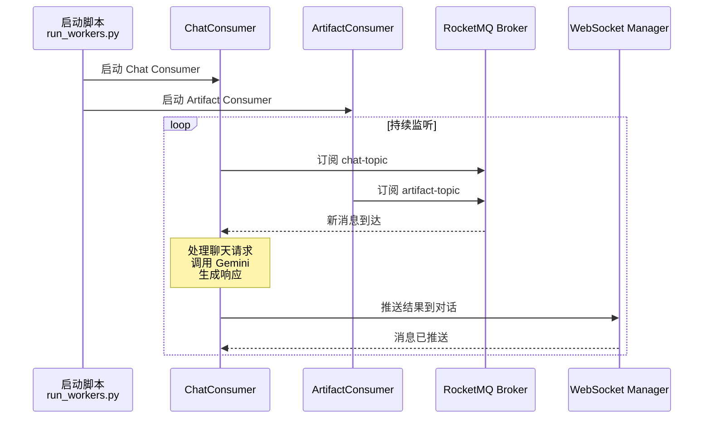

本文档介绍 BobCFC 平台中消息队列（Message Queue）的架构设计与实现集成。作为平台异步处理的核心基础设施，消息队列主要用于解耦聊天服务和制品生成任务的处理流程。

## 技术选型

BobCFC 采用 **Apache RocketMQ 5.3.1** 作为消息队列中间件。RocketMQ 是阿里巴巴开源的分布式消息系统，具有高吞吐量、低延迟、高可用等特点，适合 AI 平台的异步任务处理场景。

消息队列在项目中的定位是**可选增强组件**——当前实现中，聊天和制品生成均以同步方式直接处理，消息队列的基础设施已就绪，但尚未激活。这种设计确保了系统在任何情况下都能正常运行。

Sources: [CLAUDE.md](backend/CLAUDE.md#L8)
Sources: [docker-compose.yml](backend/docker-compose.yml#L26-L50)

## 架构设计

### 整体消息流架构

消息队列采用 **Producer-Consumer** 模式，主要服务于两个核心场景：



> **图注**：实线表示当前同步处理路径，虚线表示消息队列异步处理路径（待激活）

### 消费者 Worker 架构

消费者以独立进程运行，通过 `scripts/run_workers.py` 脚本启动：



Sources: [run_workers.py](backend/scripts/run_workers.py#L1-L50)
Sources: [chat_consumer.py](backend/app/mq/chat_consumer.py#L1-L29)
Sources: [artifact_consumer.py](backend/app/mq/artifact_consumer.py#L1-L28)

## 核心组件实现

### MQProducer 生产者

`MQProducer` 类封装了 RocketMQ 生产者的核心功能，提供异步消息发送能力：

```python
class MQProducer:
    def __init__(self, namesrv: str):
        self._namesrv = namesrv
        self._producer = None

    async def send(self, topic: str, message: dict, delay_level: int = 0):
        # 消息序列化
        body = json.dumps(message).encode("utf-8")
        msg = RMQMessage(topic, body)
        # 支持延迟消息
        if delay_level > 0:
            msg.delay_time_level = delay_level
        # 同步发送
        result = self._producer.send_sync(msg)
```

关键特性：

| 特性 | 说明 |
|------|------|
| 懒加载初始化 | 生产者在 `start()` 时才创建连接 |
| 优雅降级 | 启动失败时不中断主程序 |
| 延迟消息 | 支持设置 `delay_level` 实现定时任务 |
| 全局单例 | 通过 `init_mq()` / `close_mq()` 管理生命周期 |

Sources: [producer.py](backend/app/mq/producer.py#L1-L66)

### 消息主题定义

平台定义了两个核心主题：

| 主题名称 | 用途 | 消息内容 |
|----------|------|----------|
| `chat-topic` | 聊天消息处理 | `{conversationId, message, userId}` |
| `artifact-topic` | 制品生成任务 | `{artifactId, type, name, sessionId}` |

Sources: [chat_consumer.py](backend/app/mq/chat_consumer.py#L10)
Sources: [artifacts.py](backend/app/api/artifacts.py#L13)

## 配置管理

### 环境变量配置

消息队列相关的环境变量在 `config.py` 中定义：

| 变量名 | 默认值 | 说明 |
|--------|--------|------|
| `ROCKETMQ_NAMESRV` | `localhost:9876` | RocketMQ NameServer 地址 |
| `ROCKETMQ_GROUP` | `backend-group` | 消费者组名称 |

Sources: [config.py](backend/app/config.py#L14-L16)

### Docker Compose 基础设施

消息队列的完整 Docker Compose 配置：

```yaml
rocketmq-namesrv:
  image: apache/rocketmq:5.3.1
  command: sh mqnamesrv
  ports:
    - "9876:9876"
  healthcheck:
    test: ["CMD-SHELL", "nc -z localhost 9876"]

rocketmq-broker:
  image: apache/rocketmq:5.3.1
  command: sh mqbroker -n rocketmq-namesrv:9876 --enable-proxy
  ports:
    - "10909:10909"
    - "10911:10911"
    - "8081:8081"      # Proxy 端口（gRPC）
  depends_on:
    rocketmq-namesrv:
      condition: service_healthy
```

> **注意**：`--enable-proxy` 参数开启了 RocketMQ 5.x 的 Proxy 模式，提供 gRPC 协议支持，便于与现代应用集成。

Sources: [docker-compose.yml](backend/docker-compose.yml#L26-L50)

### Workers 服务配置

独立的 Worker 服务用于运行消费者：

```yaml
workers:
  build: .
  env_file: .env
  depends_on:
    postgres: { condition: service_healthy }
    redis: { condition: service_healthy }
    rocketmq-broker: { condition: service_healthy }
    minio: { condition: service_started }
  command: python scripts/run_workers.py
  profiles:
    - workers   # 仅通过 docker compose --profile workers 启动
```

Sources: [docker-compose.yml](backend/docker-compose.yml#L78-L90)

## 当前实现状态

### 同步处理路径（已激活）

当前所有请求均通过同步方式处理：

**聊天服务流程**：
```
POST /api/chat 或 WebSocket /api/ws/chat
    ↓
chat_service.generate_response()
    ↓
LangChain + Gemini API 调用
    ↓
数据库写入 + 响应返回
```

**制品生成流程**：
```
POST /api/artifacts/generate
    ↓
创建 PENDING 状态的 Artifact 记录
    ↓
artifact_service.generate_artifact_content()
    ↓
MinIO 上传 + 状态更新为 COMPLETED/FAILED
```

Sources: [chat_service.py](backend/app/services/chat_service.py#L1-L138)
Sources: [artifacts.py](backend/app/api/artifacts.py#L43-L95)

### 消息队列路径（待激活）

消费者模块目前为占位实现，仅包含保持连接的健康检查逻辑：

```python
async def run_chat_consumer():
    logger.info("Chat consumer starting (placeholder - requires RocketMQ broker)")
    try:
        from rocketmq.client import PushConsumer
    except ImportError:
        logger.warning("rocketmq-client-python not installed, chat consumer disabled")
        return

    while True:
        await asyncio.sleep(60)  # Keep alive
```

Sources: [chat_consumer.py](backend/app/mq/chat_consumer.py#L14-L27)

## 优雅降级机制

消息队列组件实现了完整的优雅降级策略，确保在 RocketMQ 不可用时系统仍能正常运行：

| 组件 | 降级行为 |
|------|----------|
| `MQProducer` | 初始化失败时设置 `self._producer = None`，`send()` 方法跳过发送并记录警告 |
| `ChatConsumer` | 依赖项导入失败时直接返回，不抛出异常 |
| `ArtifactConsumer` | 同上 |
| `run_workers.py` | 异常时任务取消，不会导致进程崩溃 |

这种设计使消息队列成为**可选的增强组件**，系统功能不依赖于其可用性。

Sources: [producer.py](backend/app/mq/producer.py#L21-L26)
Sources: [chat_consumer.py](backend/app/mq/chat_consumer.py#L14-L17)

## 依赖关系

### Python 依赖

消息队列客户端通过 `pyproject.toml` 管理：

```toml
dependencies = [
    "rocketmq-client-python>=2.0.0",
    # ... 其他依赖
]
```

Sources: [pyproject.toml](backend/pyproject.toml#L27)

### 系统依赖

Docker Compose 自动管理 RocketMQ 所需的 JVM 运行时，通过环境变量控制内存配置：

```yaml
environment:
  JAVA_OPT_EXT: "-Xms256m -Xmx256m"  # NameServer
  JAVA_OPT_EXT: "-Xms256m -Xmx512m"  # Broker
```

Sources: [docker-compose.yml](backend/docker-compose.yml#L36-L37)
Sources: [docker-compose.yml](backend/docker-compose.yml#L47)

## 扩展阅读

- [聊天服务实现](13-liao-tian-fu-wu-shi-xian)：了解聊天功能的详细设计与同步处理逻辑
- [制品生成服务](14-zhi-pin-sheng-cheng-fu-wu)：了解制品生成服务的架构与存储集成
- [WebSocket 实时通信](20-websocket-shi-shi-tong-xin)：了解实时通信机制与 WebSocket 管理器设计
- [Docker Compose 部署](6-docker-compose-bu-shu)：了解完整的服务部署配置