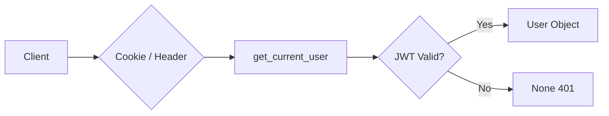

本文档详细描述 BobCFC AI Agent 平台后端 API 的完整端点清单、请求/响应格式、认证机制及使用场景。该平台基于 FastAPI 构建，采用 RESTful API 设计风格，同时支持 WebSocket 实时通信。

## 认证机制概述

平台支持两种认证模式：**演示模式**（JWT Cookie）和 **OIDC 模式**（Microsoft Entra ID / ADFS）。所有需要认证的端点通过 `get_current_user` 依赖注入解析用户身份，支持三种认证凭证传递方式：Cookie 中的 `token` 或 `session_token`、Authorization Header 中的 Bearer Token。



认证依赖注入定义于 `dependencies.py`，核心逻辑如下：`get_current_user` 函数首先尝试从 Cookie 获取 JWT token，若无则回退至 Authorization Header，最后验证 token 并从数据库加载用户信息。管理员专用端点使用 `require_admin` 依赖确保用户角色为 `SUPER_ADMIN`。Sources: [backend/app/dependencies.py](backend/app/dependencies.py#L1-L55)

## 认证相关端点

认证路由前缀为 `/api/auth`，提供用户认证状态查询、登录、登出及 OIDC 回调处理功能。

| 端点 | 方法 | 认证 | 说明 |
|------|------|------|------|
| `/api/auth/me` | GET | 可选 | 获取当前用户信息 |
| `/api/auth/config` | GET | 无 | 获取认证配置 |
| `/api/auth/login` | GET/POST | 无 | 登录入口 |
| `/api/auth/callback/microsoft` | GET | 无 | Entra ID 回调 |
| `/api/auth/callback/adfs` | GET | 无 | ADFS 回调 |
| `/api/auth/logout` | POST | 可选 | 登出 |

### 获取当前用户

**GET `/api/auth/me`**

返回当前认证用户的信息，若未认证则返回 `null`。

**响应示例：**

```json
{
  "id": "uuid-string",
  "username": "admin",
  "role": "SUPER_ADMIN",
  "email": "admin@example.com",
  "allowedAgentIds": ["agent-1", "agent-2"]
}
```

`allowedAgentIds` 字段表示该用户有权限访问的 Agent 列表，普通用户通过 `user_allowed_agents` 关联表配置。在演示模式下，该端点会返回预设的超级管理员用户。Sources: [backend/app/api/auth.py](backend/app/api/auth.py#L16-L57)

### 认证配置查询

**GET `/api/auth/config`**

前端据此判断采用何种登录方式。

**响应示例：**

```json
{
  "oidcEnabled": true,
  "oidcProvider": "entra"
}
```

当 `oidcEnabled` 为 `false` 时，平台运行在演示模式，使用 JWT Cookie 认证。Sources: [backend/app/api/auth.py](backend/app/api/auth.py#L59-L67)

### 登录流程

**GET `/api/auth/login`**

演示模式下直接完成登录并重定向至前端首页；OIDC 模式下重定向至身份提供商授权页面。

**POST `/api/auth/login`**

提供与 GET 相同的功能，返回格式为：

- 演示模式：`{"status": "ok"}`
- OIDC 模式：`{"authUrl": "https://login.microsoftonline.com/..."}`

两种 HTTP 方法均支持，以适配不同前端场景。Sources: [backend/app/api/auth.py](backend/app/api/auth.py#L69-L113)

### OIDC 回调处理

**GET `/api/auth/callback/microsoft`** 和 **GET `/api/auth/callback/adfs`**

处理来自身份提供商的授权回调，完成用户创建/更新、OAuth Session 记录及 JWT Session Cookie 设置，最终重定向至前端。

回调处理流程：首先验证 state 参数防止 CSRF 攻击，然后通过 `handle_callback` 获取并验证 ID Token，接着调用 `map_claims_to_user` 映射 OIDC 声明至标准用户格式，最后根据角色映射规则确定用户权限级别。Sources: [backend/app/api/auth.py](backend/app/api/auth.py#L115-L240)

### 登出

**POST `/api/auth/logout`**

清除服务端 OAuth Session、删除客户端 Cookie，若配置了 OIDC 提供商则返回提供商登出 URL 供前端跳转。

响应示例：

```json
{
  "status": "ok"
}
```

或 OIDC 模式下：

```json
{
  "logoutUrl": "https://login.microsoftonline.com/common/oauth2/v2.0/logout?post_logout_redirect_uri=..."
}
```

Sources: [backend/app/api/auth.py](backend/app/api/auth.py#L369-L391)

## 用户管理端点

用户路由前缀为 `/api/users`，提供用户列表查询和更新功能。

| 端点 | 方法 | 认证 | 说明 |
|------|------|------|------|
| `/api/users` | GET | 管理员 | 获取所有用户列表 |
| `/api/users/{user_id}` | PUT | 管理员 | 更新指定用户信息 |

### 列出用户

**GET `/api/users`**

仅管理员可访问，返回所有用户及其关联的 Agent 权限列表。

**响应示例：**

```json
[
  {
    "id": "user-uuid",
    "username": "john",
    "role": "REGULAR_USER",
    "email": "john@example.com",
    "allowedAgentIds": ["agent-1"]
  }
]
```

Sources: [backend/app/api/users.py](backend/app/api/users.py#L8-L31)

### 更新用户

**PUT `/api/users/{user_id}`**

支持更新用户名、邮箱、角色及可访问的 Agent 列表。

**请求体：**

```json
{
  "username": "new_username",
  "email": "new@example.com",
  "role": "REGULAR_USER",
  "allowedAgentIds": ["agent-1", "agent-2"]
}
```

所有字段均为可选，仅更新的字段需要包含在请求体中。`allowedAgentIds` 变更时会先清空旧关联再插入新记录。Sources: [backend/app/api/users.py](backend/app/api/users.py#L33-L73)

## Agent 管理端点

Agent 路由前缀为 `/api/agents`，管理 AI Agent 的配置和权限。

| 端点 | 方法 | 认证 | 说明 |
|------|------|------|------|
| `/api/agents` | GET | 可选 | 获取 Agent 列表 |
| `/api/agents/{agent_id}` | PUT | 管理员 | 更新 Agent |

### 列出 Agent

**GET `/api/agents`**

根据用户角色和认证状态返回不同的 Agent 集合：

- **未认证**：仅返回状态为 `ACTIVE` 的 Agent
- **普通用户**：返回 `ACTIVE` 且在用户 `allowedAgentIds` 列表中的 Agent
- **超级管理员**：若带 `sidebar=true` 查询参数则返回 `ACTIVE` 的 Agent，否则返回全部

**查询参数：**

| 参数 | 类型 | 说明 |
|------|------|------|
| `sidebar` | string | 值为 `true` 时启用侧边栏模式 |

**响应示例：**

```json
[
  {
    "id": "agent-1",
    "name": "Code Assistant",
    "description": "Helps with coding tasks",
    "status": "ACTIVE",
    "skillIds": ["skill-1", "skill-2"],
    "recommendedModel": "gemini-2.0-flash"
  }
]
```

Sources: [backend/app/api/agents.py](backend/app/api/agents.py#L8-L51)

### 更新 Agent

**PUT `/api/api/agents/{agent_id}`**

仅管理员可执行，支持更新 Agent 的名称、描述、状态、技能列表及推荐模型。

**请求体：**

```json
{
  "name": "Updated Name",
  "description": "Updated description",
  "status": "ACTIVE",
  "skillIds": ["skill-1", "skill-3"],
  "recommendedModel": "gemini-pro"
}
```

Sources: [backend/app/api/agents.py](backend/app/api/agents.py#L53-L95)

## 技能端点

技能路由前缀为 `/api/skills`，提供只读的技能列表查询。

| 端点 | 方法 | 认证 | 说明 |
|------|------|------|------|
| `/api/skills` | GET | 无 | 获取所有技能列表 |

### 列出技能

**GET `/api/skills`**

无需认证，返回系统中所有可用的技能。

**响应示例：**

```json
[
  {
    "id": "skill-1",
    "name": "Web Search",
    "description": "Search the web for information",
    "type": "web_search",
    "status": "ACTIVE"
  }
]
```

Sources: [backend/app/api/skills.py](backend/app/api/skills.py#L1-L25)

## 对话管理端点

对话路由前缀为 `/api/conversations`，管理用户与 Agent 之间的多轮对话。

| 端点 | 方法 | 认证 | 说明 |
|------|------|------|------|
| `/api/conversations` | GET | 必须 | 获取用户对话列表 |
| `/api/conversations/{conv_id}` | GET | 必须 | 获取对话详情 |
| `/api/conversations` | POST | 必须 | 创建新对话 |
| `/api/conversations/{conv_id}` | PATCH | 必须 | 更新对话 |

### 列出对话

**GET `/api/conversations`**

返回当前用户创建的所有对话，按更新时间倒序排列。为优化侧边栏加载性能，返回的对话对象不包含消息列表。

**响应示例：**

```json
[
  {
    "id": "conv-uuid",
    "userId": "user-uuid",
    "agentId": "agent-1",
    "messages": [],
    "title": "My Conversation",
    "modelId": "gemini-2.0-flash"
  }
]
```

Sources: [backend/app/api/conversations.py](backend/app/api/conversations.py#L36-L56)

### 获取对话详情

**GET `/api/conversations/{conv_id}`**

返回包含完整消息历史的对话对象，消息按时间戳升序排列。

**响应示例：**

```json
{
  "id": "conv-uuid",
  "userId": "user-uuid",
  "agentId": "agent-1",
  "messages": [
    {
      "role": "user",
      "content": "Hello, help me with coding",
      "timestamp": "2024-01-15T10:30:00Z"
    },
    {
      "role": "assistant",
      "content": "Sure, what do you need help with?",
      "timestamp": "2024-01-15T10:30:05Z"
    }
  ],
  "title": "Coding Help",
  "modelId": "gemini-2.0-flash"
}
```

Sources: [backend/app/api/conversations.py](backend/app/api/conversations.py#L58-L77)

### 创建对话

**POST `/api/conversations`**

创建新的对话会话，若未指定模型则使用 Agent 的推荐模型或默认模型 `gemini-2.0-flash`。

**请求体：**

```json
{
  "agentId": "agent-1",
  "title": "New Chat",
  "modelId": "gemini-pro"
}
```

**响应：** 返回新创建的对话对象（包含空消息列表）。Sources: [backend/app/api/conversations.py](backend/app/api/conversations.py#L79-L110)

### 更新对话

**PATCH `/api/conversations/{conv_id}`**

目前仅支持更新对话使用的模型。

**请求体：**

```json
{
  "modelId": "gemini-pro"
}
```

Sources: [backend/app/api/conversations.py](backend/app/api/conversations.py#L112-L139)

## 聊天端点

### HTTP 聊天

**POST `/api/chat`**

发送单条消息并获取 AI 回复。

**请求体：**

```json
{
  "conversationId": "conv-uuid",
  "message": "Help me write a Python function"
}
```

**响应示例：**

```json
{
  "content": "Here's a Python function for...",
  "conversation": {
    "id": "conv-uuid",
    "userId": "user-uuid",
    "agentId": "agent-1",
    "messages": [...],
    "title": "My Chat",
    "modelId": "gemini-2.0-flash"
  }
}
```

Sources: [backend/app/api/chat.py](backend/app/api/chat.py#L1-L34)

### WebSocket 实时聊天

**WS `/api/ws/chat`**

提供基于 WebSocket 的实时双向通信，适用于需要流式响应的场景。

**客户端发送：**

```json
{
  "conversationId": "conv-uuid",
  "message": "Hello"
}
```

**服务端响应：**

```json
{
  "content": "Hello! How can I help you?",
  "conversation": {...}
}
```

WebSocket 连接管理通过 `ws_manager` 实现，支持同一用户在多个会话间的连接切换。当 `conversationId` 发生变化时会自动断开旧会话的连接并加入新会话。Sources: [backend/app/api/chat_ws.py](backend/app/api/chat_ws.py#L1-L49)

## 制品生成端点

制品路由前缀为 `/api/artifacts`，管理 AI 生成的文档、代码等制品的存储和检索。

| 端点 | 方法 | 认证 | 说明 |
|------|------|------|------|
| `/api/artifacts` | GET | 可选 | 获取制品列表 |
| `/api/artifacts/generate` | POST | 必须 | 生成新制品 |

### 列出制品

**GET `/api/artifacts`**

返回当前用户的所有制品，按创建时间倒序排列。

**响应示例：**

```json
[
  {
    "id": "artifact-uuid",
    "sessionId": "session-uuid",
    "name": "Generated Document",
    "type": "document",
    "status": "COMPLETED",
    "createdAt": "2024-01-15T10:30:00Z",
    "storagePath": "document/artifact-uuid/Generated_Document.txt"
  }
]
```

**状态说明：**

- `PENDING`：生成中
- `COMPLETED`：已完成
- `FAILED`：生成失败

Sources: [backend/app/api/artifacts.py](backend/app/api/artifacts.py#L17-L46)

### 生成制品

**POST `/api/artifacts/generate`**

基于指定类型生成制品内容并存储至 MinIO 对象存储。

**请求体：**

```json
{
  "type": "document",
  "sessionId": "session-uuid",
  "name": "My Report"
}
```

生成流程：首先在数据库创建状态为 `PENDING` 的制品记录，然后调用 `generate_artifact_content` 生成内容，最后将内容上传至 MinIO 并更新制品状态为 `COMPLETED`。Sources: [backend/app/api/artifacts.py](backend/app/api/artifacts.py#L48-L95)

## 健康检查端点

### **GET `/health`**

无需认证，返回服务健康状态。

**响应示例：**

```json
{
  "status": "ok"
}
```

Sources: [backend/app/main.py](backend/app/main.py#L65-L68)

## API 路由汇总

以下表格汇总了所有 API 端点及其关键属性：

| 路由前缀 | 端点 | 方法 | 认证要求 |
|----------|------|------|----------|
| `/api/auth` | `/me` | GET | 可选 |
| `/api/auth` | `/config` | GET | 无 |
| `/api/auth` | `/login` | GET/POST | 无 |
| `/api/auth` | `/callback/microsoft` | GET | 无 |
| `/api/auth` | `/callback/adfs` | GET | 无 |
| `/api/auth` | `/logout` | POST | 可选 |
| `/api/users` | `/` | GET | 管理员 |
| `/api/users` | `/{user_id}` | PUT | 管理员 |
| `/api/agents` | `/` | GET | 可选 |
| `/api/agents` | `/{agent_id}` | PUT | 管理员 |
| `/api/skills` | `/` | GET | 无 |
| `/api/conversations` | `/` | GET | 必须 |
| `/api/conversations` | `/{conv_id}` | GET | 必须 |
| `/api/conversations` | `/` | POST | 必须 |
| `/api/conversations` | `/{conv_id}` | PATCH | 必须 |
| `/api` | `/chat` | POST | 必须 |
| `/api/ws` | `/chat` | WS | 依赖注入 |
| `/api/artifacts` | `/` | GET | 可选 |
| `/api/artifacts` | `/generate` | POST | 必须 |
| `/health` | `/` | GET | 无 |

## 错误响应规范

平台遵循 FastAPI 标准错误响应格式，常见错误状态码如下：

| 状态码 | 说明 | 响应示例 |
|--------|------|----------|
| 400 | 请求参数错误 | `{"detail": "conversationId and message are required"}` |
| 401 | 未认证 | `{"detail": "Not authenticated"}` |
| 403 | 无权限 | `{"detail": "Forbidden"}` |
| 404 | 资源不存在 | `{"detail": "User not found"}` |
| 500 | 服务器错误 | `{"detail": "Failed to generate response"}` |

## 后续阅读

- [OIDC 认证流程](18-oidc-ren-zheng-liu-cheng) — 深入了解 Microsoft Entra ID 和 ADFS 集成
- [JWT 会话管理](19-jwt-hui-hua-guan-li) — 了解 token 生成与验证机制
- [WebSocket 实时通信](20-websocket-shi-shi-tong-xin) — 实时聊天架构详解