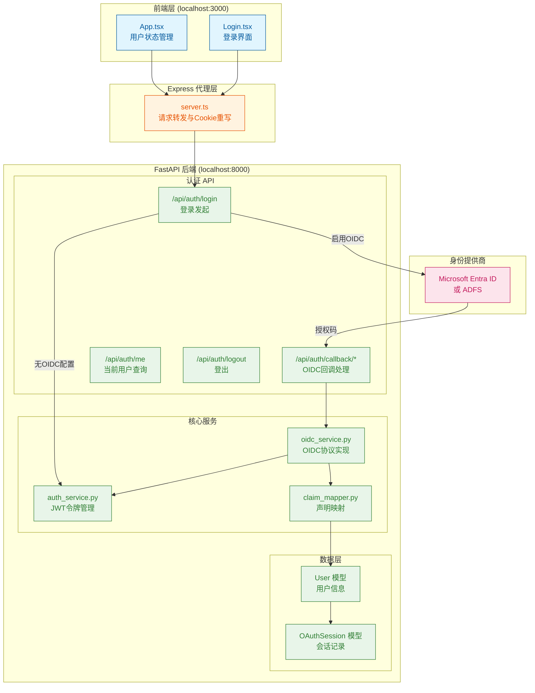
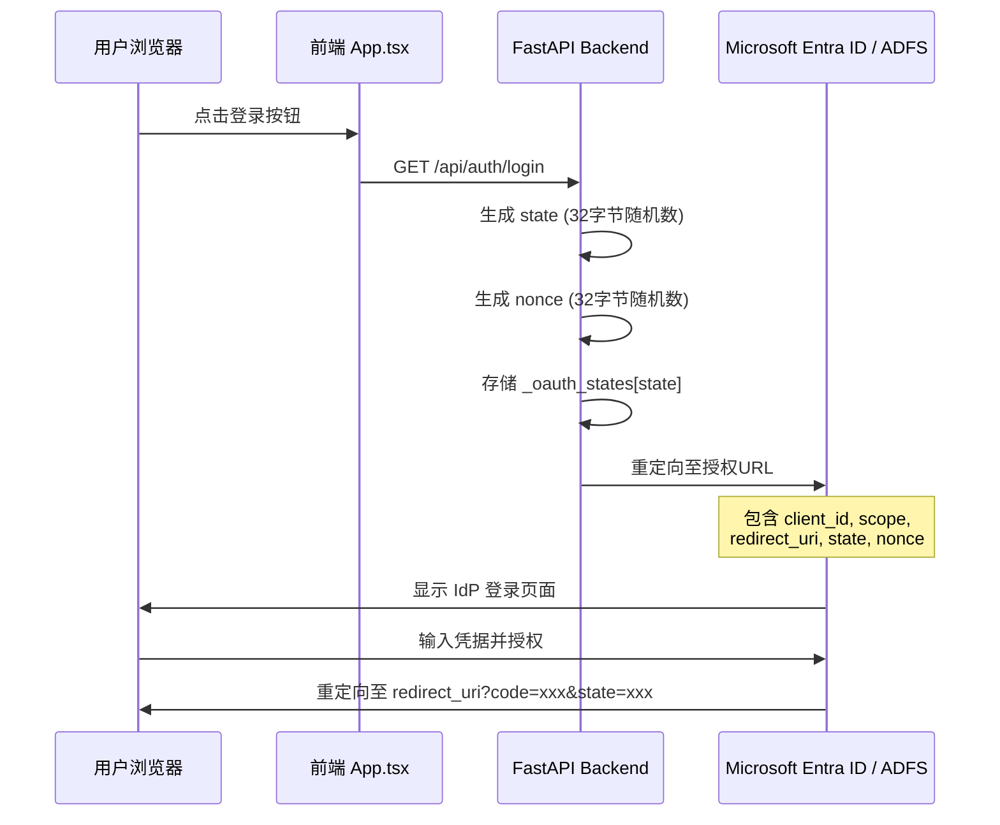
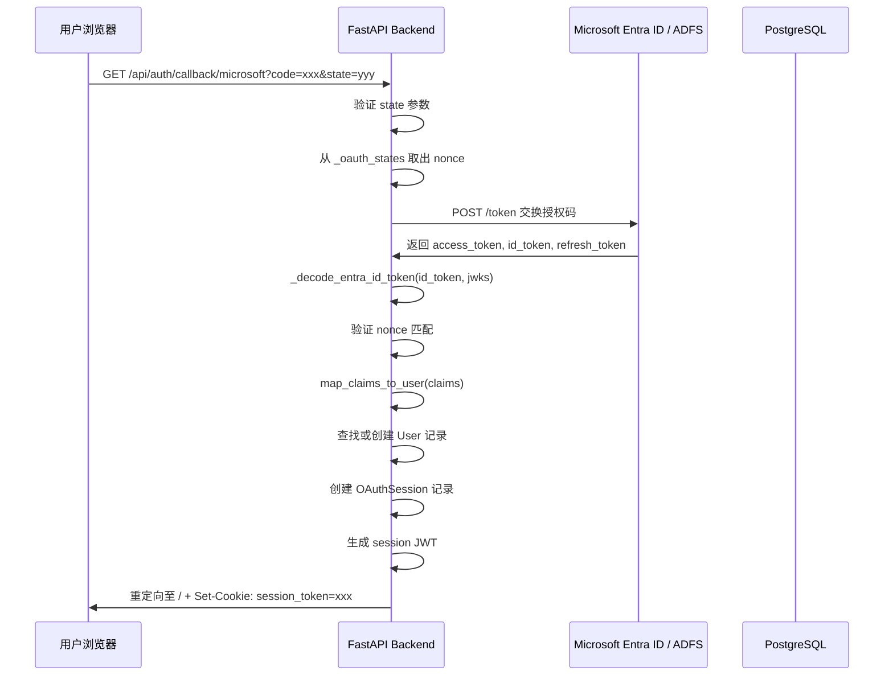

本页面详细阐述 BobCFC 平台的认证架构设计，涵盖双模式认证机制（Demo 模式与 OIDC 模式）、Microsoft Entra ID 和 ADFS 两种身份提供商的集成实现，以及完整的授权码回调处理流程。文档面向需要深度理解认证系统、进行安全审计或扩展第三方认证集成的开发者。

## 认证架构概览

BobCFC 平台采用**双轨并行认证架构**，通过 `OIDC_PROVIDER` 环境变量动态切换认证模式。当该变量为空时，系统运行于 Demo 模式，使用简化的 JWT Cookie 认证；当配置为 `entra` 或 `adfs` 时，系统启用完整的 OIDC 授权码流程，与企业身份提供商进行联邦认证。



### 核心技术栈

平台后端基于 FastAPI 框架构建，依赖以下关键库实现 OIDC 认证功能。**Authlib** 作为 OAuth2/OIDC 客户端核心库，负责授权 URL 生成、Token 交换和 ID Token 验证；**python-jose** 用于 JWT 令牌的编码解码；**httpx** 提供异步 HTTP 请求能力，用于 JWKS 获取和 UserInfo 查询。

Sources: [backend/pyproject.toml](backend/pyproject.toml#L1-L30)

## 认证模式对比

BobCFC 平台支持两种本质不同的认证模式，适用于不同的部署场景。Demo 模式面向本地开发和演示环境，提供即时可用的认证体验；OIDC 模式面向生产环境，与企业身份管理系统无缝集成。

| 特性 | Demo 模式 | OIDC 模式 |
|------|-----------|-----------|
| **配置复杂度** | 无需配置 | 需要 IdP 应用注册 |
| **用户来源** | 数据库种子数据 | 企业 IdP (Entra ID/ADFS) |
| **认证协议** | 直接 JWT 签发 | OAuth2 授权码 + OIDC |
| **会话Cookie** | `token` | `session_token` |
| **会话时长** | 24小时 (`max_age=86400`) | 可配置 (默认8小时) |
| **角色映射** | 固定 SUPER_ADMIN | 基于 IdP 组/角色声明 |
| **登出流程** | 仅清除本地Cookie | 本地清除 + IdP 联邦登出 |

在 Demo 模式下，系统通过 `seed_minimal()` 函数自动创建管理员用户，直接签发包含用户信息的 JWT Token 并写入 Cookie。整个流程绕过任何外部依赖，确保在无网络环境或 IdP 不可用时平台仍可正常运行。

Sources: [backend/app/api/auth.py](backend/app/api/auth.py#L66-L105)
Sources: [backend/app/dependencies.py](backend/app/dependencies.py#L14-L40)

## OIDC 授权码流程详解

当启用 OIDC 模式时，平台执行标准的授权码流程，这是 OAuth2.0 和 OIDC 最安全的授权方式。该流程的核心优势在于：授权码的获取需要服务端直接与 IdP 通信，Token 交换在服务端完成，客户端仅接收处理好的会话凭证。

### 登录发起阶段

用户点击登录按钮后，前端 `App.tsx` 中的 `handleLogin` 回调将浏览器重定向至后端 `/api/auth/login` 端点。在 OIDC 模式下，该端点调用 `get_authorization_url()` 函数，使用 Authlib 生成包含必要参数的授权 URL，然后返回 302 重定向至 IdP 授权页面。



授权 URL 的生成逻辑会根据配置的 `OIDC_PROVIDER` 值选择不同的构建策略。对于 Microsoft Entra ID，系统拼接 `{authority}/{tenant}/oauth2/v2.0/authorize` 端点；对于 ADFS，则使用配置的 `adfs_authorization_url`。

Sources: [backend/app/services/oidc_service.py](backend/app/services/oidc_service.py#L42-L83)

### 授权码回调处理

用户完成 IdP 认证后，浏览器携带授权码重定向回后端回调端点。回调处理是整个 OIDC 流程的核心环节，涉及状态验证、Token 交换、ID Token 校验和用户映射等多个步骤。



回调处理函数 `handle_callback()` 首先验证 state 参数以防止 CSRF 攻击，确保回调请求确实源自之前发起的授权请求。随后使用 Authlib 的 `fetch_token()` 方法向 Token 端点发送授权码交换请求。对于 Entra ID，系统会从 Microsoft JWKS 端点获取公钥，对 ID Token 进行签名验证并校验 nonce 值。

Sources: [backend/app/services/oidc_service.py](backend/app/services/oidc_service.py#L85-L158)

### 声明映射与角色提取

ID Token 校验通过后，原始声明需要经过 `claim_mapper.py` 的标准化处理。不同 IdP 返回的声明格式存在差异，系统需要统一提取用户标识、邮箱、用户名和角色信息。

```python
def _map_entra_claims(claims: dict) -> StandardUserClaims:
    oid = claims.get("oid") or claims.get("sub", "")
    email = claims.get("email") or claims.get("preferred_username") or ""
    roles = _extract_entra_roles(claims)
    # ...
```

角色映射是 OIDC 集成中最关键的配置项。系统支持两种角色来源：`roles` 声明直接包含应用角色分配，`groups` 声明包含安全组信息。配置中的 `ENTRA_ROLE_MAPPINGS` 字典定义了从 IdP 角色/组名称到本地角色的映射规则。例如 `{"Global Administrator": "admin", "User": "user"}` 配置会将 Entra ID 中的 "Global Administrator" 组映射为本地 SUPER_ADMIN 角色。

Sources: [backend/app/services/claim_mapper.py](backend/app/services/claim_mapper.py#L66-L92)

### 会话建立

完成用户映射后，系统执行三项关键操作：创建或更新 User 记录、创建 OAuthSession 记录用于后续 Token 管理、生成应用会话 JWT 写入 Cookie。

```python
# 创建会话 JWT
session_jwt = create_access_token(user.id, user.role, user.email)

# 设置会话 Cookie
redirect_response.set_cookie(
    key=SESSION_COOKIE,
    value=session_jwt,
    httponly=True,
    samesite="lax",
    path="/",
    max_age=settings.session_max_age,  # 默认8小时
)
```

User 模型中的 `provider_user_id` 字段存储 IdP 中的用户唯一标识（Entra ID 的 `oid` 或 ADFS 的 `sub`/`upn`），这是实现用户自动关联而非重复创建的关键。首次登录时创建新用户，后续登录通过该字段匹配现有记录并更新信息。

Sources: [backend/app/api/auth.py](backend/app/api/auth.py#L150-L175)
Sources: [backend/app/models/user.py](backend/app/models/user.py#L1-L21)

## 前端认证集成

前端采用代理模式处理认证请求，所有 `/api/auth/*` 请求通过 Express 服务器转发至 FastAPI 后端。这一设计的核心考量是 Cookie 作用域管理：后端设置的 HttpOnly Cookie 在跨域场景下可能受限，通过同域代理确保浏览器能够正确接收和发送会话 Cookie。

```typescript
// App.tsx 中的认证流程
useEffect(() => {
  fetch('/api/auth/me', { credentials: 'include' })
    .then(res => res.json())
    .then(data => {
      if (data && data.id) {
        setUser(data);
      }
    });
}, []);

const handleLogin = () => {
  window.location.href = '/api/auth/login';
};
```

前端通过 `/api/auth/me` 端点获取当前用户状态，该端点在未认证时返回 `null`，触发 `Login` 组件显示。登录成功后 IdP 重定向回后端，后端设置 Cookie 后再次重定向至前端根路径，此时 `App.tsx` 重新调用 `/api/auth/me` 即可获取已认证用户信息。

Sources: [frontend/src/App.tsx](frontend/src/App.tsx#L1-L97)

## 会话管理机制

### Cookie 双轨设计

系统支持两种会话 Cookie 共存，分别服务于不同的认证模式。这种设计允许 Demo 模式和 OIDC 模式在开发环境中灵活切换而无需清除历史 Cookie。

| Cookie 名称 | 使用场景 | 来源 | 有效期 |
|-------------|---------|------|--------|
| `token` | Demo 模式直接登录 | `create_access_token()` | 24小时 |
| `session_token` | OIDC 模式 | `create_access_token()` | 8小时（可配置） |

`get_current_user` 依赖函数会依次检查 `token`、`session_token` Cookie 和 Authorization Header，任一方式有效即可完成认证。OIDC 回调成功后会清除旧的 `token` Cookie 并设置新的 `session_token` Cookie。

Sources: [backend/app/dependencies.py](backend/app/dependencies.py#L14-L40)

### OAuth Session 持久化

OAuthSession 模型存储 IdP 颁发的原始 Token 信息，包括 access_token、refresh_token 和 id_token。这些信息支持未来的 Token 刷新机制实现。`expires_at` 字段存储 IdP Token 过期时间戳，用于判断是否需要执行静默刷新。

```python
class OAuthSession(Base):
    id = Column(String(36), primary_key=True)
    user_id = Column(String(36), ForeignKey("users.id"))
    provider = Column(String(50))  # "entra" 或 "adfs"
    access_token = Column(String(4000))
    refresh_token = Column(String(4000))
    id_token = Column(String(8000))
    expires_at = Column(BigInteger)  # Unix 时间戳
```

登出时系统会删除当前用户的 OAuthSession 记录，并清除浏览器 Cookie。在 OIDC 模式下，系统还会返回 IdP 联邦登出 URL，引导用户至 IdP 端完成单点登出。

Sources: [backend/app/models/oauth_session.py](backend/app/models/oauth_session.py#L1-L19)
Sources: [backend/app/api/auth.py](backend/app/api/auth.py#L350-L385)

## 环境配置指南

### Demo 模式配置

无需任何 OIDC 相关配置即可运行。确保 `OIDC_PROVIDER` 环境变量为空或不存在：

```bash
# .env 文件
# OIDC_PROVIDER=  # 留空或注释
```

首次访问登录接口时，系统自动执行 `seed_minimal()` 创建默认管理员用户。

### Microsoft Entra ID 配置

1. 在 Azure Portal 注册应用，选择「Web」平台类型，配置Redirect URI为 `http://localhost:3000/api/auth/callback/microsoft`
2. 启用 ID tokens 和 Access tokens
3. 配置 API 权限，至少需要 `openid`, `email`, `profile` 范围
4. 在「证书和机密」创建客户端密钥
5. 在「应用角色」中定义应用角色（如 SUPER_ADMIN）
6. 在「所有者」或「用户和组」中分配用户或组

```bash
# .env 配置
OIDC_PROVIDER=entra
ENTRA_CLIENT_ID=你的应用(客户端)ID
ENTRA_CLIENT_SECRET=你的客户端密钥
ENTRA_TENANT_ID=你的租户ID或"common"
ENTRA_ROLE_MAPPINGS={"Global Administrator":"admin","User":"user"}
```

Sources: [backend/.env.example](backend/.env.example#L24-L31)

### ADFS 配置

ADFS 配置需要更多手动参数指定，因为每个 ADFS 部署的端点 URL 各不相同：

```bash
# .env 配置
OIDC_PROVIDER=adfs
ADFS_CLIENT_ID=你的客户端ID
ADFS_CLIENT_SECRET=你的客户端密钥
ADFS_ISSUER=https://adfs.company.com
ADFS_AUTHORIZATION_URL=https://adfs.company.com/adfs/oauth2/authorize
ADFS_TOKEN_URL=https://adfs.company.com/adfs/oauth2/token
ADFS_USERINFO_URL=https://adfs.company.com/adfs/userinfo
ADFS_ROLE_MAPPINGS={"CN=Admins,OU=Groups,DC=company,DC=com":"admin"}
```

ADFS 的角色声明通常通过安全组获取，组名格式为 LDAP DN（如 `CN=Admins,OU=Groups,DC=company,DC=com`）。`claim_mapper.py` 中的 `normalize_role()` 函数会自动处理这类格式，提取 `CN=` 后的组名进行匹配。

Sources: [backend/app/config.py](backend/app/config.py#L28-L40)
Sources: [backend/app/services/claim_mapper.py](backend/app/services/claim_mapper.py#L15-L24)

## 安全考量

### CSRF 防护

OIDC 流程通过 `state` 参数实现 CSRF 防护。授权请求时生成 32 字节的随机 state 值并存储，回调时验证 state 匹配。过期状态（超过 10 分钟）会通过 `cleanup_expired_states()` 定时清理，防止状态字典无限膨胀。

Sources: [backend/app/services/oidc_service.py](backend/app/services/oidc_service.py#L54-L66)
Sources: [backend/app/services/oidc_service.py](backend/app/services/oidc_service.py#L229-L240)

### Nonce 验证

ID Token 中的 `nonce` 声明用于防止 Token 重放攻击。授权请求时生成的 nonce 随 state 一起存储，ID Token 解码后必须与存储值完全匹配。Entra ID 强制要求 nonce 验证，ADFS 若返回 nonce 则同样验证。

Sources: [backend/app/services/oidc_service.py](backend/app/services/oidc_service.py#L143-L149)
Sources: [backend/app/services/oidc_service.py](backend/app/services/oidc_service.py#L191-L196)

### Cookie 安全属性

会话 Cookie 设置了 `HttpOnly`（防止 JavaScript 读取）、`SameSite=Lax`（CSRF 防护）和 `Path=/`（全路径可用）属性。在生产环境中建议添加 `Secure` 属性（HTTPS 传输），但开发环境 localhost 场景下会与代理的 Cookie 重写逻辑冲突。

Sources: [backend/app/api/auth.py](backend/app/api/auth.py#L160-L168)

## 扩展阅读

完成 OIDC 认证流程的深入理解后，建议继续阅读以下页面以掌握完整的认证安全体系：

- **[JWT 会话管理](19-jwt-hui-hua-guan-li)** — 深入了解平台 JWT 令牌的生成、验证机制和过期策略
- **[API 端点参考](17-api-duan-dian-can-kao)** — 完整的认证相关 API 接口文档
- **[角色权限控制](22-jiao-se-quan-xian-kong-zhi)** — 了解 SUPER_ADMIN 和 REGULAR_USER 角色的权限差异