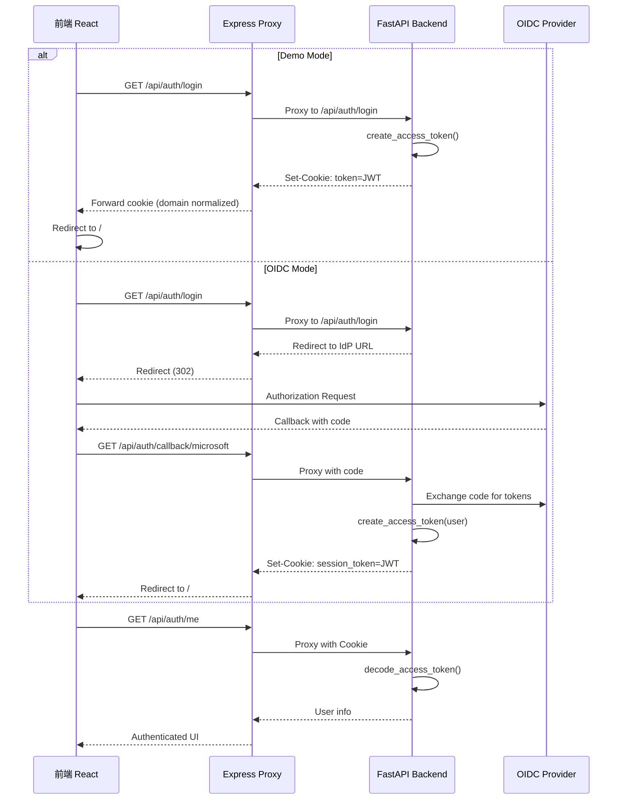

本文档深入解析 BobCFCPlatform 中 JWT 会话管理的完整实现，涵盖 token 生成、验证、Cookie 传输机制以及双模式认证架构。

## 系统架构概览

BobCFCPlatform 采用 **Cookie-based JWT 会话管理模式**，同时支持演示模式（Demo Mode）和 OIDC 企业认证模式。整个认证流程涉及前端 Express 代理层、FastAPI 后端、以及可选的 OIDC 身份提供商。



**核心设计原则**：前端通过 Express 代理层（`server.ts`）访问 FastAPI 后端，确保 Cookie 能在同一源（`localhost:3000`）下正常工作，同时保留后端返回的 `Set-Cookie` 头。

Sources: [server.ts](frontend/server.ts#L48-L113), [auth.py](backend/app/api/auth.py#L83-L118)

## JWT Token 结构

系统生成的 JWT Token 包含用户核心身份信息，采用 HS256 对称加密算法签名。

| 字段 | 类型 | 说明 | 来源 |
|------|------|------|------|
| `sub` | string | 用户 ID | `create_access_token(user.id, ...)` |
| `role` | string | 用户角色 | `SUPER_ADMIN` 或 `REGULAR_USER` |
| `email` | string | 用户邮箱 | 用于标识和显示 |
| `exp` | timestamp | 过期时间 | 当前时间 + `jwt_expire_minutes` |

Token 有效期通过 `jwt_expire_minutes` 配置项控制，默认为 **1440 分钟（24 小时）**。

```python
def create_access_token(user_id: str, role: str, email: str) -> str:
    expire = datetime.now(timezone.utc) + timedelta(minutes=settings.jwt_expire_minutes)
    payload = {
        "sub": user_id,
        "role": role,
        "email": email,
        "exp": expire,
    }
    return jwt.encode(payload, settings.jwt_secret, algorithm=settings.jwt_algorithm)
```

Sources: [auth_service.py](backend/app/services/auth_service.py#L20-L28)

## 双模式认证架构

系统支持两种认证模式，通过 `oidc_provider` 配置项切换：

### 演示模式（Demo Mode）

当 `oidc_provider` 为空时，系统进入演示模式：

- **登录流程**：直接通过 `seed_minimal()` 创建超级管理员用户
- **Token 生成**：调用 `create_access_token()` 生成 JWT Cookie
- **Cookie 名称**：`token`
- **过期时间**：固定 86400 秒（1 天）

```python
token = create_access_token(user.id, user.role, user.email)
response.set_cookie(
    key="token",
    value=token,
    httponly=True,
    samesite="lax",
    path="/",
    max_age=86400,
)
```

Sources: [auth.py](backend/app/api/auth.py#L103-L112)

### OIDC 企业认证模式

当配置 `oidc_provider` 为 `entra` 或 `adfs` 时，系统启用 OIDC 认证：

- **登录流程**：重定向到 IdP 授权端点
- **Token 生成**：OIDC 回调后创建 Session JWT
- **Cookie 名称**：`session_token`
- **过期时间**：由 `session_max_age` 配置（默认 8 小时）

**Microsoft Entra ID 配置示例**：

```python
# Entra ID OIDC Client
client = AsyncOAuth2Client(
    client_id=settings.entra_client_id,
    client_secret=settings.entra_client_secret,
    scope="openid email profile",
    redirect_uri="http://localhost:3000/api/auth/callback/microsoft",
)
```

Sources: [oidc_service.py](backend/app/services/oidc_service.py#L30-L37), [config.py](backend/app/config.py#L31-L39)

## Token 验证与用户提取

`get_current_user` 依赖注入函数负责从请求中提取并验证用户身份：

```python
async def get_current_user(
    request: Request,
    token: str | None = Cookie(None, alias="token"),
    session_token: str | None = Cookie(None, alias=SESSION_COOKIE),
    db: AsyncSession = Depends(get_db),
) -> User | None:
    # 优先级：token > session_token > Authorization Header
    jwt_token = token or session_token
    if not jwt_token:
        auth_header = request.headers.get("authorization", "")
        if auth_header.startswith("Bearer "):
            jwt_token = auth_header[7:]
        else:
            return None
    
    payload = decode_access_token(jwt_token)
    if not payload:
        return None
    
    user = await db.get(User, payload["sub"])
    return user
```

**验证优先级**：
1. `token` Cookie（演示模式）
2. `session_token` Cookie（OIDC 模式）
3. `Authorization: Bearer <token>` Header（API 兼容）

Sources: [dependencies.py](backend/app/dependencies.py#L14-L41)

## OAuth Session 持久化

OIDC 模式下，系统同时维护 OAuth Session 记录，用于存储 IdP 返回的原始 Access Token：

| 字段 | 类型 | 说明 |
|------|------|------|
| `id` | String(36) | Session UUID |
| `user_id` | String(36) | 关联用户 ID |
| `provider` | String(50) | 认证提供商（entra/adfs） |
| `access_token` | String(4000) | IdP Access Token |
| `refresh_token` | String(4000) | IdP Refresh Token |
| `id_token` | String(8000) | IdP ID Token |
| `expires_at` | BigInteger | Token 过期时间戳 |

```python
oauth_session = OAuthSession(
    id=session_id,
    user_id=user.id,
    provider=provider,
    access_token=token.get("access_token", ""),
    refresh_token=token.get("refresh_token"),
    id_token=id_token,
    expires_at=expires_at,
)
db.add(oauth_session)
await db.commit()
```

Sources: [oauth_session.py](backend/app/models/oauth_session.py#L7-L19), [auth.py](backend/app/api/auth.py#L223-L233)

## Cookie 安全配置

所有 JWT Cookie 采用以下安全配置：

| 配置项 | 值 | 说明 |
|--------|-----|------|
| `httponly` | `True` | 阻止 JavaScript 访问 |
| `samesite` | `lax` | 允许顶层导航携带 |
| `path` | `/` | 整个应用域生效 |
| `max_age` | 可配置 | Token 有效期秒数 |

**Express 代理层的 Cookie 重写**：由于 Cookie 的 `Domain` 属性限制，前端代理层需重写 Cookie 头以适配 `localhost:3000`：

```typescript
const rewrittenCookies = (Array.isArray(rawCookies) ? rawCookies : [rawCookies]).map(c => {
    return c.replace(/Domain=[^;]+/gi, '').replace(/; Secure/gi, '');
});
```

Sources: [server.ts](frontend/server.ts#L75-L86)

## 登出流程

登出操作执行以下步骤：

1. 删除数据库中的 `OAuthSession` 记录
2. 清除前端 Cookie（`token` 和 `session_token`）
3. OIDC 模式下返回提供商注销 URL

```python
@router.post("/logout")
async def logout(response: Response, ...):
    # 删除 OAuth Session
    if current_user:
        stmt = delete(OAuthSession).where(OAuthSession.user_id == current_user.id)
        await db.execute(stmt)
    
    # 清除 Cookies
    response.delete_cookie(key="token", path="/")
    response.delete_cookie(key=SESSION_COOKIE, path="/")
    
    # OIDC 模式返回注销 URL
    if settings.oidc_provider and current_user:
        logout_url = get_provider_logout_url(provider)
        return {"logoutUrl": logout_url}
```

Sources: [auth.py](backend/app/api/auth.py#L351-L378)

## 环境变量配置

| 变量名 | 默认值 | 说明 |
|--------|--------|------|
| `jwt_secret` | `change-me-in-production` | JWT 签名密钥 |
| `jwt_algorithm` | `HS256` | 加密算法 |
| `jwt_expire_minutes` | `1440` | Token 有效期（分钟） |
| `oidc_provider` | 空 | 认证模式：`entra`/`adfs`/空 |
| `session_max_age` | `28800` | Session 有效期（秒） |

Sources: [config.py](backend/app/config.py#L26-L51)

## 下一步

- 深入了解 [OIDC 认证流程](18-oidc-ren-zheng-liu-cheng) 的完整实现细节
- 查看 [API 端点参考](17-api-duan-dian-can-kao) 了解所有认证相关接口
- 参考 [后端技术架构](8-hou-duan-ji-zhu-jia-gou) 了解整体服务设计