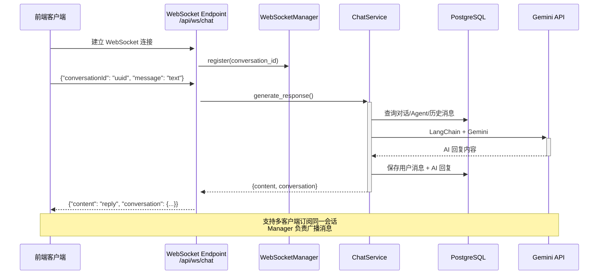
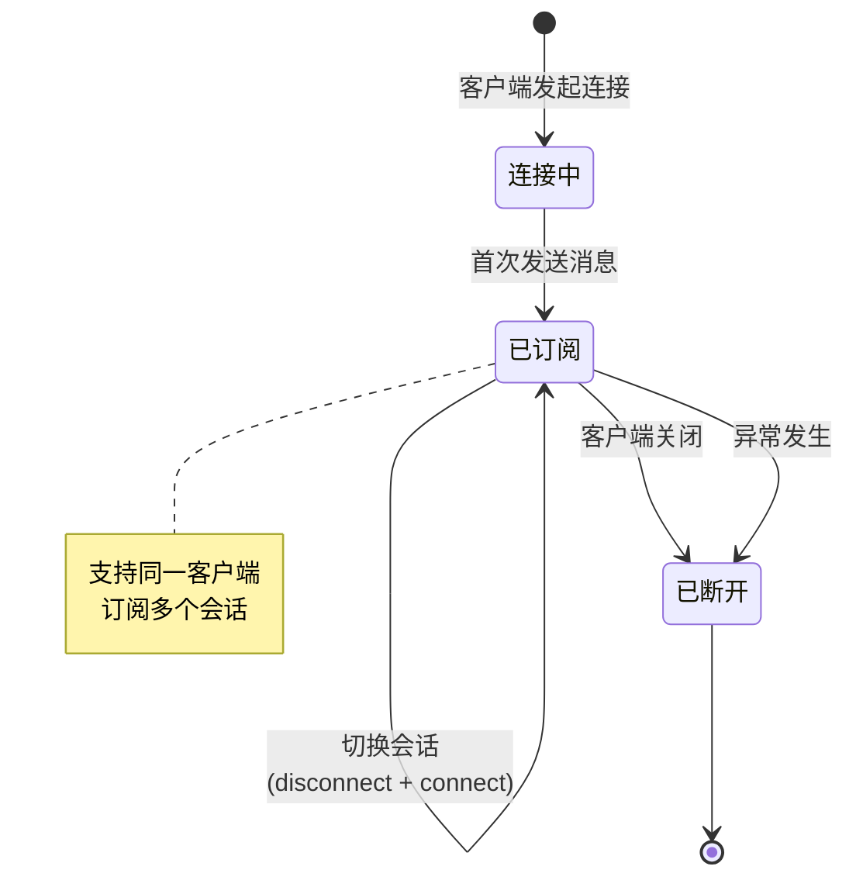
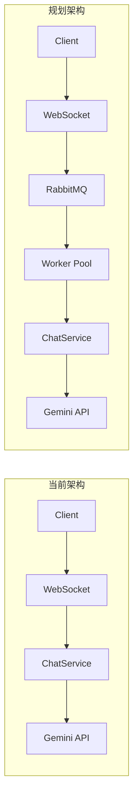

本文档介绍 BobCFC 平台中 WebSocket 实时通信的实现架构、协议规范和使用方式。该功能通过 WebSocket 协议实现客户端与服务器之间的双向实时消息传递，支持多客户端对话上下文共享。

## 架构概览

BobCFC 的 WebSocket 通信基于 FastAPI 原生支持构建，采用管理器模式管理会话连接。以下架构图展示整体通信流程：



### 核心组件

| 组件 | 文件路径 | 职责 |
|------|---------|------|
| WebSocketManager | [manager.py](backend/app/websocket/manager.py#L1-L45) | 连接管理、会话分组、消息广播 |
| WebSocket Endpoint | [chat_ws.py](backend/app/api/chat_ws.py#L1-L49) | 协议处理、请求路由、错误处理 |
| ChatService | [chat_service.py](backend/app/services/chat_service.py#L1-L138) | 核心业务逻辑、LLM 调用、数据库操作 |

Sources: [manager.py](backend/app/websocket/manager.py#L1-L45), [chat_ws.py](backend/app/api/chat_ws.py#L1-L49)

## 协议规范

### 端点信息

```
WebSocket Endpoint: ws://host:port/api/ws/chat
```

在本地开发环境中，默认地址为：`ws://localhost:8000/api/ws/chat`

Sources: [chat_ws.py](backend/app/api/chat_ws.py#L8)

### 消息格式

**客户端发送消息：**

```json
{
  "conversationId": "550e8400-e29b-41d4-a716-446655440000",
  "message": "帮我分析这份数据报告"
}
```

| 字段 | 类型 | 必填 | 描述 |
|------|------|------|------|
| conversationId | string (UUID) | 是 | 对话会话的唯一标识符 |
| message | string | 是 | 用户发送的消息内容 |

**服务端响应消息：**

```json
{
  "content": "根据您提供的数据报告，我总结了以下要点：...",
  "conversation": {
    "id": "550e8400-e29b-41d4-a716-446655440000",
    "userId": "user-uuid",
    "agentId": "agent-uuid",
    "messages": [
      {"role": "user", "content": "帮我分析这份数据报告", "timestamp": "2024-01-15T10:30:00Z"},
      {"role": "assistant", "content": "根据您提供的数据报告...", "timestamp": "2024-01-15T10:30:05Z"}
    ],
    "title": "帮我分析这份数据报告",
    "modelId": "gemini-2.0-flash"
  }
}
```

| 字段 | 类型 | 描述 |
|------|------|------|
| content | string | AI 生成的回复内容 |
| conversation | object | 更新后的完整对话对象 |
| conversation.id | string | 对话 ID |
| conversation.messages | array | 包含历史消息的数组 |
| conversation.title | string | 对话标题（首条消息前30字符） |

Sources: [chat_ws.py](backend/app/api/chat_ws.py#L16-L17), [chat_service.py](backend/app/services/chat_service.py#L130-L138)

### 错误响应

| 错误类型 | 响应格式 | 触发条件 |
|---------|---------|---------|
| 参数缺失 | `{"error": "conversationId and message required"}` | conversationId 或 message 字段为空 |
| 服务异常 | `{"error": "详细错误信息"}` | 数据库操作或 LLM 调用失败 |
| 连接断开 | WebSocketDisconnect 事件 | 客户端主动关闭或网络中断 |

Sources: [chat_ws.py](backend/app/api/chat_ws.py#L30-L32), [chat_ws.py](backend/app/api/chat_ws.py#L46-L48)

## 连接管理

### WebSocketManager 实现

`WebSocketManager` 类采用字典结构维护连接状态，支持按会话分组和多客户端广播：

```python
class WebSocketManager:
    """Manages WebSocket connections grouped by conversation_id."""
    
    def __init__(self):
        # conversation_id -> set[WebSocket]
        self._connections: dict[str, set[WebSocket]] = {}
        # WebSocket -> Optional[str] (conversation_id)
        _ws_to_conv: dict[WebSocket, Optional[str]] = {}
```

**核心方法：**

| 方法 | 功能 | 异常处理 |
|------|------|---------|
| `connect(websocket, conversation_id)` | 接受连接并注册到会话组 | — |
| `disconnect(websocket, conversation_id)` | 断开连接并清理空会话组 | 自动处理不存在的会话 |
| `send_to_conversation(conversation_id, data)` | 广播消息到所有订阅客户端 | 移除死连接，自动清理空会话组 |

Sources: [manager.py](backend/app/websocket/manager.py#L1-L45)

### 连接生命周期



**连接管理流程：**

1. 客户端发起 WebSocket 连接，服务器自动接受
2. 客户端发送首条消息时，传入 `conversationId` 建立会话订阅
3. 切换会话时自动取消旧订阅，注册新订阅
4. 连接断开时自动清理所有订阅记录

Sources: [chat_ws.py](backend/app/api/chat_ws.py#L14-L28)

## 实时消息处理

### 消息处理流程

当服务端接收到客户端消息时，触发以下处理流程：

```mermaid
flowchart TD
    A[接收 JSON 消息] --> B{验证参数}
    B -->|缺失 conversationId| E[返回错误]
    B -->|缺失 message| E
    B -->|参数完整| C[更新会话订阅]
    C --> D[调用 generate_response]
    D --> F[查询对话上下文]
    F --> G[加载 Agent 和 Skills]
    G --> H[构建 LangChain Prompt]
    H --> I[调用 Gemini API]
    I --> J[保存用户消息]
    J --> K[保存 AI 回复]
    K --> L[返回 {content, conversation}]
    E --> M[发送错误响应]
    L --> N[发送给客户端]
```

### 对话上下文构建

`ChatService.generate_response()` 方法负责构建完整的对话上下文：

```python
async def generate_response(
    conversation_id: str,
    user_message: str,
    db: AsyncSession,
) -> dict:
    # 1. 加载对话记录
    conv = await db.execute(select(Conversation)...)

    # 2. 加载 Agent 和关联的 Skills
    agent = await db.get(Agent, conv.agent_id)
    skills = await db.execute(select(Skill).where(...))

    # 3. 构建系统提示词
    system_text = _build_system_prompt(agent, skills)

    # 4. 加载历史消息
    history_msgs = await db.execute(select(Message)...)

    # 5. 调用 Gemini
    llm = ChatGoogleGenerativeAI(model=model_id, ...)
    response = await llm.ainvoke(messages)
```

Sources: [chat_service.py](backend/app/services/chat_service.py#L28-L90)

## 认证机制

### 当前实现状态

当前 WebSocket 端点**未实现显式认证中间件**。认证依赖于以下隐式机制：

| 认证模式 | Cookie 名称 | 触发条件 |
|---------|------------|---------|
| Demo 模式 | `token` | `OIDC_PROVIDER` 环境变量为空 |
| OIDC 模式 | `session_token` | `OIDC_PROVIDER` 设置为 `entra` 或 `adfs` |

**说明：** WebSocket 连接建立时，服务端自动接受连接。后续消息处理中的 `generate_response()` 调用会通过 `Conversation` 关联的 `userId` 隐式验证用户身份。

Sources: [chat_ws.py](backend/app/api/chat_ws.py#L11), [dependencies.py](backend/app/dependencies.py#L11-L34)

### 安全建议

生产环境中建议为 WebSocket 添加认证层：

```python
@router.websocket("/chat")
async def websocket_chat(websocket: WebSocket, token: str = Query(...)):
    # 验证 JWT Token
    payload = decode_access_token(token)
    if not payload:
        await websocket.close(code=4001)
        return
    # 继续处理...
```

## REST vs WebSocket 对比

BobCFC 同时提供了 REST API 和 WebSocket 两种聊天接口：

| 特性 | REST API (`/api/chat`) | WebSocket (`/api/ws/chat`) |
|------|----------------------|---------------------------|
| 协议 | HTTP POST | WebSocket 双向通信 |
| 适用场景 | 简单请求、单次响应 | 实时交互、多客户端同步 |
| 连接开销 | 每次请求新建连接 | 保持长连接 |
| 响应方式 | 同步等待 | 流式/即时推送 |
| 当前前端状态 | ✅ 已集成使用 | ⚠️ 端点已实现但未使用 |

**REST API 示例：**

```typescript
const response = await fetch(`${API_BASE}/api/chat`, {
  method: 'POST',
  credentials: 'include',
  headers: { 'Content-Type': 'application/json' },
  body: JSON.stringify({
    message: input,
    conversationId
  })
});
```

Sources: [chat.py](backend/app/api/chat.py#L1-L34), [Chat.tsx](frontend/src/components/Chat.tsx#L102-L120)

## 前端集成示例

### WebSocket 客户端实现

以下代码展示如何在前端使用 WebSocket：

```typescript
class ChatWebSocket {
  private ws: WebSocket | null = null;
  private conversationId: string = '';

  connect(conversationId: string) {
    this.conversationId = conversationId;
    const wsUrl = `${API_BASE.replace('http', 'ws')}/api/ws/chat`;
    this.ws = new WebSocket(wsUrl);
    
    this.ws.onopen = () => {
      console.log('WebSocket 连接已建立');
    };
    
    this.ws.onmessage = (event) => {
      const data = JSON.parse(event.data);
      if (data.error) {
        console.error('错误:', data.error);
      } else {
        // 处理消息: data.content, data.conversation
        this.onMessage(data);
      }
    };
    
    this.ws.onclose = () => {
      console.log('WebSocket 连接已关闭');
    };
  }

  sendMessage(content: string) {
    if (this.ws?.readyState === WebSocket.OPEN) {
      this.ws.send(JSON.stringify({
        conversationId: this.conversationId,
        message: content
      }));
    }
  }

  private onMessage(data: { content: string; conversation: any }) {
    // 更新 UI - data.content 为 AI 回复
    // data.conversation 包含完整对话历史
  }
}
```

### 切换会话

```typescript
switchConversation(newConversationId: string) {
  this.conversationId = newConversationId;
  // WebSocket 会自动处理会话切换
  // 下一条消息会自动订阅新会话
}
```

Sources: [lib/api.ts](frontend/src/lib/api.ts#L1-L4), [Chat.tsx](frontend/src/components/Chat.tsx#L1-L30)

## 消息队列集成规划

当前架构预留了 RocketMQ 消息队列集成接口，用于支持分布式部署和异步消息处理：



**消息队列消费者占位符：**

```python
# backend/app/mq/chat_consumer.py
async def run_chat_consumer():
    """
    从 RocketMQ 消费消息，调用 Gemini，
    通过 WebSocket 推送结果。
    当前为占位实现。
    """
    logger.info("Chat consumer starting (placeholder - requires RocketMQ broker)")
```

Sources: [chat_consumer.py](backend/app/mq/chat_consumer.py#L1-L29), [producer.py](backend/app/mq/producer.py#L1-L66)

## 故障排除

### 常见问题

| 问题 | 可能原因 | 解决方案 |
|------|---------|---------|
| 连接被拒绝 | CORS 配置问题 | 检查 `CORS_ORIGINS` 环境变量配置 |
| 消息发送失败 | connectionId 不匹配 | 确保 conversationId 格式正确且存在 |
| 响应超时 | Gemini API 调用慢 | 检查网络连接和 API Key 配置 |
| 连接意外断开 | 服务器重启/网络不稳定 | 实现重连逻辑 |

### 调试建议

1. **检查 WebSocket 连接状态：**
   ```typescript
   console.log('Ready State:', ws.readyState); 
   // 0: CONNECTING, 1: OPEN, 2: CLOSING, 3: CLOSED
   ```

2. **验证服务器日志：**
   ```bash
   uvicorn app.main:app --reload --port 8000 --log-level debug
   ```

3. **检查数据库连接：**
   确保 PostgreSQL 服务运行正常，对话记录可正常查询。

Sources: [main.py](backend/app/main.py#L1-L74), [config.py](backend/app/config.py#L1-L75)

## 相关文档

- [聊天服务实现](13-liao-tian-fu-wu-shi-xian) — 深入了解对话处理逻辑
- [消息队列集成](16-xiao-xi-dui-lie-ji-cheng) — RocketMQ 异步处理架构
- [API 端点参考](17-api-duan-dian-can-kao) — REST API 完整说明
- [JWT 会话管理](19-jwt-hui-hua-guan-li) — 认证机制详解