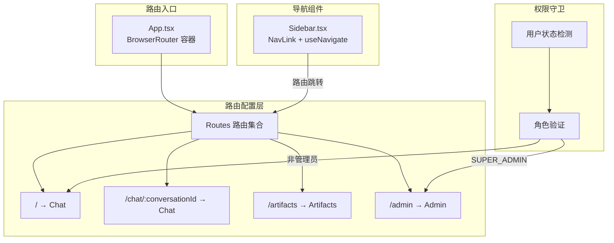
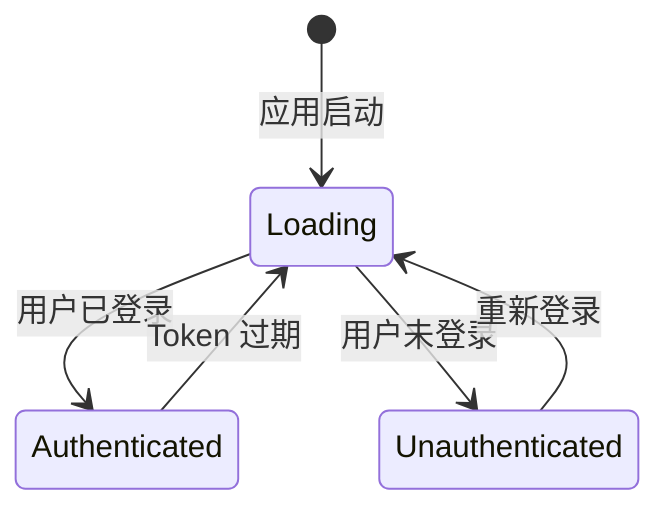
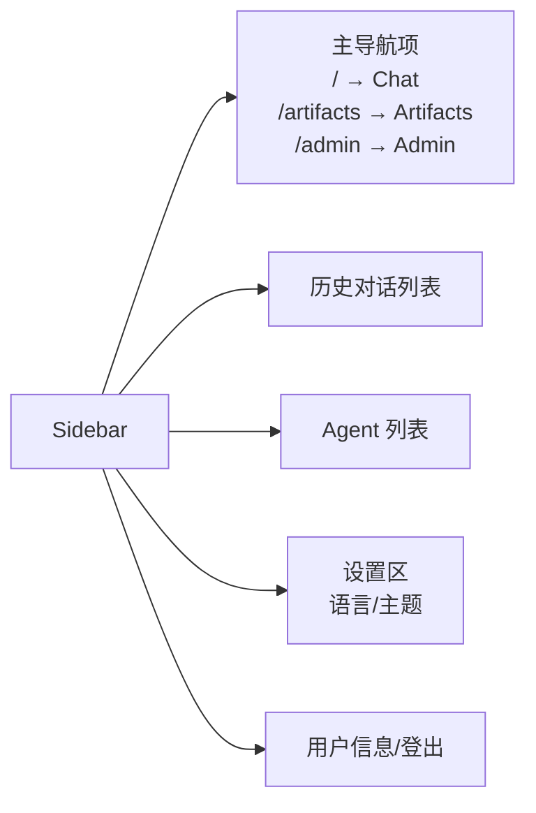
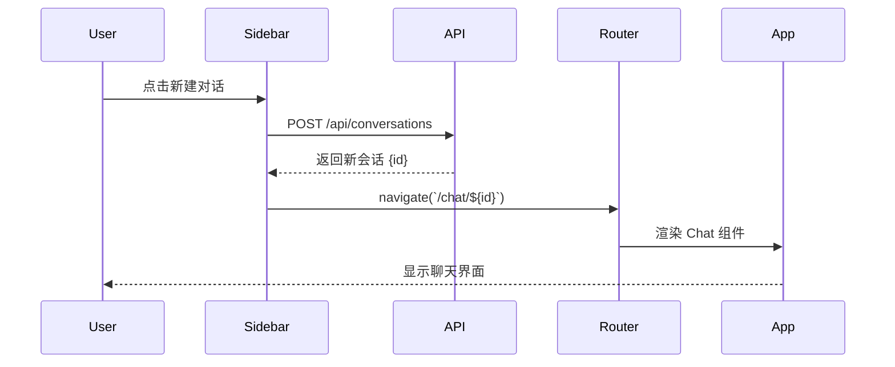

本文档详细解析 BobCFC 平台前端的路由架构设计与导航实现机制，帮助开发者理解单页应用（SPA）的路由组织方式、权限控制策略以及用户交互流程。

## 路由架构概览

该平台采用 **React Router v7** 作为路由解决方案，基于 `BrowserRouter` 实现客户端路由管理。整体架构遵循「路由集中配置 + 组件化导航 + 权限守卫」的设计模式。



**核心设计要点**：
- 所有路由集中配置在 `App.tsx` 的 `<Routes>` 组件中
- 路由组件按功能模块划分（Chat、Artifacts、Admin）
- 通过 `<Navigate>` 组件实现未授权访问的重定向
- Sidebar 组件提供全局导航入口

Sources: [App.tsx](frontend/src/App.tsx#L1-L97)

## 路由配置详解

### 基础路由定义

路由配置采用声明式写法，通过 `<Route>` 组件定义路径与组件的映射关系。`element` 属性接收要渲染的 React 组件：

```tsx
<Routes>
  <Route path="/" element={<Chat user={user} />} />
  <Route path="/chat/:conversationId" element={<Chat user={user} />} />
  <Route path="/artifacts" element={<Artifacts />} />
  <Route
    path="/admin"
    element={user.role === 'SUPER_ADMIN' ? <Admin /> : <Navigate to="/" />}
  />
</Routes>
```

**路由参数解析**：通过 `useParams` hook 获取动态路由参数。在 Sidebar 中，`conversationId` 用于高亮当前对话记录：

```tsx
const { conversationId } = useParams();
```

Sources: [App.tsx](frontend/src/App.tsx#L75-L82), [Sidebar.tsx](frontend/src/components/Sidebar.tsx#L23)

### 动态路由：会话导航

平台支持两种聊天路由模式：

| 路由 | 组件 | 用途 | 参数传递 |
|------|------|------|----------|
| `/` | `Chat` | 新建对话（首页） | 无参数 |
| `/chat/:conversationId` | `Chat` | 加载历史对话 | conversationId |

这种设计允许用户在对话列表中点击任意历史记录，系统通过路由参数加载对应会话的上下文信息。

Sources: [App.tsx](frontend/src/App.tsx#L76-L77)

## 权限控制机制

### 基于角色的路由守卫

平台实现了轻量级的路由守卫机制，通过三元表达式在路由层面进行权限校验：

```tsx
<Route
  path="/admin"
  element={user.role === 'SUPER_ADMIN' ? <Admin /> : <Navigate to="/" />}
/>
```

当用户角色不为 `SUPER_ADMIN` 时，访问 `/admin` 路径会自动重定向到首页 `/`。这种设计将权限判断逻辑内联于路由配置中，无需额外的守卫组件。

**角色定义**（见 `types.ts`）：

```typescript
export interface User {
  id: string;
  username: string;
  role: 'SUPER_ADMIN' | 'REGULAR_USER';
  email: string;
  allowedAgentIds?: string[];
}
```

Sources: [App.tsx](frontend/src/App.tsx#L81), [types.ts](frontend/src/types.ts#L1-L10)

### 认证状态检测流程

应用启动时通过 `useEffect` 钩子从后端 `/api/auth/me` 端点获取当前用户状态：

```tsx
useEffect(() => {
  let cancelled = false;
  fetch('/api/auth/me', { credentials: 'include' })
    .then(res => res.json())
    .then(data => {
      if (cancelled) return;
      if (data && data.id) {
        setUser(data);
      }
      setLoading(false);
    })
    .catch(() => {
      if (cancelled) return;
      setLoading(false);
    });
  return () => { cancelled = true; };
}, []);
```

**状态转换流程**：



Sources: [App.tsx](frontend/src/App.tsx#L18-L36)

## 导航组件设计

### Sidebar 组件架构

Sidebar 作为全局导航栏，承担了路由导航、动态内容展示、主题切换等多重职责：



**导航项配置**：

```tsx
const navItems = [
  { icon: MessageSquare, label: t('chat_console'), path: '/' },
  { icon: Box, label: t('artifact_repo'), path: '/artifacts' },
  ...(user.role === 'SUPER_ADMIN' ? [{ icon: Settings, label: t('admin_panel'), path: '/admin' }] : []),
];
```

通过扩展运算符动态添加管理员导航项，体现了权限驱动的 UI 渲染模式。

Sources: [Sidebar.tsx](frontend/src/components/Sidebar.tsx#L50-L54)

### NavLink 高亮激活状态

使用 React Router 的 `<NavLink>` 组件实现导航高亮效果，通过 `isActive` 回调函数动态添加样式类：

```tsx
<NavLink
  key={item.path}
  to={item.path}
  className={({ isActive }) => cn(
    "flex items-center gap-3 px-3 py-2.5 rounded-md text-sm transition-all",
    isActive 
      ? "bg-slate-200 text-primary font-semibold" 
      : "text-text-muted hover:bg-slate-100 hover:text-primary"
  )}
>
  <item.icon className="w-4 h-4" />
  {item.label}
</NavLink>
```

`cn` 工具函数合并类名，支持条件样式切换。相同的模式也应用于历史对话列表的激活状态：

```tsx
<NavLink
  key={conv.id}
  to={`/chat/${conv.id}`}
  className={({ isActive }) => cn(
    "flex items-center gap-3 px-3 py-2 rounded-md text-sm transition-all group",
    isActive 
      ? "bg-slate-200 text-primary font-semibold" 
      : "text-text-muted hover:bg-slate-100 hover:text-primary"
  )}
>
```

Sources: [Sidebar.tsx](frontend/src/components/Sidebar.tsx#L65-L82), [utils.ts](frontend/src/lib/utils.ts)

## 动态导航元素

### 会话列表加载

Sidebar 通过 `useEffect` 初始化时获取用户会话列表：

```tsx
useEffect(() => {
  fetch(`${API_BASE}/api/conversations`, { credentials: 'include' })
    .then(res => res.json())
    .then(setConversations);
}, []);
```

### 新建对话导航

创建新对话时，系统会发起 POST 请求，然后使用 `useNavigate` 进行路由跳转：

```tsx
const createNewChat = async (agentId?: string) => {
  const res = await fetch(`${API_BASE}/api/conversations`, {
    method: 'POST',
    credentials: 'include',
    headers: { 'Content-Type': 'application/json' },
    body: JSON.stringify({ agentId })
  });
  const newConv = await res.json();
  setConversations(prev => [newConv, ...prev]);
  navigate(`/chat/${newConv.id}`);
};
```

**导航流程**：



Sources: [Sidebar.tsx](frontend/src/components/Sidebar.tsx#L37-L45), [Sidebar.tsx](frontend/src/components/Sidebar.tsx#L57-L62)

## 主题与国际化切换

### 主题状态管理

主题使用 `useState` + `localStorage` 管理，支持 Aegis 和 Nexus 两套主题：

```tsx
const [theme, setTheme] = useState(localStorage.getItem('theme') || 'aegis');

useEffect(() => {
  document.documentElement.setAttribute('data-theme', theme);
  localStorage.setItem('theme', theme);
}, [theme]);

const toggleTheme = () => {
  setTheme(prev => prev === 'aegis' ? 'nexus' : 'aegis');
};
```

### 语言切换

通过 `i18next` 的 `changeLanguage` 方法实现运行时语言切换：

```tsx
const { t, i18n } = useTranslation();

const toggleLanguage = () => {
  const nextLng = i18n.language === 'zh' ? 'en' : 'zh';
  i18n.changeLanguage(nextLng);
};
```

这两个功能均在 Sidebar 的底部设置区域提供入口。

Sources: [Sidebar.tsx](frontend/src/components/Sidebar.tsx#L20-L21), [Sidebar.tsx](frontend/src/components/Sidebar.tsx#L124-L136), [Sidebar.tsx](frontend/src/components/Sidebar.tsx#L138-L144)

## 代理配置与开发环境

### API 代理设置

Vite 开发服务器配置了 `/api` 路径代理，将请求转发至后端服务：

```typescript
server: {
  proxy: {
    '/api': {
      target: 'http://localhost:8000',
      changeOrigin: true,
    },
  },
}
```

生产环境中，Express 服务器（`server.ts`）同样实现了 `/api/*` 路径的代理转发，并通过 cookie 重写确保跨域认证正常工作。

Sources: [vite.config.ts](frontend/vite.config.ts#L24-L28), [server.ts](frontend/server.ts#L96-L99)

## 相关页面

| 文档章节 | 关联内容 |
|----------|----------|
| [角色权限控制](22-jiao-se-quan-xian-kong-zhi) | 深入了解 SUPER_ADMIN 与 REGULAR_USER 的权限差异 |
| [主题系统](23-zhu-ti-xi-tong) | 查看 Aegis/Nexus 主题的完整设计 |
| [国际化支持](24-guo-ji-hua-zhi-chi) | 了解 i18next 配置与翻译文件结构 |

---

**技术栈**：React Router v7 · React 19 · TypeScript · Tailwind CSS