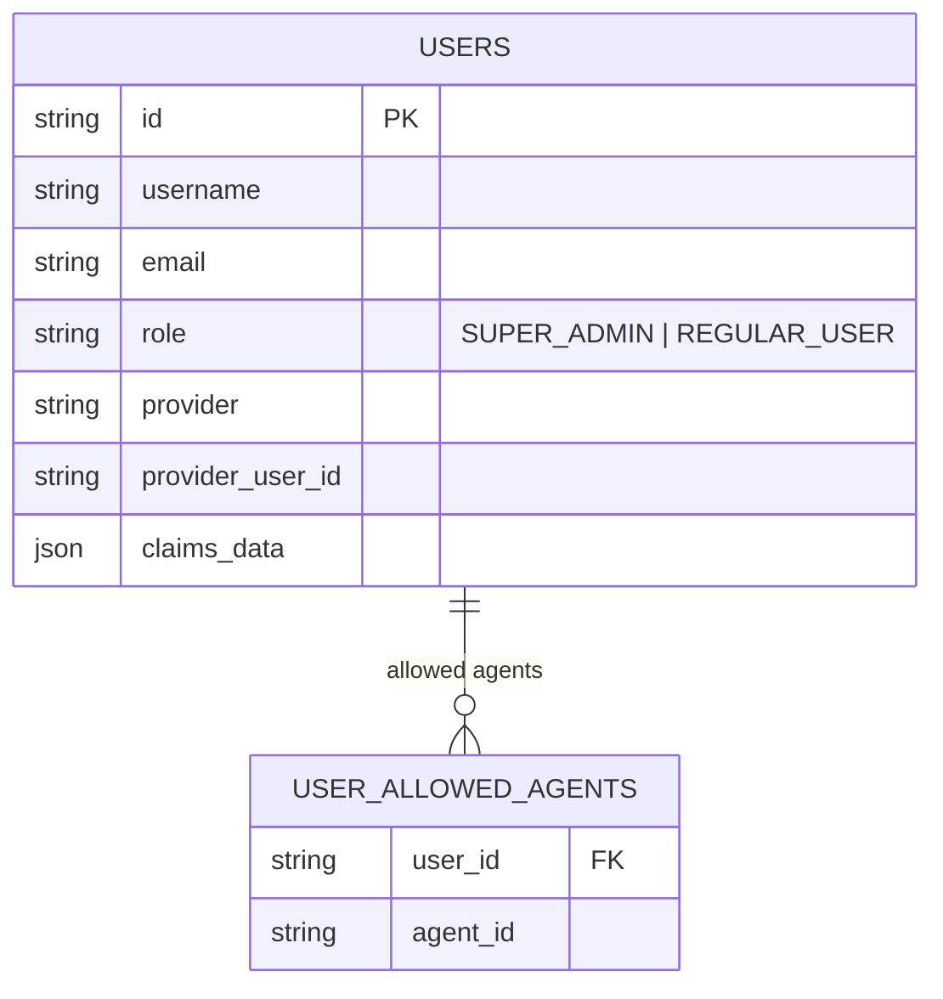
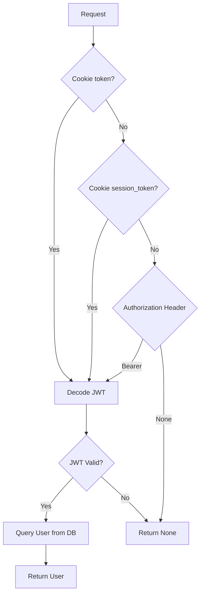
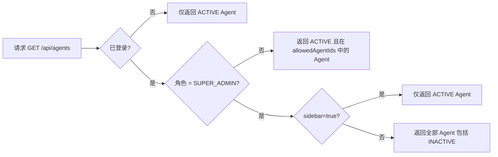
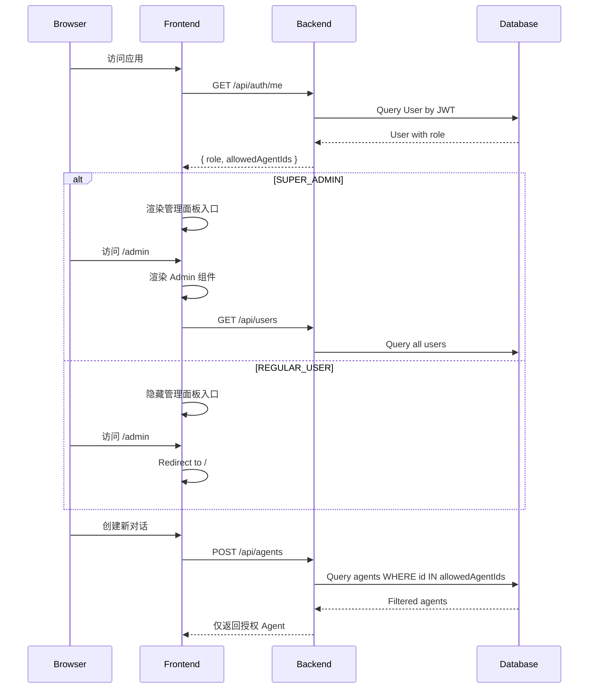

本页面详细阐述 BobCFC 平台的双层权限控制体系——后端 API 级别的角色守卫机制与前端组件级别的条件渲染策略。该系统基于 `SUPER_ADMIN` 和 `REGULAR_USER` 两个预定义角色构建，通过 JWT 令牌承载身份上下文，实现从数据库约束到 UI 层面的端到端权限隔离。

## 角色定义与数据模型

### 用户角色枚举

系统在数据库层通过 Check Constraint 强制角色取值范围，确保数据完整性不受应用层异常影响。用户角色定义位于 `User` 模型中，采用字符串枚举而非布尔值，为未来扩展预留灵活性。



**角色类型说明：**

| 角色 | 数据库值 | 权限范围 |
|------|---------|----------|
| 超级管理员 | `SUPER_ADMIN` | 平台全功能访问，包括用户管理、Agent 状态控制、角色分配 |
| 普通用户 | `REGULAR_USER` | 仅可访问已授权的 Agent，对话及制品生成功能 |

Sources: [user.py](backend/app/models/user.py#L1-L21)

### Agent 访问控制关联表

平台采用多对多关联表 `user_allowed_agents` 实现细粒度的 Agent 访问控制。普通用户仅能查看和使用被明确授权的 Agent 实例，而超级管理员可访问全部 Agent。该设计允许在同一平台内为不同用户群体配置差异化的 AI 服务能力。

Sources: [agent.py](backend/app/models/agent.py#L18-L24)

## 后端权限守卫机制

### 身份解析依赖

`get_current_user` 依赖函数负责从请求中提取用户身份，支持三种令牌来源：Cookie 中的 `token`（演示模式）、Cookie 中的 `session_token`（OIDC 模式）、以及 Authorization Header 的 Bearer Token。该函数返回 `User | None`，未认证请求不会触发 401 异常，而是返回空值由下游处理。



Sources: [dependencies.py](backend/app/dependencies.py#L10-L28)

### 管理员守卫

`require_admin` 依赖函数在 `get_current_user` 基础上增加角色校验，非超级管理员请求将收到 403 Forbidden 响应。该函数用于保护用户管理、角色分配等敏感端点。

```python
async def require_admin(current_user: User = Depends(get_current_user)) -> User:
    if not current_user or current_user.role != "SUPER_ADMIN":
        raise HTTPException(status_code=403, detail="Forbidden")
    return current_user
```

Sources: [dependencies.py](backend/app/dependencies.py#L30-L34)

## API 端点权限矩阵

### 认证相关端点

| 端点 | 认证要求 | 权限说明 |
|------|---------|----------|
| `GET /api/auth/me` | 可选 | 返回当前用户信息及 `allowedAgentIds`，未认证返回 `null` |
| `GET /api/auth/login` | 无 | 演示模式自动登录，OIDC 模式重定向至 IdP |
| `GET /api/auth/callback/*` | 无 | OIDC 回调处理，创建/更新用户后设置会话 Cookie |

Sources: [auth.py](backend/app/api/auth.py#L1-L10)

### 用户管理端点

| 端点 | 认证要求 | 功能 |
|------|---------|------|
| `GET /api/users` | `require_admin` | 列出所有用户及其 Agent 授权列表 |
| `PUT /api/users/{id}` | `require_admin` | 更新用户角色、用户名、Email、Agent 授权 |

超级管理员可为任意用户分配或撤销 Agent 访问权限，通过操作 `user_allowed_agents` 关联表实现。该操作在单次事务内完成，先清除旧关联再插入新关联，确保数据一致性。

Sources: [users.py](backend/app/api/users.py#L1-L73)

### Agent 列表端点的三层过滤

`GET /api/agents` 端点实现了基于用户身份的三层过滤逻辑：



该设计确保普通用户无法通过 API 发现未被授权的 Agent 实例，实现了后端层面的数据隔离。

Sources: [agents.py](backend/app/api/agents.py#L11-L43)

### Agent 更新端点

| 端点 | 认证要求 | 可修改字段 |
|------|---------|-----------|
| `PUT /api/agents/{id}` | `require_admin` | name, description, status, recommended_model, skill_ids |

普通用户无法修改任何 Agent 属性，即使已获得该 Agent 的使用授权。这遵循了最小权限原则——使用权限与配置权限严格分离。

Sources: [agents.py](backend/app/api/agents.py#L45-L95)

## 前端权限控制策略

### 用户状态类型定义

前端定义 `User` 接口与后端数据模型对齐，TypeScript 编译期检查确保类型安全。`allowedAgentIds` 字段为可选数组，未定义时表示用户可使用全部已授权 Agent。

```typescript
export interface User {
  id: string;
  username: string;
  role: 'SUPER_ADMIN' | 'REGULAR_USER';
  email: string;
  allowedAgentIds?: string[];
}
```

Sources: [types.ts](frontend/src/types.ts#L1-L7)

### 路由级权限守卫

`App.tsx` 采用条件渲染实现路由级别的权限控制。超级管理员可访问 `/admin` 路径，其他用户访问该路径将被重定向至首页 `/`。

```typescript
<Route
  path="/admin"
  element={user.role === 'SUPER_ADMIN' ? <Admin /> : <Navigate to="/" />}
/>
```

Sources: [App.tsx](frontend/src/App.tsx#L74-L76)

### 导航项条件渲染

侧边栏组件根据用户角色动态生成导航菜单。超级管理员可见「管理面板」入口，普通用户仅显示「聊天」和「制品库」两个基础功能入口。

```typescript
const navItems = [
  { icon: MessageSquare, label: t('chat_console'), path: '/' },
  { icon: Box, label: t('artifact_repo'), path: '/artifacts' },
  ...(user.role === 'SUPER_ADMIN' ? [{ icon: Settings, label: t('admin_panel'), path: '/admin' }] : []),
];
```

Sources: [Sidebar.tsx](frontend/src/components/Sidebar.tsx#L56-L60)

## 管理员面板功能

管理员面板提供三个管理维度：**用户管理**、**Agent 管理**、**技能目录**。采用 Tab 页签设计，超级管理员可在单一界面完成平台资源的配置操作。

### 用户管理功能

| 功能 | 操作方式 | 影响范围 |
|------|---------|----------|
| 角色切换 | 开关按钮 | 立即生效，影响 API 访问权限 |
| Agent 授权 | 勾选列表 | 写入 `user_allowed_agents` 关联表 |
| 用户信息修改 | 编辑表单 | 更新 username、email |

角色切换采用双向开关控件，视觉上清晰呈现当前状态。Agent 授权则通过多选列表实现，管理员可同时为多个用户配置多个 Agent 的访问权限。

Sources: [Admin.tsx](frontend/src/components/Admin.tsx#L55-L75)

### Agent 管理功能

| 功能 | 操作方式 | 权限要求 |
|------|---------|----------|
| 状态切换 | 开关按钮 | 超级管理员 |
| 技能关联 | 勾选列表 | 超级管理员 |
| 基本信息编辑 | 编辑表单 | 超级管理员 |

Agent 的状态（ACTIVE/INACTIVE）决定了普通用户是否可在列表中看到该 Agent。关闭某 Agent 后，所有普通用户立即失去访问权，而超级管理员仍可通过完整列表进行管理操作。

Sources: [Admin.tsx](frontend/src/components/Admin.tsx#L80-L145)

## JWT 令牌结构

系统使用 HS256 算法签名的 JWT 令牌承载用户身份信息，令牌内容包含用户 ID、角色和 Email。令牌有效期通过 `JWT_EXPIRE_MINUTES` 配置，演示模式默认为 24 小时。

```json
{
  "sub": "user-uuid",
  "role": "SUPER_ADMIN",
  "email": "admin@example.com",
  "exp": 1234567890
}
```

Sources: [auth_service.py](backend/app/services/auth_service.py#L17-L25)

## 双模式认证与角色

系统支持演示模式和 OIDC 模式两种认证路径。演示模式下，系统自动以超级管理员身份登录，便于开发测试；OIDC 模式下，角色由 IdP 声明映射决定，通过 `_determine_role` 函数实现从外部身份到内部角色的转换。

```python
def _determine_role(roles: list, provider: str) -> str:
    """Map IdP roles to internal role."""
    settings = get_settings()
    admin_roles = settings.oidc_admin_roles
    return "SUPER_ADMIN" if any(r in admin_roles for r in roles) else "REGULAR_USER"
```

Sources: [auth.py](backend/app/api/auth.py#L150-L156)

## 权限控制流程总览



---

## 相关文档

- [OIDC 认证流程](18-oidc-ren-zheng-liu-cheng) — 外部身份提供者集成
- [JWT 会话管理](19-jwt-hui-hua-guan-li) — 令牌生命周期管理
- [API 端点参考](17-api-duan-dian-can-kao) — 完整 API 清单