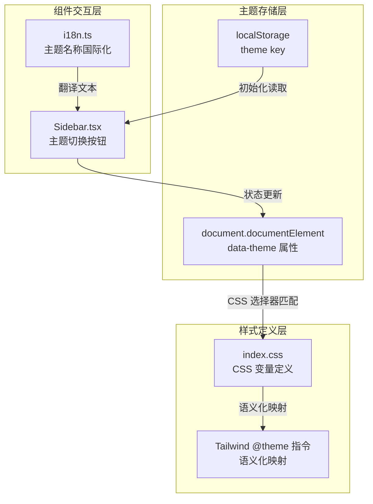
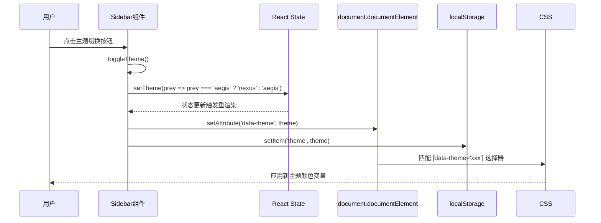

主题系统是平台前端视觉呈现的核心模块，通过 CSS 变量与 React 状态管理相结合，实现了一套灵活的双主题切换机制。该系统支持 Aegis（蓝色专业风格）和 Nexus（绿色清新风格）两种品牌主题，允许用户在运行时自由切换，同时保持所有 UI 组件的视觉一致性。

## 架构设计

主题系统采用**三层分离架构**，将主题定义、主题切换逻辑和国际化文本支持解耦到独立模块中。这种设计确保了主题系统与业务逻辑的清晰边界，便于后续扩展和维护。



主题配置的核心变量定义在 `index.css` 中，包含六组核心颜色变量：`primary`（主色调）、`accent`（强调色）、`sidebar`（侧边栏背景）、`border`（边框色）、`text-main`（主文本色）和 `text-muted`（次要文本色）。通过修改这些基础变量组合，可以快速创建新的主题变体。

Sources: [index.css](frontend/src/index.css#L1-L58)
Sources: [Sidebar.tsx](frontend/src/components/Sidebar.tsx#L1-L185)
Sources: [i18n.ts](frontend/src/i18n.ts#L1-L128)

## 双主题配色方案

平台内置了两套完整的品牌主题，分别对应不同的业务场景和视觉偏好。两套主题共享相同的变量结构，仅在颜色值上有所区分，确保了 UI 组件能够无差别地适配两种主题。

| 变量名 | Aegis（蓝色） | Nexus（绿色） | 用途说明 |
|--------|---------------|---------------|----------|
| `--primary` | `#0F172A` | `#064E3B` | 品牌主色、标题文字 |
| `--accent` | `#2563EB` | `#10B981` | 交互强调色、按钮 |
| `--sidebar` | `#F8FAFC` | `#F0FDF4` | 侧边栏背景 |
| `--border` | `#E2E8F0` | `#D1FAE5` | 边框分隔线 |
| `--text-main` | `#1E293B` | `#064E3B` | 正文内容 |
| `--text-muted` | `#64748B` | `#34D399` | 次要信息文字 |
| `--bg-canvas` | `#FFFFFF` | `#FFFFFF` | 主画布背景 |
| `--artifact-bg` | `#F1F5F9` | `#ECFDF5` | 制品区域背景 |

Aegis 主题采用蓝色调设计，传达专业、可信赖的企业形象，适合金融类应用场景。Nexus 主题以绿色为主，呈现清新、环保的品牌调性，适用于强调创新与活力的业务场景。两种主题的 `--bg-canvas` 均保持白色，确保内容可读性不受主题切换影响。

Sources: [index.css](frontend/src/index.css#L20-L56)

## 主题切换机制

主题切换通过 React 的 `useState` 和 `useEffect` Hook 实现。`Sidebar` 组件维护当前主题状态，并在状态变更时同步更新 DOM 属性和持久化存储。



核心实现代码位于 `Sidebar.tsx` 中。组件初始化时从 `localStorage` 读取保存的主题偏好，若无保存记录则默认使用 `'aegis'` 主题。`useEffect` 监听主题状态变化，同时执行 DOM 属性更新和本地存储持久化操作，确保页面刷新后主题偏好得以保留。

```typescript
// 主题状态初始化
const [theme, setTheme] = useState(localStorage.getItem('theme') || 'aegis');

// 主题变更监听
useEffect(() => {
  document.documentElement.setAttribute('data-theme', theme);
  localStorage.setItem('theme', theme);
}, [theme]);

// 切换处理函数
const toggleTheme = () => {
  setTheme(prev => prev === 'aegis' ? 'nexus' : 'aegis');
};
```

Sources: [Sidebar.tsx](frontend/src/components/Sidebar.tsx#L16-L49)

## CSS 变量与 Tailwind 集成

主题系统利用 Tailwind CSS v4 的 `@theme` 指令，将 CSS 自定义属性映射为语义化的设计令牌。这种映射方式使得组件可以使用语义化的类名（如 `text-primary`、`bg-accent`）编写样式，同时自动响应主题切换。

```css
@theme {
  --font-sans: "Inter", ui-sans-serif, system-ui, sans-serif;
  
  --color-primary: var(--primary);
  --color-accent: var(--accent);
  --color-sidebar: var(--sidebar);
  --color-border: var(--border);
  --color-text-main: var(--text-main);
  --color-text-muted: var(--text-muted);
  --color-bg-canvas: var(--bg-canvas);
  --color-artifact-bg: var(--artifact-bg);
}

@layer base {
  :root {
    --primary: #0F172A;
    --accent: #2563EB;
    /* ... Aegis 默认值 */
  }

  [data-theme='nexus'] {
    --primary: #064E3B;
    --accent: #10B981;
    /* ... Nexus 覆盖值 */
  }
}
```

组件中可以直接使用映射后的 Tailwind 类名，例如 `<div className="text-primary bg-sidebar border-border">`。当 `data-theme` 属性变更时，CSS 选择器 `[data-theme='nexus']` 下的变量覆盖会自动生效，页面颜色随之更新，无需额外触发组件重渲染。

Sources: [index.css](frontend/src/index.css#L1-L19)

## 国际化支持

主题系统的用户可见文本（主题名称、切换按钮提示等）均已集成国际化支持。目前支持中文（`zh`）和英文（`en`）两种语言环境，翻译文本定义在 `i18n.ts` 的翻译资源对象中。

| i18n Key | 中文文本 | 英文文本 |
|----------|----------|----------|
| `subject` | 主题 | Theme |
| `aegis_ai` | Aegis AI (蓝色) | Aegis AI |
| `nexus_ai` | Nexus AI (绿色) | Nexus AI |

侧边栏底部区域同时提供了语言切换和主题切换两个快捷操作按钮，用户可以在不进入设置页面的情况下快速调整偏好。语言和主题偏好相互独立，可以自由组合使用。

Sources: [i18n.ts](frontend/src/i18n.ts#L63-L66)
Sources: [Sidebar.tsx](frontend/src/components/Sidebar.tsx#L168-L185)

## 自定义主题扩展

如需添加新的品牌主题，建议按照以下步骤扩展主题系统。首先在 `index.css` 的 `:root` 之后添加新的 `[data-theme='xxx']` 规则块，定义该主题的所有颜色变量。其次在 `Sidebar.tsx` 的 `toggleTheme` 函数中增加新主题的切换分支。最后在 `i18n.ts` 中添加新主题的翻译键值。

```css
/* 新增主题示例：Ember（橙色主题） */
[data-theme='ember'] {
  --primary: #7C2D12;
  --accent: #EA580C;
  --sidebar: #FFF7ED;
  --border: #FED7AA;
  --text-main: #7C2D12;
  --text-muted: #FB923C;
  --bg-canvas: #FFFFFF;
  --artifact-bg: #FFEDD5;
}
```

```typescript
// Sidebar.tsx 修改
const toggleTheme = () => {
  setTheme(prev => {
    if (prev === 'aegis') return 'nexus';
    if (prev === 'nexus') return 'ember';
    return 'aegis';
  });
};
```

扩展主题时需注意保持所有颜色变量的完整性定义，避免出现未定义变量导致的样式异常。同时建议在 `types.ts` 中添加主题类型定义以获得 TypeScript 类型安全支持。

Sources: [Sidebar.tsx](frontend/src/components/Sidebar.tsx#L116-L121)

## 技术依赖

主题系统基于以下技术栈实现，理解这些依赖关系有助于问题排查和功能扩展：

| 依赖项 | 版本 | 用途 |
|--------|------|------|
| Tailwind CSS | 4.x | CSS 变量映射与原子化样式 |
| React | 19.x | 状态管理与副作用处理 |
| i18next | 26.x | 国际化文本管理 |
| localStorage | Web API | 主题偏好持久化 |

Tailwind CSS v4 引入的 `@theme` 指令是本主题系统的核心实现基础。若项目需要降级到 Tailwind CSS v3 版本，主题系统需要改用传统 CSS 变量定义方式，并通过 Tailwind 配置文件中的 `extend.colors` 字段进行映射。

Sources: [package.json](frontend/package.json#L1-L46)

## 后续内容

- [国际化支持](24-guo-ji-hua-zhi-chi)：深入了解平台的 i18n 架构与翻译工作流
- [前端技术架构](9-qian-duan-ji-zhu-jia-gou)：了解前端整体技术选型与架构设计
- [角色权限控制](22-jiao-se-quan-xian-kong-zhi)：了解基于用户角色的功能控制机制