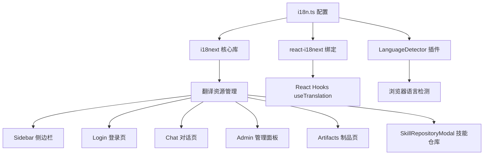
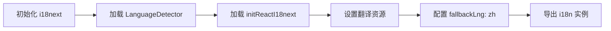
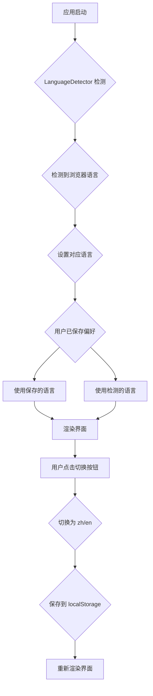

本页面详细说明平台前端如何实现多语言支持，包括技术架构、配置方式和使用规范。国际化（i18n）系统基于 i18next 生态构建，支持中文（zh）和英文（en）两种语言，通过浏览器语言自动检测和手动切换两种方式实现语言切换功能。

## 技术选型与依赖

本项目采用业界标准的 React 国际化解决方案，核心技术栈包括 i18next 主库、react-i18next 绑定库以及浏览器语言检测插件。这些依赖共同构成了完整的国际化解决方案，涵盖翻译资源管理、React 组件集成和运行时语言检测三大核心能力。



### 核心依赖版本

| 依赖包 | 版本 | 用途 |
|--------|------|------|
| i18next | ^26.0.4 | 国际化核心框架 |
| react-i18next | ^17.0.3 | React 绑定库 |
| i18next-browser-languagedetector | ^8.2.1 | 浏览器语言自动检测 |

Sources: [package.json](frontend/package.json#L25-L27)

## 配置架构

国际化配置集中在 `frontend/src/i18n.ts` 文件中，采用内联资源定义方式管理翻译内容。这种设计将翻译资源与配置代码集中管理，便于维护和审查。配置包含完整的初始化流程、语言检测策略和回退机制。



配置采用分层结构设计，顶部为应用级翻译键（如应用名称），中部为功能模块翻译键（如对话、制品、管理），底部为具体交互文本。这种分层方式便于翻译键的组织和查找。

Sources: [i18n.ts](frontend/src/i18n.ts#L1-L128)

### 配置参数说明

| 参数 | 值 | 说明 |
|------|-----|------|
| fallbackLng | 'zh' | 当未找到翻译时回退到中文 |
| interpolation.escapeValue | false | 禁用 HTML 转义以支持 React 组件 |
| resources.en/zh | translation 对象 | 中英文翻译资源 |

Sources: [i18n.ts](frontend/src/i18n.ts#L121-L127)

## 翻译资源结构

翻译资源采用扁平化的键值对结构设计，键名采用下划线分隔的命名规范，便于阅读和维护。翻译值支持模板变量插值，使用双花括号语法声明变量位置。

### 应用级翻译键

| 键名 | 中文值 | 英文值 |
|------|--------|--------|
| app_name | AI 智能体协作平台 | AI Agent Platform |
| login_title_1 | 北京银行 | Bank of Beijing |
| login_title_2 | 消费金融公司 | Consumer Finance Company |
| login_subtitle | 大模型服务平台 | Large Model Service Platform |
| login_description | 用人工智能重塑工作方式... | Reshaping work with AI... |

Sources: [i18n.ts](frontend/src/i18n.ts#L5-L15)

### 功能模块翻译键

| 键名 | 中文值 | 英文值 | 使用组件 |
|------|--------|--------|----------|
| chat_console | 对话控制台 | Chat Console | Sidebar |
| artifact_repo | 制品仓库 | Artifact Repository | Sidebar, Artifacts |
| admin_panel | 管理后台 | Admin Panel | Sidebar |
| my_agents | 我的智能体 | My Agents | Sidebar |
| current_agent | 当前智能体 | Current Agent | Chat |
| general_assistant | 通用助手 | General Assistant | Chat |
| share_session | 分享会话 | Share Session | Chat |

Sources: [i18n.ts](frontend/src/i18n.ts#L16-L25)

### 模板变量插值

翻译值支持动态内容插值，通过 `{{variableName}}` 语法在翻译字符串中预留变量位置。渲染时传入的实际值会替换这些占位符，支持复数形式和复杂文本组合。

```typescript
// 定义带变量的翻译
'memory_usage': '内存占用: {{percent}}% / {{total}} Token',
'start_conversation': '开始与 {{name}} 对话吧。'

// 使用时传入变量值
t('memory_usage', { percent: 45, total: 100 })
t('start_conversation', { name: 'Nexus AI' })
```

Sources: [i18n.ts](frontend/src/i18n.ts#L26-L27)

## 组件集成方式

所有需要多语言支持的 React 组件通过 `useTranslation` Hook 获取翻译功能。该 Hook 返回翻译函数 `t` 和 i18n 实例 `i18n`，前者用于获取翻译文本，后者用于控制语言切换。

### 标准使用模式

组件引入和使用翻译功能的标准流程如下：先从 react-i18next 导入 Hook，然后在组件内部调用并解构获取 `t` 函数，最后在 JSX 中通过 `t('key')` 语法获取翻译文本。

```typescript
import { useTranslation } from 'react-i18next';

export function Chat({ user }: ChatProps) {
  const { t } = useTranslation();
  
  return (
    <div>
      <span>{t('current_agent')}</span>
      <span>{agent?.name || t('general_assistant')}</span>
    </div>
  );
}
```

Sources: [Chat.tsx](frontend/src/components/Chat.tsx#L8-L19)

### 动态值传递

当翻译文本包含动态内容时，通过 `t` 函数的第二个参数对象传递变量值。这种方式确保翻译逻辑与组件数据分离，便于翻译内容的独立维护和更新。

```typescript
// Chat.tsx 中的使用示例
<span className="text-sm text-text-muted">
  {t('memory_usage', { percent: 45, total: 100 })}
</span>

// Login.tsx 中的使用示例
<h3 className="text-3xl md:text-4xl font-medium text-[#1E293B] mb-12">
  {t('login_subtitle')}
</h3>
```

Sources: [Chat.tsx](frontend/src/components/Chat.tsx#L26-L27)
Sources: [Login.tsx](frontend/src/components/Login.tsx#L24-L26)

### 使用翻译的组件清单

| 组件 | 翻译键数量 | 主要功能 |
|------|------------|----------|
| Login.tsx | 5 | 登录页面标题和按钮文本 |
| Sidebar.tsx | 20+ | 导航菜单、用户信息、语言切换 |
| Chat.tsx | 10+ | 对话界面标签和状态文本 |
| Artifacts.tsx | 4 | 制品仓库页面 |
| Admin.tsx | 10+ | 管理面板各功能模块 |
| SkillRepositoryModal.tsx | 4 | 技能仓库弹窗 |

Sources: [Sidebar.tsx](frontend/src/components/Sidebar.tsx#L1-L185)
Sources: [Artifacts.tsx](frontend/src/components/Artifacts.tsx#L1-L102)
Sources: [Admin.tsx](frontend/src/components/Admin.tsx#L1-L200)

## 语言切换机制

平台实现两种语言切换机制：浏览器语言自动检测和用户手动切换。两种方式互补，确保用户始终能以熟悉的语言使用平台。



### 自动语言检测

`i18next-browser-languagedetector` 插件在应用初始化时自动检测浏览器语言设置。检测顺序通常为：用户手动保存的语言偏好 → 浏览器 Accept-Language 头 → 域名/子域名配置 → 默认语言（zh）。

Sources: [i18n.ts](frontend/src/i18n.ts#L120-L121)

### 手动语言切换

Sidebar 组件底部的语言切换按钮实现用户主动切换功能。切换逻辑通过 `i18n.changeLanguage()` 方法实现，同时更新 localStorage 存储以持久化用户选择。

```typescript
// Sidebar.tsx 中的切换实现
const toggleLanguage = () => {
  const nextLng = i18n.language === 'zh' ? 'en' : 'zh';
  i18n.changeLanguage(nextLng);
};
```

Sources: [Sidebar.tsx](frontend/src/components/Sidebar.tsx#L57-L60)

### 语言状态显示

切换按钮显示当前语言状态，文本会根据当前语言动态变化：

| 当前语言 | 按钮显示 |
|----------|----------|
| zh | `语言: 中文` |
| en | `Language: English` |

Sources: [Sidebar.tsx](frontend/src/components/Sidebar.tsx#L157-L162)

## 应用初始化

国际化功能在 React 应用入口点 `main.tsx` 中完成初始化。通过动态导入 `i18n.ts` 模块，确保翻译配置在组件渲染前完成加载。

```typescript
// main.tsx
import { StrictMode } from 'react';
import { createRoot } from 'react-dom/client';
import App from './App.tsx';
import './index.css';
import './i18n';  // 国际化初始化

createRoot(document.getElementById('root')!).render(
  <StrictMode>
    <App />
  </StrictMode>,
);
```

Sources: [main.tsx](frontend/src/main.tsx#L1-L12)

初始化时序如下：

1. 浏览器加载 HTML 和 JavaScript 资源
2. 执行 `import './i18n'` 加载翻译配置
3. LanguageDetector 检测浏览器语言
4. 初始化 i18next 并设置默认语言
5. React 渲染 App 组件
6. 各组件通过 useTranslation 获取翻译文本

## 添加新翻译

为平台添加新的翻译内容需要同步更新 `i18n.ts` 文件中的中英文翻译资源。确保翻译键在两种语言中都存在且语义对应。

### 新增翻译键流程

**步骤 1**：在 `i18n.ts` 的 `resources` 对象中找到对应的语言块（zh 或 en）

**步骤 2**：添加新的键值对，遵循现有命名规范

```typescript
const resources = {
  en: {
    translation: {
      // ... 现有翻译
      'new_feature': 'New Feature Name',
    }
  },
  zh: {
    translation: {
      // ... 现有翻译
      'new_feature': '新功能名称',
    }
  }
};
```

Sources: [i18n.ts](frontend/src/i18n.ts#L17-L19)

**步骤 3**：在需要使用翻译的组件中导入并调用

```typescript
import { useTranslation } from 'react-i18next';

function MyComponent() {
  const { t } = useTranslation();
  return <button>{t('new_feature')}</button>;
}
```

### 翻译键命名规范

| 规范 | 示例 | 说明 |
|------|------|------|
| 下划线分隔 | `share_session` | 全小写，单词间用下划线 |
| 功能前缀 | `login_*`, `admin_*` | 按功能模块分组 |
| 描述性命名 | `ready_to_download` | 使用描述性名称而非简写 |

## 扩展多语言支持

如需添加更多语言支持，可在 `resources` 对象中添加新的语言块。扩展时需确保新语言块包含所有现有翻译键，并设置 `fallbackLng` 为目标默认语言。

### 添加新语言配置

```typescript
const resources = {
  en: { translation: { /* 英文翻译 */ } },
  zh: { translation: { /* 中文翻译 */ } },
  ja: { translation: { /* 日文翻译 */ } },  // 新增
};

i18n.init({
  resources,
  fallbackLng: 'zh',  // 可选更改默认回退语言
  // ...
});
```

## 下一步

完成国际化配置学习后，建议继续阅读以下相关页面：

- [主题系统](23-zhu-ti-xi-tong) - 了解与国际化并列的另一个全局配置系统
- [路由与导航](21-lu-you-yu-dao-hang) - 了解 Sidebar 导航组件的完整实现
- [角色权限控制](22-jiao-se-quan-xian-kong-zhi) - 了解 Admin 面板的多语言权限管理