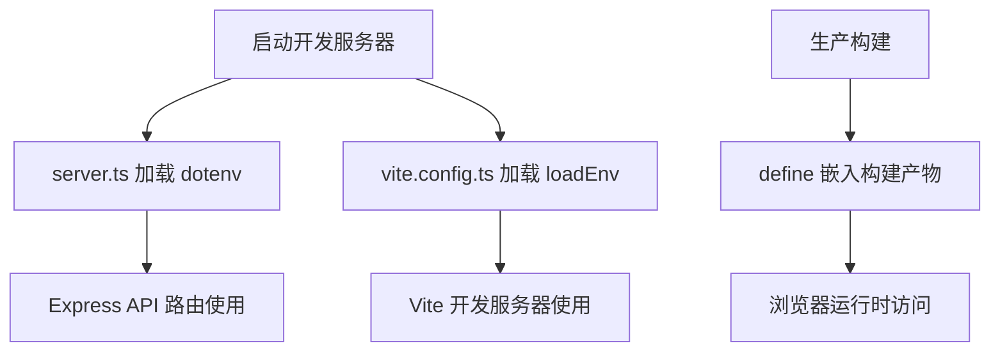

本文档详细说明 BobCFC 平台前端的环境变量配置方法。前端采用 Vite 作为构建工具，Express 作为开发服务器，环境变量同时服务于开发环境和生产构建。配置文件 `.env` 位于 `frontend/` 目录，与后端配置分离，确保前后端可以独立部署和维护。

Sources: [.env.example](frontend/.env.example#L1-L10), [vite.config.ts](frontend/vite.config.ts#L1-L31), [server.ts](frontend/server.ts#L1-L20)

## 配置文件结构

前端使用标准的环境变量文件机制，与 Vite 项目惯例保持一致：

| 文件名 | 用途 | 是否提交到 Git |
|--------|------|----------------|
| `.env` | 本地实际配置（包含敏感信息） | 否 |
| `.env.example` | 配置模板（仅包含占位符） | 是 |
| `.env.production` | 生产环境构建专用 | 可选 |

`.gitignore` 规则确保实际配置文件不会被意外提交：

```bash
.env*
!.env.example
```

Sources: [.gitignore](frontend/.gitignore#L1-L9)

## 环境变量速查表

| 变量名 | 必填 | 默认值 | 说明 |
|--------|------|--------|------|
| `GEMINI_API_KEY` | 是 | 无 | Google Gemini AI API 密钥 |
| `APP_URL` | 建议 | 无 | 应用托管地址（用于 OAuth 回调和自引用链接） |
| `BACKEND_API` | 否 | `http://localhost:8000` | 后端 API 地址（仅开发模式使用） |
| `DISABLE_HMR` | 否 | `false` | 是否禁用热模块替换 |

Sources: [.env.example](frontend/.env.example#L1-L10), [server.ts](frontend/server.ts#L10-L15)

## 配置加载机制

前端环境变量的加载分为两个层面，分别服务于不同的运行场景：



### 开发环境加载

开发模式下，Express 服务器和 Vite 分别加载环境变量：

```typescript
// server.ts - Express 服务器环境变量加载
import dotenv from 'dotenv';
dotenv.config();

// 使用方式
const genAI = new GoogleGenerativeAI(process.env.GEMINI_API_KEY || '');
const BACKEND_API = process.env.BACKEND_API || 'http://localhost:8000';
```

```typescript
// vite.config.ts - Vite 构建工具环境变量加载
import {defineConfig, loadEnv} from 'vite';

export default defineConfig(({mode}) => {
  const env = loadEnv(mode, '.', '');
  return {
    // ...
  };
});
```

Sources: [server.ts](frontend/server.ts#L14-L17), [vite.config.ts](frontend/vite.config.ts#L1-L10)

### 生产环境构建

生产构建时，`GEMINI_API_KEY` 通过 Vite 的 `define` 机制嵌入到客户端代码中：

```typescript
// vite.config.ts
define: {
  'process.env.GEMINI_API_KEY': JSON.stringify(env.GEMINI_API_KEY),
},
```

这意味着密钥在构建时被替换为具体值，前端应用在浏览器中运行时可直接访问此变量。

Sources: [vite.config.ts](frontend/vite.config.ts#L12-L14)

### AI Studio 运行时注入

当应用部署到 Google AI Studio 时，环境变量由平台自动注入，无需手动配置：

- `GEMINI_API_KEY`：从用户 Secrets 面板自动获取
- `APP_URL`：自动注入为 Cloud Run 服务 URL

Sources: [.env.example](frontend/.env.example#L1-L10)

## 核心环境变量详解

### GEMINI_API_KEY

`GEMINI_API_KEY` 是前端与 Google Gemini AI 服务交互的凭证，用于聊天功能的消息生成：

```typescript
// server.ts 中初始化 AI 客户端
const genAI = new GoogleGenerativeAI(process.env.GEMINI_API_KEY || '');
```

**获取方式**：

1. 访问 [Google AI Studio](https://aistudio.google.com/apikey)
2. 点击 "Create API Key" 创建新密钥
3. 复制密钥并添加到本地 `.env` 文件

**安全建议**：不要将包含真实密钥的 `.env` 文件提交到版本控制系统。

Sources: [server.ts](frontend/server.ts#L16), [CLAUDE.md](frontend/CLAUDE.md#L1-L15)

### APP_URL

`APP_URL` 定义应用的托管地址，用于以下场景：

- OAuth 认证回调
- 自引用链接生成
- API 端点的前缀

在 AI Studio 环境中，此值由平台自动注入。在本地开发时通常不需要配置，因为使用相对路径和本地代理即可。

Sources: [.env.example](frontend/.env.example#L5-L8)

### BACKEND_API

`BACKEND_API` 指定后端 FastAPI 服务的地址，仅在开发模式下使用：

```typescript
const BACKEND_API = process.env.BACKEND_API || 'http://localhost:8000';
```

默认连接本地后端服务。当后端服务不可用时，前端 Express 服务器会提供演示模式的模拟数据。

Sources: [server.ts](frontend/server.ts#L15)

### DISABLE_HMR

`DISABLE_HMR` 控制热模块替换功能，在 AI Studio 环境中自动设为 `true` 以避免智能体编辑时出现闪烁。默认情况下本地开发会启用 HMR 以提升开发体验：

```typescript
server: {
  hmr: process.env.DISABLE_HMR !== 'true',
},
```

Sources: [vite.config.ts](frontend/vite.config.ts#L23-L26)

## 开发环境配置步骤

### 1. 创建配置文件

从模板复制并创建本地配置文件：

```bash
cd frontend
cp .env.example .env
```

### 2. 配置必要变量

编辑 `.env` 文件，填入实际值：

```bash
# 必填：Gemini API 密钥
GEMINI_API_KEY="your-actual-api-key-here"

# 可选：应用 URL（本地开发通常不需要）
# APP_URL="http://localhost:3000"

# 可选：后端地址（默认已配置本地服务）
# BACKEND_API="http://localhost:8000"
```

### 3. 验证配置

启动开发服务器验证配置：

```bash
npm run dev
```

控制台应显示：
```
Server running on http://localhost:3000
```

如果看到 `GEMINI_API_KEY` 相关错误，请确认密钥已正确配置且有效。

Sources: [.env.example](frontend/.env.example#L1-L10), [CLAUDE.md](frontend/CLAUDE.md#L1-L15)

## 环境变量使用场景映射

下表展示不同环境下环境变量的可用性：

| 变量 | 本地开发 | 生产构建 | AI Studio |
|------|----------|----------|-----------|
| `GEMINI_API_KEY` | ✅ dotenv 加载 | ✅ define 嵌入 | ✅ 运行时注入 |
| `APP_URL` | ⚠️ 可选 | ⚠️ 可选 | ✅ 自动注入 |
| `BACKEND_API` | ✅ 可用 | ❌ 未使用 | ❌ 未使用 |
| `DISABLE_HMR` | ✅ 可用 | ❌ 未使用 | ✅ 自动设为 true |

Sources: [vite.config.ts](frontend/vite.config.ts#L1-L31), [server.ts](frontend/server.ts#L1-L20)

## 本地代理配置

开发模式下，前端 Express 服务器会自动代理 `/api/*` 请求到后端，避免跨域问题：

```typescript
// server.ts 代理配置
app.all('/api*', (req: express.Request, res: express.Response) => {
  proxyToBackend(req, res);
});
```

Vite 配置中也定义了备用代理：

```typescript
proxy: {
  '/api': {
    target: 'http://localhost:8000',
    changeOrigin: true,
  },
},
```

Sources: [server.ts](frontend/server.ts#L68-L97), [vite.config.ts](frontend/vite.config.ts#L27-L30)

## 主题配置

前端支持两种主题，通过 `localStorage` 中的 `theme` 键管理，与环境变量无关：

| 主题 | 标识 | 主色调 | CSS 变量 |
|------|------|--------|----------|
| Aegis AI（默认） | `data-theme` 未设置或 `aegis` | 蓝色 #2563EB | `--accent: #2563EB` |
| Nexus AI | `data-theme="nexus"` | 绿色 #10B981 | `--accent: #10B981` |

主题切换在 `Sidebar` 组件中实现，通过修改 `<html>` 元素的 `data-theme` 属性生效。

Sources: [index.css](frontend/src/index.css#L1-L58)

## 后续步骤

完成环境变量配置后，建议继续阅读以下文档：

- [快速启动](2-kuai-su-qi-dong) — 了解项目启动的完整流程
- [本地开发模式](5-ben-di-kai-fa-mo-shi) — 深入了解开发服务器的工作原理
- [后端环境变量配置](3-hou-duan-huan-jing-bian-liang-pei-zhi) — 了解后端服务配置（如果需要）
- [Docker Compose 部署](6-docker-compose-bu-shu) — 了解容器化部署方式