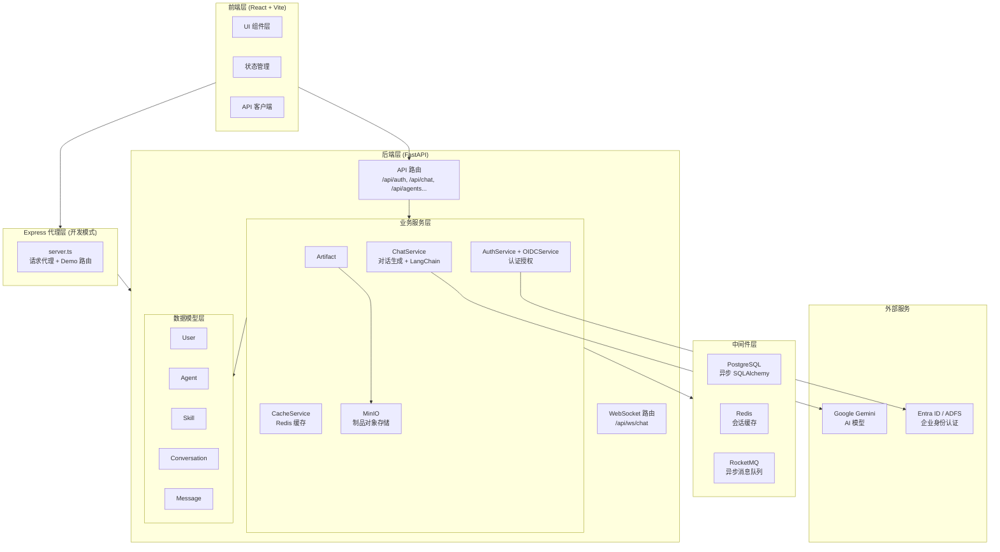
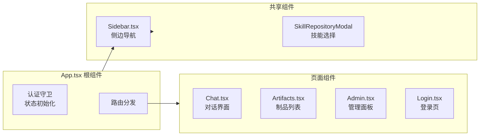
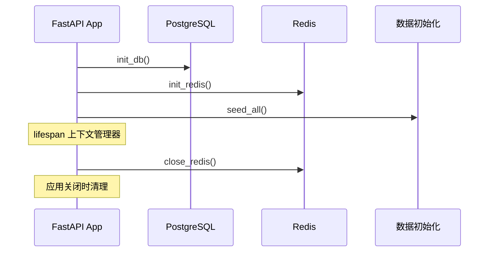
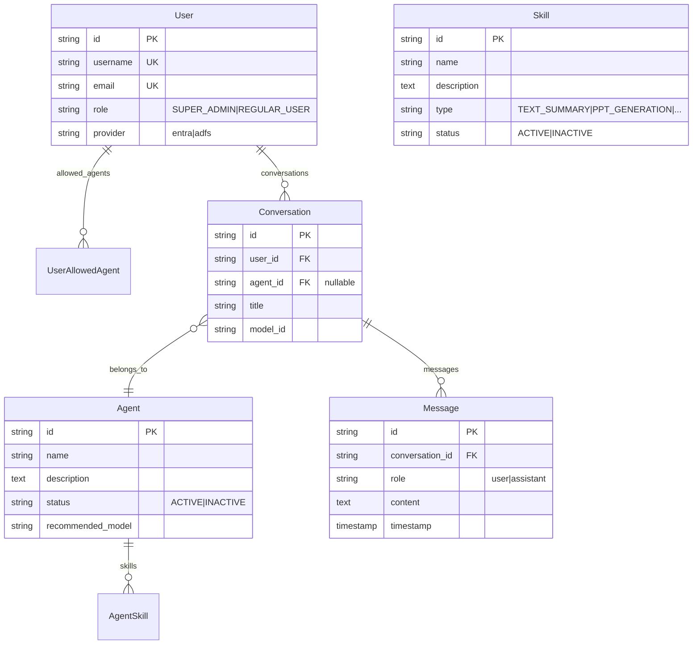
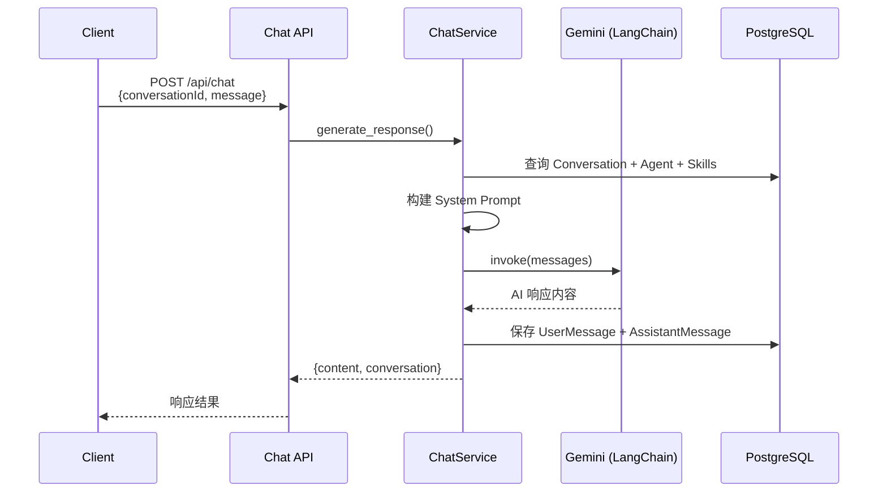
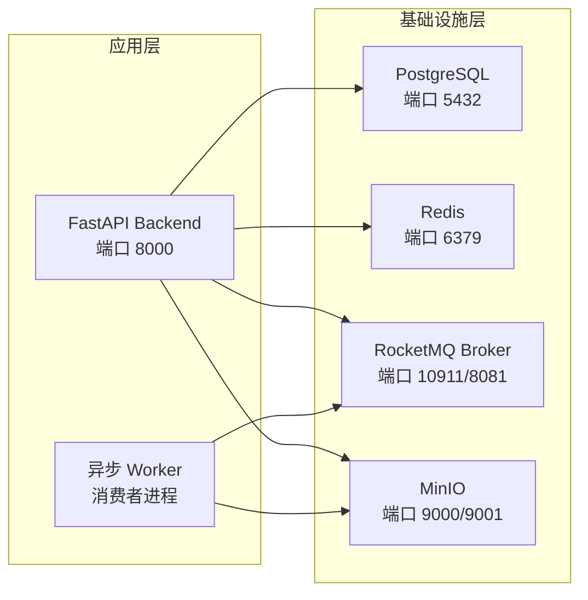
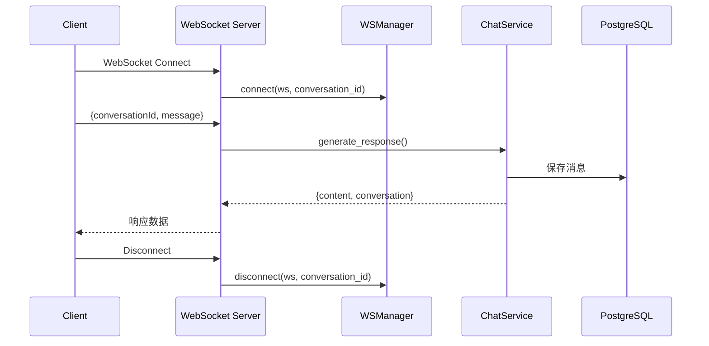

本文档介绍北京银行消费金融公司大模型服务平台（BobCFCPlatform）的整体技术架构。该平台采用前后端分离设计，融合了 FastAPI 异步后端、React 现代前端以及多种企业级中间件，为 AI Agent 协作、对话管理、技能调度与制品生成提供端到端的技术支撑。

## 系统架构图



## 技术栈总览

| 层级 | 技术选型 | 用途说明 |
|------|----------|----------|
| **前端框架** | React 19 + Vite 6 | 构建工具链与组件化开发 |
| **路由管理** | React Router 7 | 单页应用路由控制 |
| **样式方案** | Tailwind CSS 4 | 原子化 CSS 方案 |
| **动画效果** | Framer Motion 12 | 交互动画支持 |
| **国际化** | i18next | 多语言切换（zh/en）|
| **后端框架** | FastAPI | 异步 API 框架 |
| **数据库 ORM** | SQLAlchemy (asyncpg) | PostgreSQL 异步驱动 |
| **AI 集成** | LangChain + Gemini SDK | 大模型调用封装 |
| **消息队列** | RocketMQ | 异步任务解耦 |
| **对象存储** | MinIO | 制品文件存储 |
| **缓存服务** | Redis | 会话与数据缓存 |
| **身份认证** | Authlib + JWT | OIDC + JWT 双模式认证 |

Sources: [frontend/CLAUDE.md](frontend/CLAUDE.md#L30-L45) [backend/app/main.py](backend/app/main.py#L1-L30)

## 前端架构

前端采用典型的单页应用（SPA）架构，Express 开发服务器同时承担 Vite 开发代理和 API 请求转发职能。

### 核心组件结构



### 路由与权限矩阵

| 路由路径 | 渲染组件 | 权限要求 | 说明 |
|----------|----------|----------|------|
| `/` | Chat | 认证用户 | 默认对话页面 |
| `/chat/:conversationId` | Chat | 认证用户 | 历史会话恢复 |
| `/artifacts` | Artifacts | 认证用户 | 制品管理 |
| `/admin` | Admin | **SUPER_ADMIN** | 系统管理 |

前端通过 `App.tsx` 统一拦截认证状态，未登录用户强制跳转至登录页。管理员路由额外校验 `user.role === 'SUPER_ADMIN'` 字段，确保权限隔离。

Sources: [frontend/src/App.tsx](frontend/src/App.tsx#L60-L80)

### 主题系统

平台内置双主题支持，通过 HTML 元素上的 `data-theme` 属性切换：

| 主题名称 | 主色调 | 配色变量 |
|----------|--------|----------|
| **Aegis AI**（默认） | `#2563EB` | 蓝灰色系 slate tones |
| **Nexus AI** | `#10B981` | 绿宝石色系 emerald tones |

主题首选项存储于 `localStorage`，键名为 `theme`，由 `Sidebar.tsx` 组件在挂载时读取并应用。

Sources: [frontend/CLAUDE.md](frontend/CLAUDE.md#L60-L68)

## 后端架构

后端基于 FastAPI 构建，采用分层架构设计，核心模块包括路由层、服务层、数据模型层和中间件集成层。

### 应用启动流程



在 `main.py` 中通过 `lifespan` 上下文管理器实现启动初始化和关闭清理逻辑，包括数据库连接、Redis 连接池建立以及初始数据的填充。

Sources: [backend/app/main.py](backend/app/main.py#L1-L25)

### API 路由注册

后端统一注册了 8 个功能路由模块：

| 路由前缀 | 文件 | 核心功能 |
|----------|------|----------|
| `/api/auth` | `auth.py` | 登录/登出/OIDC 回调 |
| `/api/users` | `users.py` | 用户管理（仅管理员）|
| `/api/agents` | `agents.py` | Agent CRUD |
| `/api/skills` | `skills.py` | 技能配置 |
| `/api/conversations` | `conversations.py` | 会话管理 |
| `/api/chat` | `chat.py` | 同步对话生成 |
| `/api/ws/chat` | `chat_ws.py` | WebSocket 实时对话 |
| `/api/artifacts` | `artifacts.py` | 制品生成与查询 |

Sources: [backend/app/main.py](backend/app/main.py#L52-L63)

### 依赖注入体系

FastAPI 通过 `dependencies.py` 实现请求级别的依赖注入：

```python
# 获取当前用户（支持 Cookie/Header 双重认证）
async def get_current_user(
    request: Request,
    token: str | None = Cookie(None, alias="token"),  # Demo 模式
    session_token: str | None = Cookie(None, alias=SESSION_COOKIE),  # OIDC 模式
    db: AsyncSession = Depends(get_db),
) -> User | None

# 管理员权限校验
async def require_admin(current_user: User = Depends(get_current_user)) -> User
```

系统同时支持 JWT Cookie 和 OIDC Session Token 两种认证方式，根据配置自动切换。

Sources: [backend/app/dependencies.py](backend/app/dependencies.py#L1-L35)

## 数据模型

### 核心实体关系



关键关联表 `agent_skills` 和 `user_allowed_agents` 采用多对多关联，支持灵活的 Agent 技能配置和用户权限控制。

Sources: [backend/app/models/agent.py](backend/app/models/agent.py#L1-L33) [backend/app/models/user.py](backend/app/models/user.py#L1-L21)

## 认证体系

平台支持双模式认证架构：

### 认证模式对比

| 特性 | Demo 模式 | OIDC 模式 |
|------|-----------|-----------|
| **触发条件** | `oidc_provider` 为空 | `oidc_provider` 配置为 `entra` 或 `adfs` |
| **认证方式** | JWT Cookie | OAuth2 + OIDC + Session Cookie |
| **用户来源** | 数据库预置数据 | Microsoft Entra ID / ADFS |
| **Token 类型** | `token` Cookie | `session_token` Cookie |
| **角色映射** | 数据库 `role` 字段 | 基于 Claim 的动态映射 |

OIDC 服务支持 Microsoft Entra ID 和 ADFS 两种企业身份提供商，通过 `claim_mapper.py` 将 IdP 返回的 Claim 映射为平台内部角色。

Sources: [backend/app/services/oidc_service.py](backend/app/services/oidc_service.py#L1-L50) [backend/app/config.py](backend/app/config.py#L25-L40)

## 核心服务流程

### 对话生成流程



`ChatService` 负责加载会话上下文、Agent 配置和关联技能，将信息整合为 LangChain 的 SystemMessage，连同历史消息一并发送给 Gemini 模型。

Sources: [backend/app/services/chat_service.py](backend/app/services/chat_service.py#L30-L80)

### 制品生成流程

制品服务通过 Gemini 生成 PPT、音频脚本或摘要文档：

```python
async def generate_artifact_content(artifact_type: str, name: str) -> tuple[bytes, str]:
    if artifact_type == "PPT":
        prompt = f"Create a PowerPoint presentation outline for '{name}'..."
    elif artifact_type == "AUDIO":
        prompt = f"Generate a script for an audio narration about '{name}'..."
    elif artifact_type == "SUMMARY":
        prompt = f"Create a concise summary document for '{name}'..."
```

生成的二进制内容通过 MinIO 服务上传至对象存储，并生成预签名 URL 供客户端下载。

Sources: [backend/app/services/artifact_service.py](backend/app/services/artifact_service.py#L1-L51) [backend/app/services/minio_service.py](backend/app/services/minio_service.py#L1-L48)

## 中间件集成

### Docker Compose 服务编排



生产环境通过 Docker Compose 统一编排所有依赖服务，`backend` 服务依赖健康检查后的基础设施，而 `workers` 服务作为独立进程处理 RocketMQ 消息。

Sources: [backend/docker-compose.yml](backend/docker-compose.yml#L1-L112)

### Redis 缓存服务

```python
class CacheService:
    async def get(self, key: str) -> str | None
    async def set(self, key: str, value: str, ex: int = 0) -> bool
    async def delete(self, key: str) -> bool
```

缓存服务封装了 Redis 的基础操作，用于会话管理和数据缓存场景。

Sources: [backend/app/services/cache_service.py](backend/app/services/cache_service.py)

## WebSocket 实时通信



`WebSocketManager` 维护 conversation_id 到 WebSocket 连接的映射，支持同一会话的多客户端连接和广播消息推送。

Sources: [backend/app/websocket/manager.py](backend/app/websocket/manager.py#L1-L45) [backend/app/api/chat_ws.py](backend/app/api/chat_ws.py#L1-L49)

## 读取路径建议

- **[项目概述](1-xiang-mu-gai-shu)** — 了解平台业务背景与核心功能
- **[快速启动](2-kuai-su-qi-dong)** — 本地开发环境搭建
- **[后端技术架构](8-hou-duan-ji-zhu-jia-gou)** — FastAPI 服务层深入解析
- **[前端技术架构](9-qian-duan-ji-zhu-jia-gou)** — React 组件体系与状态管理
- **[OIDC 认证流程](18-oidc-ren-zheng-liu-cheng)** — 企业身份集成详解