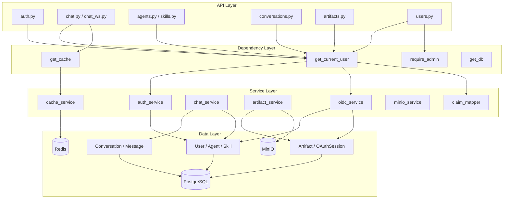
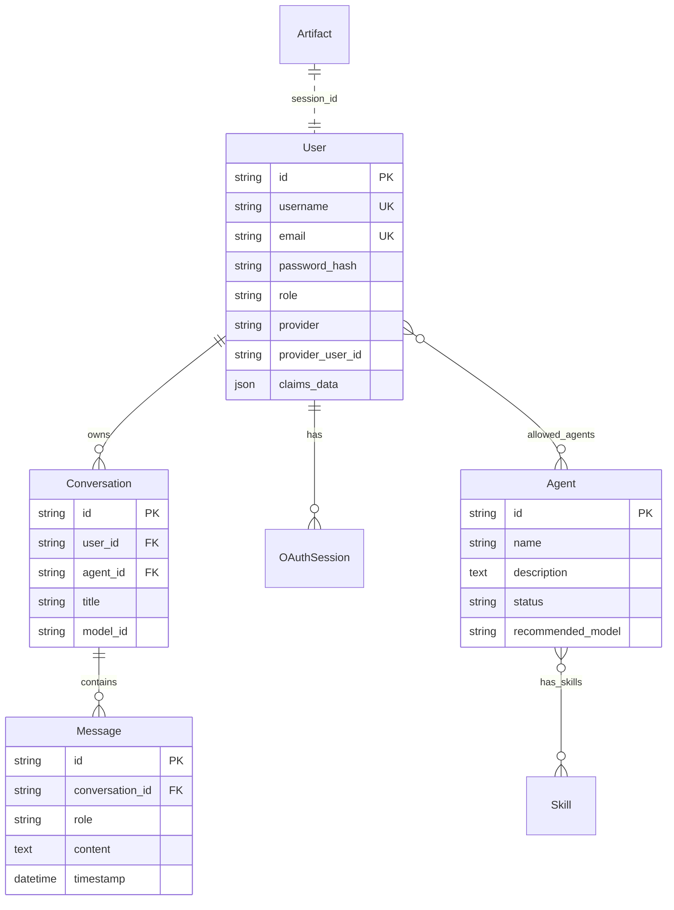
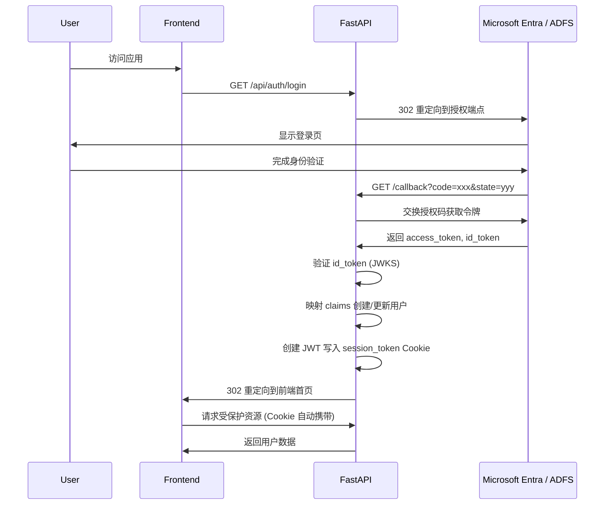

本文档深入解析 BobCFC 平台的 Python 后端技术架构，涵盖技术栈选型、分层设计、数据模型、服务编排及认证流程等核心维度。该架构采用 FastAPI 异步框架为核心，构建了一个支持 OIDC 企业认证、LangChain + Gemini AI 集成、消息队列异步处理、对象存储持久化的现代化 AI Agent 协作平台后端。

## 技术栈全景

后端基于 Python 3.12+ 构建，选用 FastAPI 作为 Web 框架，充分利用其异步能力和自动 OpenAPI 文档生成特性。核心技术栈按层次划分如下：

| 层次 | 技术选型 | 用途说明 |
|------|----------|----------|
| Web 框架 | FastAPI 0.115+ / uvicorn | 异步 HTTP/WebSocket 服务 |
| 数据库 | PostgreSQL 16 + SQLAlchemy 2.0 (async) + asyncpg | 异步 ORM 访问，连接池 20+10 |
| 认证 | Authlib (OIDC) + python-jose (JWT) + passlib/bcrypt | 企业 SSO 与本地 JWT |
| AI | LangChain + langchain-google-genai + Gemini | Agent 对话与制品生成 |
| 缓存 | Redis (hiredis) | 会话缓存、令牌存储 |
| 消息队列 | RocketMQ 5.3.1 | 异步任务解耦（当前为占位实现） |
| 对象存储 | MinIO (S3 兼容) | AI 生成的制品文件持久化 |
| 配置 | pydantic-settings | 环境变量驱动配置 |

Sources: [pyproject.toml](backend/pyproject.toml#L1-L30), [main.py](backend/app/main.py#L1-L74), [config.py](backend/app/config.py#L1-L75)

## 分层架构设计

后端采用经典的分层架构模式，从上至下依次为 **API 层 → 依赖注入层 → 服务层 → 数据层**，各层职责明确，依赖单向流动。

### API 层设计

API 层由 8 个 FastAPI Router 模块组成，采用前缀 `/api` 的统一路由组织。核心设计特点：

**认证路由** (`auth.py`)：支持双模式认证。演示模式下自动登录超级管理员；OIDC 模式下重定向至 IdP 并处理回调。路由涵盖 `/login`、`/callback/microsoft`、`/callback/adfs`、`/logout`、`/me`、`/config`。

**对话路由** (`chat.py`、`chat_ws.py`)：提供 REST 和 WebSocket 两种交互方式。REST 端点返回标准 JSON 响应，WebSocket 端点支持实时双向通信，两者共享底层的 `generate_response` 核心逻辑。

**资源路由** (`agents.py`、`skills.py`、`conversations.py`、`artifacts.py`、`users.py`)：实现 CRUD 操作，其中 Agent 路由包含基于用户角色的动态过滤逻辑。

Sources: [main.py](backend/app/main.py#L50-L73), [auth.py](backend/app/api/auth.py#L1-L200), [chat.py](backend/app/api/chat.py#L1-L34), [chat_ws.py](backend/app/api/chat_ws.py#L1-L49)

### 依赖注入层设计

`dependencies.py` 封装了跨路由复用的依赖逻辑，通过 FastAPI 的 `Depends` 机制实现自动依赖解析：

**用户认证**：`get_current_user` 函数从 Cookie 或 Authorization Header 提取 JWT，验证签名后从数据库加载用户对象。演示模式读取 `token` Cookie，OIDC 模式读取 `session_token` Cookie，支持优雅降级为匿名访问。

**权限校验**：`require_admin` 依赖项验证用户角色为 `SUPER_ADMIN`，否则抛出 403 错误。

**缓存服务**：`get_cache` 返回 `CacheService` 实例封装 Redis 客户端。

Sources: [dependencies.py](backend/app/dependencies.py#L1-L55)

## 数据模型体系

数据库包含 10 张表，通过 SQLAlchemy ORM 定义，采用 UUID 作为主键策略，基类混入时间戳自动管理。

### 核心实体关系

### 模型定义规范

所有模型继承 `Base` (DeclarativeBase) 和 `TimestampMixin`，统一提供 `id` (UUID36 字符串)、`created_at`、`updated_at` 字段。表约束使用 CheckConstraint 限制枚举值范围，例如用户角色限定为 `SUPER_ADMIN` 或 `REGULAR_USER`。

**多对多关联**通过关联表实现：`agent_skills` 表连接 Agent 与 Skill，`user_allowed_agents` 表控制用户可见的 Agent 范围。

Sources: [base.py](backend/app/models/base.py#L1-L21), [user.py](backend/app/models/user.py#L1-L21), [agent.py](backend/app/models/agent.py#L1-L33), [conversation.py](backend/app/models/conversation.py#L1-L15), [message.py](backend/app/models/message.py#L1-L21)

## 服务层架构

服务层封装核心业务逻辑，与 API 层解耦，支持独立测试和复用。

### 认证服务

**auth_service.py** 提供 JWT 令牌的创建与验证能力。`create_access_token` 生成包含 `sub` (user_id)、`role`、`email`、`exp` 的 HS256 签名令牌，默认有效期 1440 分钟。`decode_access_token` 解析并验证令牌，失败返回 `None` 而非抛异常，便于上游处理。

**oidc_service.py** 实现完整的 OIDC 授权码流程。使用 Authlib 的 `AsyncOAuth2Client` 与 Microsoft Entra ID 或 ADFS 交互。关键流程包括：生成随机 state/nonce 防 CSRF、从 JWKS 端点获取公钥验证 ID Token、提取标准声明映射用户信息。

**claim_mapper.py** 标准化不同 IdP 的声明格式。Entra ID 提取 `oid` 作为用户标识，`email`/`preferred_username` 作为邮箱，`roles`/`groups` 作为角色；ADFS 从 UPN、emailaddress 等多字段降级获取。

Sources: [auth_service.py](backend/app/services/auth_service.py#L1-L36), [oidc_service.py](backend/app/services/oidc_service.py#L1-L100), [claim_mapper.py](backend/app/services/claim_mapper.py#L1-L50)

### 聊天服务

**chat_service.py** 是对话核心，完整流程如下：

1. 根据 `conversation_id` 加载对话上下文和关联的 Agent/Skill
2. 构建 LangChain 消息链：`SystemMessage` (Agent 描述 + 技能列表) + 历史消息 + 当前用户输入
3. 调用 `ChatGoogleGenerativeAI` (Gemini 2.0 Flash) 生成回复
4. 持久化用户消息和助手回复，自动为首次对话生成标题
5. 返回回复内容和更新后的对话结构

Messages 使用 `selectin` 预加载策略优化查询性能，时间戳统一处理时区转换。

Sources: [chat_service.py](backend/app/services/chat_service.py#L1-L138)

### 制品服务

**artifact_service.py** 支持 PPT、AUDIO、SUMMARY 三种制品类型生成。每个类型对应特定的 prompt 模板发送给 Gemini，返回结构化文本内容，存储为 UTF-8 编码的文本文件。

**minio_service.py** 封装 MinIO 客户端操作：`ensure_bucket` 懒创建桶、`upload_object` 分块上传、`get_presigned_url` 生成带签名的下载链接（默认 1 小时有效期）、`download_object` 获取文件内容。

Sources: [artifact_service.py](backend/app/services/artifact_service.py#L1-L51), [minio_service.py](backend/app/services/minio_service.py#L1-L48)

### 缓存服务

**cache_service.py** 提供统一的 Redis 操作封装。`CacheService` 类封装 GET/SET/DELETE 操作，自动处理 JSON 序列化，支持 TTL 设置。`invalidate_pattern` 方法通过 SCAN 迭代删除匹配通配符的键，避免 KEYS 命令阻塞。

Sources: [cache_service.py](backend/app/services/cache_service.py#L1-L57)

## 消息队列集成

**mq/producer.py** 实现 RocketMQ 生产者封装，提供异步 `send` 方法支持主题投递和延迟级别设置。当前实现包含异常降级逻辑：当 RocketMQ 不可用时静默跳过消息而非中断业务。

**mq/chat_consumer.py** 是消费者占位实现，设计为独立 Worker 进程运行，从 RocketMQ 拉取消息后调用 Gemini 生成回复并通过 WebSocket 推送。由于 RocketMQ 依赖当前为可选，当前对话处理采用同步直连模式。

Sources: [producer.py](backend/app/mq/producer.py#L1-L66), [chat_consumer.py](backend/app/mq/chat_consumer.py#L1-L29)

## WebSocket 实时通信

**websocket/manager.py** 实现连接管理器，按 `conversation_id` 分组维护 WebSocket 连接。核心能力包括：连接注册与按组隔离、断开时自动清理空组、向指定组内所有客户端广播消息、自动检测并移除失效连接。

`chat_ws.py` 的 WebSocket 端点实现：接受连接后循环接收客户端 JSON 消息，解析 `conversationId` 和 `message` 字段，调用 `generate_response` 处理后将结果发送回客户端，支持中途切换对话的场景。

Sources: [manager.py](backend/app/websocket/manager.py#L1-L45), [chat_ws.py](backend/app/api/chat_ws.py#L1-L49)

## 应用生命周期管理

`main.py` 通过 FastAPI 的 `lifespan` 上下文管理器实现启动和关闭钩子：

**启动阶段**：依次初始化数据库表结构、连接 Redis、运行数据初始化种子脚本 (seed_all)。确保所有基础设施就绪后再接受请求。

**关闭阶段**：断开数据库连接池、关闭 Redis 连接。确保资源正确释放，避免连接泄漏。

CORS 中间件配置允许前端 origins 列表，支持认证凭据传递。

Sources: [main.py](backend/app/main.py#L1-L74), [session.py](backend/app/db/session.py#L1-L36)

## 配置管理

`config.py` 基于 Pydantic Settings 定义所有配置项，从 `.env` 文件加载。主要配置分组：

| 配置组 | 关键字段 | 说明 |
|--------|----------|------|
| 数据库 | `database_url` | PostgreSQL Async 连接字符串 |
| Redis | `redis_url` | Redis 连接 URL |
| RocketMQ | `rocketmq_namesrv`、`rocketmq_group` | 消息队列地址与消费组 |
| MinIO | `minio_endpoint`、`minio_access_key`、`minio_bucket` | 对象存储配置 |
| JWT | `jwt_secret`、`jwt_algorithm`、`jwt_expire_minutes` | 本地认证密钥 |
| OIDC Entra | `entra_client_id`、`entra_tenant_id`、`entra_role_mappings` | Azure AD 配置 |
| OIDC ADFS | `adfs_client_id`、`adfs_issuer`、`adfs_role_mappings` | ADFS 配置 |
| AI | `gemini_api_key` | Google Gemini API 密钥 |

`model_post_init` 方法处理 JSON 字符串格式的角色映射配置，从环境变量加载时自动反序列化。

Sources: [config.py](backend/app/config.py#L1-L75)

## 认证流程详解

### 演示模式（无 OIDC 配置）

用户访问 `/api/auth/login` (GET/POST)，后端自动创建或获取超级管理员用户，生成 JWT 写入 `token` Cookie (HttpOnly, SameSite=Lax)。后续请求自动携带 Cookie，`get_current_user` 解析并验证。

### OIDC 企业认证模式

OIDC 回调处理后，用户信息持久化到 `users` 表，令牌存储到 `oauth_sessions` 表（支持刷新令牌后续操作）。

Sources: [auth.py](backend/app/api/auth.py#L80-L200), [oidc_service.py](backend/app/services/oidc_service.py#L55-L120)

## 延伸阅读

- 认证机制详情：[OIDC 认证流程](18-oidc-ren-zheng-liu-cheng)
- 会话管理机制：[JWT 会话管理](19-jwt-hui-hua-guan-li)
- 数据库完整模型：[数据库模型设计](10-shu-ju-ku-mo-xing-she-ji)
- 缓存服务应用：[缓存服务设计](12-huan-cun-fu-wu-she-ji)
- 消息队列集成：[消息队列集成](16-xiao-xi-dui-lie-ji-cheng)