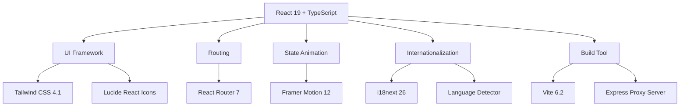
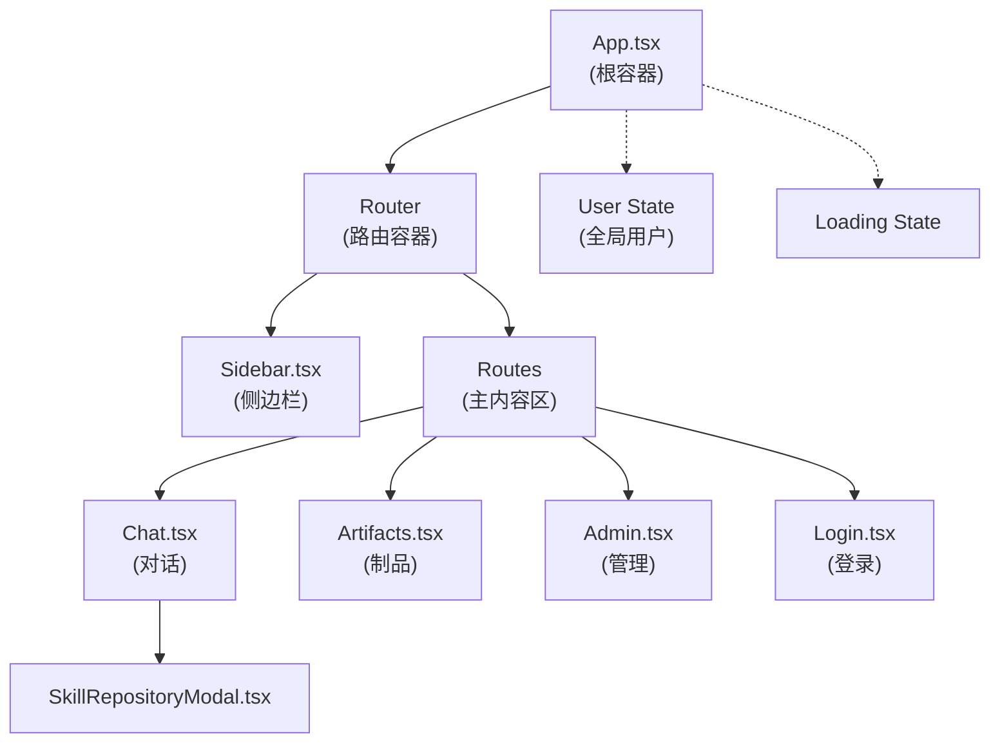
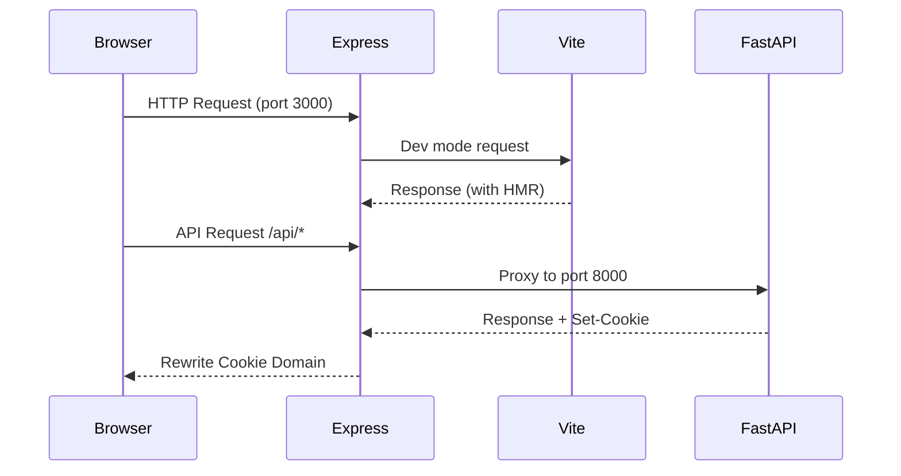

本文档深入剖析 AI 智能体协作平台的前端技术架构，涵盖技术栈选型、组件设计模式、状态管理、样式系统及开发构建流程。该平台基于 React 19 + TypeScript 构建，采用现代化的 Vite 构建工具，集成了 Tailwind CSS 4、React Router 7 及 Framer Motion 等主流库，为企业级 AI 应用提供稳定、高效的前端技术底座。

## 技术栈概览

### 核心依赖体系

前端项目采用当前主流的 React 生态技术栈，通过精心的依赖选型平衡开发效率与运行时性能。React 19 的引入不仅带来了 Concurrent Rendering 能力，更强化了对 Server Components 的支持基础，尽管当前应用仍以客户端渲染为主。



Sources: [package.json](frontend/package.json#L1-L46)

### 关键依赖版本对照表

| 依赖类别 | 包名 | 版本 | 用途说明 |
|---------|------|------|----------|
| 运行时核心 | react / react-dom | 19.0.0 | UI 渲染核心框架 |
| 类型系统 | typescript | 5.8.2 | TypeScript 编译器 |
| 构建工具 | vite | 6.2.0 | 极速前端构建工具 |
| 样式框架 | tailwindcss | 4.1.14 | Utility-First CSS 框架 |
| 路由管理 | react-router-dom | 7.14.1 | SPA 路由导航 |
| 动画库 | motion | 12.23.24 | 声明式动画解决方案 |
| 图标库 | lucide-react | 0.546.0 | 开源 SVG 图标集 |
| 国际化 | i18next / react-i18next | 26.0.4 / 17.0.3 | 多语言支持 |
| AI 集成 | @google/genai | 1.29.0 | Gemini API 客户端 |
| 工具库 | date-fns / clsx / uuid | 4.1.0 / 2.1.1 / 13.0.0 | 辅助工具函数 |

Sources: [package.json](frontend/package.json#L1-L46)

## 项目结构

### 目录组织原则

前端项目遵循 React 社区成熟的项目结构约定，按功能职责划分目录层级。这种组织方式使得代码的可维护性和可扩展性得到保障，同时也便于团队成员快速定位目标文件。

```
frontend/src
├── App.tsx                    # 应用根组件 + 路由配置
├── main.tsx                   # React 应用入口
├── i18n.ts                    # 国际化初始化配置
├── types.ts                   # TypeScript 类型定义
├── index.css                  # 全局样式 + Tailwind 入口
├── components/                # UI 组件目录
│   ├── Chat.tsx              # 核心对话组件
│   ├── Sidebar.tsx           # 侧边导航栏
│   ├── Artifacts.tsx         # 制品仓库视图
│   ├── Admin.tsx             # 管理员控制台
│   ├── Login.tsx             # 登录页面
│   └── SkillRepositoryModal.tsx  # 技能仓库模态框
└── lib/                       # 工具函数库
    ├── api.ts                # API 基础配置
    └── utils.ts              # 通用工具函数
```

Sources: [get_dir_structure](frontend/src)

### 类型定义系统

类型系统是保证代码质量的第一道防线。项目定义了完整的 TypeScript 接口，涵盖用户、会话、消息、制品、智能体和技能等核心实体。这种强类型约束不仅能在编译期捕获潜在错误，更为团队协作提供了清晰的数据契约。

```typescript
// 用户角色类型
type UserRole = 'SUPER_ADMIN' | 'REGULAR_USER';

// 智能体状态类型
type AgentStatus = 'ACTIVE' | 'INACTIVE';

// 制品状态类型
type ArtifactStatus = 'PENDING' | 'COMPLETED' | 'FAILED';

// 消息角色类型
type MessageRole = 'user' | 'assistant';
```

Sources: [types.ts](frontend/src/types.ts#L1-L50)

## 核心组件架构

### 组件层次结构

应用采用经典的容器组件（Container）与展示组件（Presentational）混合模式。根组件 `App.tsx` 承担全局状态管理职责，包括用户认证状态和初始数据加载，而各功能组件则专注于自身业务逻辑的渲染呈现。



Sources: [App.tsx](frontend/src/App.tsx#L1-L97)

### 应用入口与路由

应用初始化流程从 `main.tsx` 开始，经过 React 严格模式检查后挂载根组件。`App.tsx` 中的路由配置定义了四个主要视图路径，其中 `/admin` 路由受到基于用户角色的条件渲染保护。

```typescript
// 路由配置
<Routes>
  <Route path="/" element={<Chat user={user} />} />
  <Route path="/chat/:conversationId" element={<Chat user={user} />} />
  <Route path="/artifacts" element={<Artifacts />} />
  <Route
    path="/admin"
    element={
      user.role === 'SUPER_ADMIN' 
        ? <Admin /> 
        : <Navigate to="/" />
    }
  />
</Routes>
```

Sources: [App.tsx](frontend/src/App.tsx#L78-L89)

### 认证流程集成

认证状态在应用启动时通过 `useEffect` 钩子发起请求验证，`credentials: 'include'` 配置确保 Cookie 自动随请求发送。当后端不可达时，错误处理逻辑会优雅降级至登录页面而非崩溃，这种容错设计对于企业级应用至关重要。

```typescript
// 认证状态初始化
useEffect(() => {
  let cancelled = false;
  fetch('/api/auth/me', { credentials: 'include' })
    .then(res => res.json())
    .then(data => {
      if (cancelled) return;
      if (data && data.id) {
        setUser(data);
      }
      setLoading(false);
    })
    .catch(() => {
      if (cancelled) return;
      setLoading(false);  // 后端不可达时优雅降级
    });
  return () => { cancelled = true; };
}, []);
```

Sources: [App.tsx](frontend/src/App.tsx#L15-L37)

## 状态管理策略

### 组件级状态

应用采用 React 原生 Hooks 进行状态管理，按需使用 `useState` 和 `useEffect` 管理组件局部状态。这种轻量级方案避免了 Redux/MobX 等全局状态库的引入成本，同时通过合理的状态提升确保组件间数据共享。

| 组件 | 状态变量 | 数据来源 | 更新触发 |
|------|---------|---------|---------|
| App | user, loading | /api/auth/me | 初始化/登出 |
| Sidebar | agents, conversations, theme | /api/agents, /api/conversations | 切换智能体/主题 |
| Chat | messages, agent, artifacts, input | 多 API 端点 | 发送消息/选择制品 |
| Admin | agents, skills, users, editing states | 多 API 端点 | CRUD 操作 |
| Artifacts | artifacts, filter | /api/artifacts | 筛选操作 |

Sources: [Chat.tsx](frontend/src/components/Chat.tsx#L1-L330), [Sidebar.tsx](frontend/src/components/Sidebar.tsx#L1-L185), [Admin.tsx](frontend/src/components/Admin.tsx#L1-L339)

### 数据获取封装

各组件通过 `fetch` API 与后端通信，统一配置 `credentials: 'include'` 以支持 Cookie 认证。API 基础 URL 通过环境变量配置，开发环境默认指向本地 FastAPI 服务。

```typescript
// API 基础配置
export const API_BASE = import.meta.env.VITE_BACKEND_URL || 'http://localhost:8000';

// 统一的数据获取模式
fetch(`${API_BASE}/api/conversations/${conversationId}`, { credentials: 'include' })
  .then(res => res.json())
  .then(data => {
    setMessages(data.messages || []);
    setCurrentModelId(data.modelId || 'gemini-2.0-flash');
  });
```

Sources: [lib/api.ts](frontend/src/lib/api.ts#L1-L4), [Chat.tsx](frontend/src/components/Chat.tsx#L43-L56)

## 样式系统

### Tailwind CSS 4 集成

项目使用 Tailwind CSS 4 的 Vite 插件集成方式，通过 `@tailwindcss/vite` 插件直接在构建时处理样式。这种方式相比 PostCSS 方案具有更快的构建速度和更简洁的配置。

```typescript
// vite.config.ts
export default defineConfig(({mode}) => {
  const env = loadEnv(mode, '.', '');
  return {
    plugins: [react(), tailwindcss()],  // Tailwind 插件集成
    resolve: {
      alias: {
        '@': path.resolve(__dirname, '.'),
      },
    },
    server: {
      proxy: {
        '/api': {
          target: 'http://localhost:8000',
          changeOrigin: true,
        },
      },
    },
  };
});
```

Sources: [vite.config.ts](frontend/vite.config.ts#L1-L31), [package.json](frontend/package.json#L22)

### CSS 主题变量

项目在 CSS 中定义了完整的主题变量体系，包含主色、强调色、边框色、文字色等语义化命名。Tailwind 4 的 `@theme` 指令将这些 CSS 变量映射为 Tailwind 类名。

```css
@layer base {
  :root {
    --primary: #0F172A;
    --accent: #2563EB;
    --sidebar: #F8FAFC;
    --border: #E2E8F0;
    --text-main: #1E293B;
    --text-muted: #64748B;
    --bg-canvas: #FFFFFF;
    --artifact-bg: #F1F5F9;
  }

  [data-theme='nexus'] {
    --primary: #064E3B;
    --accent: #10B981;
    --sidebar: #F0FDF4;
    --border: #D1FAE5;
    --text-main: #064E3B;
    --text-muted: #34D399;
    --bg-canvas: #FFFFFF;
    --artifact-bg: #ECFDF5;
  }
}
```

Sources: [index.css](frontend/src/index.css#L22-L58)

### 主题切换实现

主题切换通过修改 `document.documentElement` 的 `data-theme` 属性实现，配合 `localStorage` 持久化用户偏好。Sidebar 组件提供主题切换按钮，实时更新全局样式。

```typescript
// 主题切换逻辑
useEffect(() => {
  document.documentElement.setAttribute('data-theme', theme);
  localStorage.setItem('theme', theme);
}, [theme]);

const toggleTheme = () => {
  setTheme(prev => prev === 'aegis' ? 'nexus' : 'aegis');
};
```

Sources: [Sidebar.tsx](frontend/src/components/Sidebar.tsx#L33-L40)

## 国际化实现

### i18next 配置

项目使用 i18next 生态实现中英文切换，支持浏览器语言自动检测和手动切换两种方式。翻译资源以嵌套对象结构组织，支持命名插值和复数形式。

```typescript
// i18n.ts 配置
i18n
  .use(LanguageDetector)  // 自动检测浏览器语言
  .use(initReactI18next)
  .init({
    resources: {
      en: { translation: { /* 英文翻译 */ } },
      zh: { translation: { /* 中文翻译 */ } }
    },
    fallbackLng: 'zh',  // 默认回退语言
    interpolation: {
      escapeValue: false  // React 默认处理 XSS
    }
  });
```

Sources: [i18n.ts](frontend/src/i18n.ts#L1-L128)

### 翻译键值示例

| 键名 | 中文 | 英文 |
|------|------|------|
| app_name | AI 智能体协作平台 | AI Agent Platform |
| chat_console | 对话控制台 | Chat Console |
| artifact_repo | 制品仓库 | Artifact Repository |
| admin_panel | 管理后台 | Admin Panel |
| new_chat | 开启新对话 | New Chat |

Sources: [i18n.ts](frontend/src/i18n.ts#L1-L128)

## 开发服务器架构

### Vite + Express 混合架构

项目采用独特的开发服务器架构：Express 服务器（`server.ts`）作为主服务器，Vite 开发服务器作为开发模式下的 HMR 代理。这种设计解决了开发环境下的 Cookie 跨域和 API 代理问题。



Sources: [server.ts](frontend/server.ts#L1-L305)

### Cookie 重写机制

后端返回的 Cookie 携带 `Domain=backend.host` 属性，浏览器无法将其写入 `localhost:3000`。Express 代理层通过移除 `Domain` 属性并删除 `Secure` 标志来解决此问题。

```typescript
// Cookie 重写逻辑
const rewrittenCookies = (Array.isArray(rawCookies) ? rawCookies : [rawCookies]).map(c => {
  return c.replace(/Domain=[^;]+/gi, '').replace(/; Secure/gi, '');
});
```

Sources: [server.ts](frontend/server.ts#L60-L64)

### 开发与生产模式

| 模式 | 命令 | 服务器 | API 代理 |
|------|------|--------|----------|
| 开发 | `npm run dev` | Express (port 3000) | 本地 FastAPI |
| 生产 | `npm run build` | 静态文件 | Nginx/CDN |

Sources: [package.json](frontend/package.json#L4-L8)

## 组件详细设计

### Chat 组件

Chat 组件是应用的核心交互区域，负责消息渲染、模型选择、技能管理和制品生成。组件内部维护多个状态变量，通过 `useParams` 读取路由参数中的会话 ID。

```typescript
// Chat 组件状态管理
const [messages, setMessages] = useState<Message[]>([]);
const [input, setInput] = useState('');
const [isLoading, setIsLoading] = useState(false);
const [agent, setAgent] = useState<Agent | null>(null);
const [artifacts, setArtifacts] = useState<Artifact[]>([]);
const [currentModelId, setCurrentModelId] = useState('gemini-2.0-flash');
const [availableSkills, setAvailableSkills] = useState<Skill[]>([]);
```

Sources: [Chat.tsx](frontend/src/components/Chat.tsx#L24-L31)

### Admin 组件

Admin 组件实现三标签页管理界面，支持用户、智能体和技能的全量管理。编辑状态通过条件渲染实现，每个标签页的数据通过 `fetchData` 函数统一加载。

```typescript
// 管理员组件状态
const [activeTab, setActiveTab] = useState<'USERS' | 'AGENTS' | 'SKILLS'>('USERS');
const [agents, setAgents] = useState<Agent[]>([]);
const [skills, setSkills] = useState<Skill[]>([]);
const [users, setUsers] = useState<User[]>([]);
const [editingAgent, setEditingAgent] = useState<Agent | null>(null);
```

Sources: [Admin.tsx](frontend/src/components/Admin.tsx#L9-L16)

## 构建配置

### 环境变量处理

Vite 通过 `loadEnv` 函数加载环境变量，`VITE_` 前缀的变量可在客户端代码中通过 `import.meta.env` 访问。开发环境通过 `.env.example` 文件记录必需的环境变量。

```typescript
// 环境变量加载
const env = loadEnv(mode, '.', '');

export default defineConfig(({mode}) => {
  return {
    define: {
      'process.env.GEMINI_API_KEY': JSON.stringify(env.GEMINI_API_KEY),
    },
  };
});
```

Sources: [vite.config.ts](frontend/vite.config.ts#L1-L31)

### 构建脚本

```json
{
  "scripts": {
    "dev": "tsx server.ts",
    "build": "vite build",
    "preview": "vite preview",
    "clean": "rm -rf dist",
    "lint": "tsc --noEmit"
  }
}
```

Sources: [package.json](frontend/package.json#L4-L9)

## 后续阅读建议

完成本页面后，建议按以下路径深入学习：

1. **[API 端点参考](17-api-duan-dian-can-kao)** — 了解前端调用的所有后端接口及其请求响应格式
2. **[OIDC 认证流程](18-oidc-ren-zheng-liu-cheng)** — 深入理解前端认证集成的后端认证机制
3. **[WebSocket 实时通信](20-websocket-shi-shi-tong-xin)** — 探索实时消息推送的架构设计
4. **[国际化支持](24-guo-ji-hua-zhi-chi)** — 深入了解多语言支持的完整实现方案